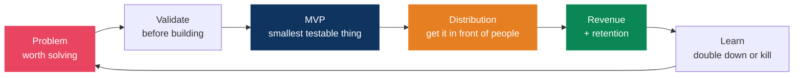
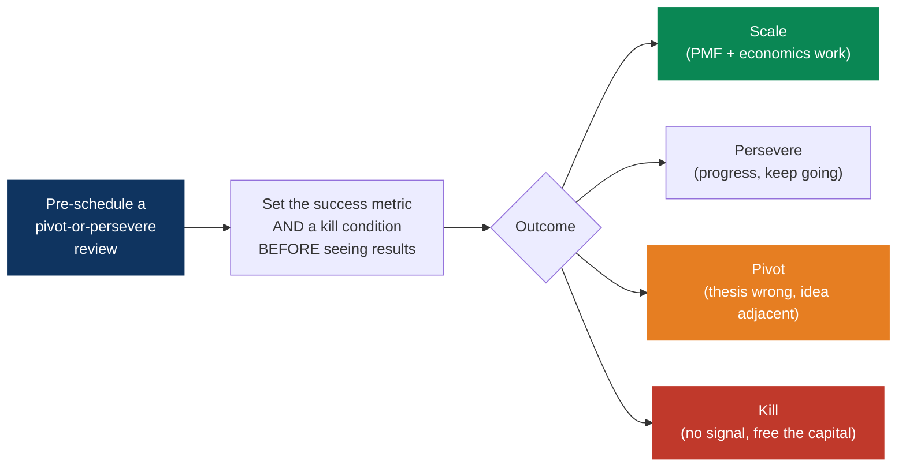
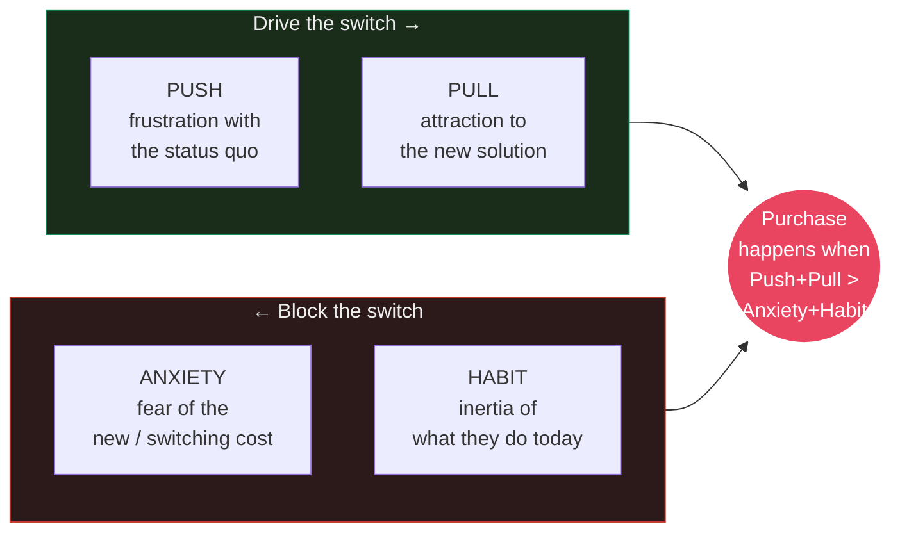
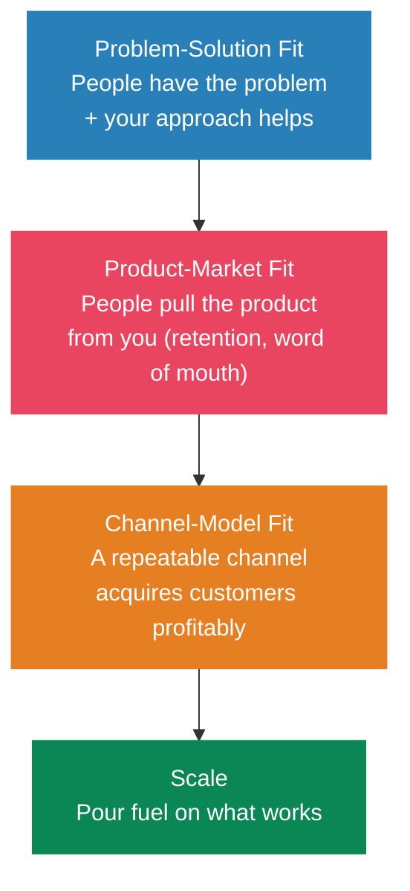
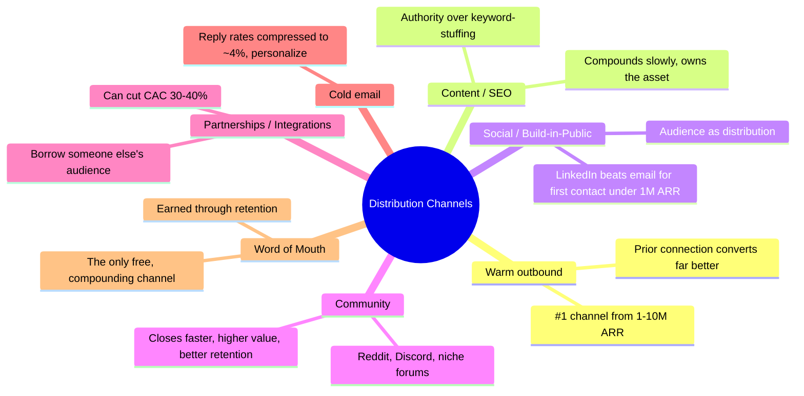
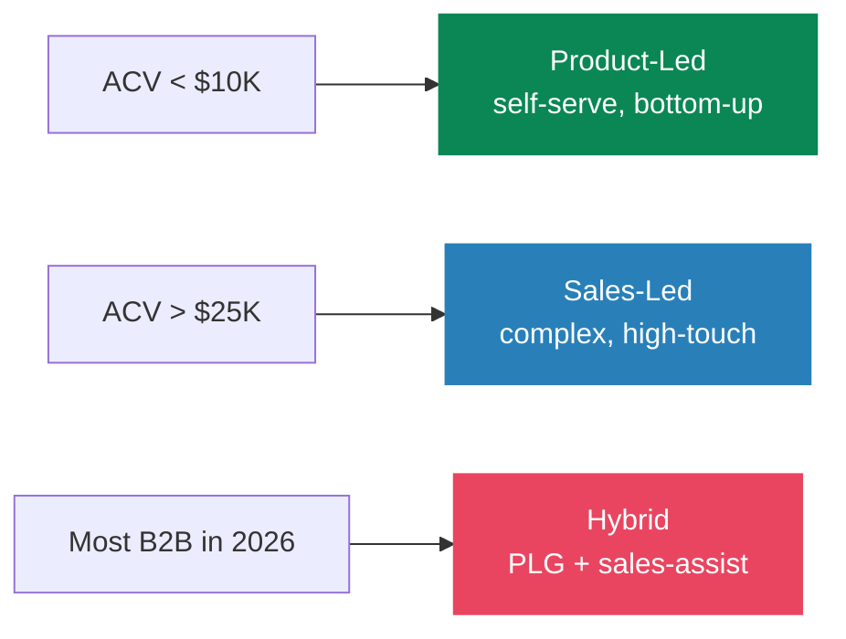
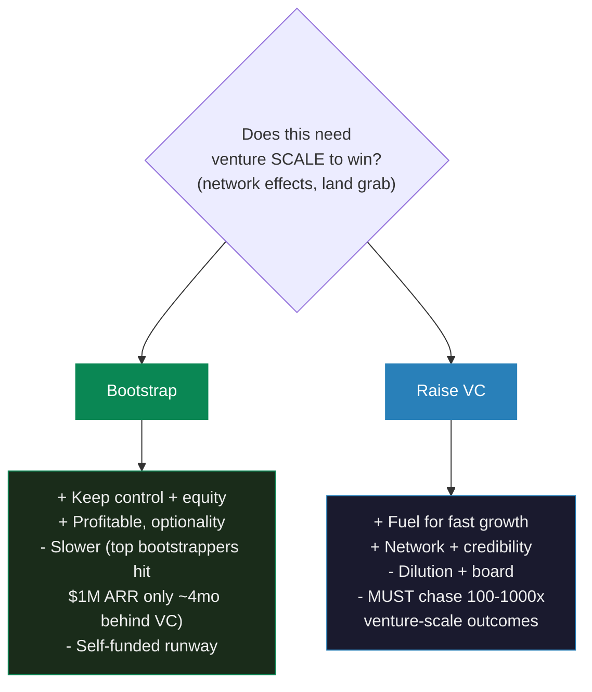

# Startup and business playbook

> A worse product with better distribution beats a better product with none. This is my operating manual for turning side projects into a business, written for a developer-founder building B2B in 2026.

## The build to sell loop

> This connects to my [side projects](../hobbies/interests.md). arkitekto.review and miming.io are live experiments in the loop, and the [career growth flywheel](../career/growth-system.md) is the personal-brand engine feeding distribution.

---

## My founder journey

Several swings, several misses, each one buying a lesson I couldn't have got another way. The data supports the reframe: in one survey of failed founders, 81% had pivoted at least once and 42% wished they'd pivoted sooner. Flexible on the idea, stubborn on the mission.

| Venture | When | What it was | What I took from it |
|---------|------|-------------|---------------------|
| **ShopMe** | ~2022 (co-founded with a friend) | First startup | Co-founder dynamics, and the gap between building and selling |
| **callhenk.com** | ~2025 | Second venture | _(capture the real lesson: why it stalled, what I'd do differently)_ |
| **Current focus** | 2026 | A B2B product, still exploring the problem space | Validate demand before building, and pick a channel early |

> Why B2B now: businesses pay for ROI, contracts recur, and 100 customers at $100/mo beats chasing 10,000 consumers at $1 (see [pricing](#pricing)). The build isn't the hard part. [Finding the right problem](#idea-validation) before writing code is.

### What second-time founders do differently

Research on repeat founders (NFX, byFounders) keeps landing on the same shift: from product-obsession to distribution-obsession.

First-timers ask what they should build. Second-timers ask who they'll sell to and through what channel, and they bake ICP, positioning and the first funnel into week one instead of month six.

They also validate with currency rather than compliments. A signed LOI, a deposit, or a paid pilot is the only yes that counts. Enthusiasm in a meeting is a compliment, not a commitment.

And they carry the assets forward. Every failed venture should leave something reusable: a validated ICP, a channel that converts, an audience, or a sharp thesis about why demand was thin. That's the compounding return on failure.

---

## Why startups fail, and how to fail well

You can't dodge every trap, but the common ones are known. CB Insights' post-mortem analysis ranks the killers. They sum past 100% because failure is almost always multi-causal:

> CB Insights' larger 2024 re-analysis reframed this: about 70% "ran out of capital," but that's the death certificate rather than the disease. The root causes were poor product-market fit (43%), bad timing (29%) and unsustainable unit economics (19%).

### The four traps that matter most

**No market need**, the build-before-validating trap. The most common killer and the most preventable one. It happens when you fall in love with a solution and skip demand validation. The antidote is getting target buyers to commit currency before you write production code.

**Premature scaling.** Startup Genome studied over 3,200 startups and found 74% failed from scaling too early: hiring, paid acquisition, or infrastructure built ahead of product-market fit. No prematurely-scaled startup passed 100,000 users, while balanced ones grew about 20x faster. Don't pour fuel on a fire that isn't lit.

**Co-founder conflict**, which accounts for 65% of failures under the heading of people problems (Wasserman, *The Founder's Dilemmas*). De-risk it up front. Four-year vesting with a one-year cliff on every founder, so a departing founder's equity reverts. Treat equity as dynamic, since 73% of teams split it within a month, before anyone knows who actually contributes. Write down roles, decision rights and who's CEO. Teams of friends are less stable than teams of strangers, because friends dodge the hard conversations. Have them (money, control, time, exit) before incorporating.

**Distribution failure**: a great product with no go-to-market. Products without distribution fade quietly. Find what's already working at small scale and amplify it rather than inventing a new channel.

### Default alive or default dead (Paul Graham)

Run the math monthly. At constant expenses and current revenue growth, do you reach profitability on the cash you have left? Yes is default alive, no is default dead. The variable that decides it is growth rate, not just runway.

Aim for 18-24 months of runway, 12 minimum, and start raising with 9-12 months left. Keep the burn multiple (net burn ÷ net new ARR) under 2x and software gross margins above 70%. Knowing your status early is what leaves you options.

### Pivot, persevere, or kill

Separate the demoralized quit from the rational kill. Graham: "Startups rarely die in mid keystroke. So keep typing." Most deaths are demoralization wearing a financial mask.

Beat sunk cost with the outsider test. If a new CEO took over today, knowing only the facts, would they keep going? What you've already spent has no bearing on the answer.

Pre-commit the criteria, as Eric Ries argues. Put the decision on the calendar with its metric and kill condition defined in advance, so the bias doesn't get a vote when you're emotionally invested.

---

## Idea validation

The most expensive mistake is building something nobody wants. AI collapsed most MVPs down to a weekend, so the bottleneck is no longer whether you can build it. Validate demand, not feasibility.

### The Mom Test (Rob Fitzpatrick)

Ask about their life, not your idea. A good customer question can't be answered with a compliment.

| Bad question (invites lies) | Good question (surfaces truth) |
|---|---|
| "Would you use an app that does X?" | "Walk me through the last time you faced this problem." |
| "Do you think this is a good idea?" | "What have you tried to solve it? What did it cost you?" |
| "Would you pay for this?" | "What are you spending on this today, in time, money or tools?" |

> Talk about their problem and their past behavior, never your solution or a hypothetical. Hypotheticals produce false positives because saying yes costs them nothing.

For B2B, follow the money and map the room. Ask whose budget pays for this and who else can kill the deal. The economic buyer, the user or champion, and the blockers are rarely the same person.

Signals that a problem is real: it's a painkiller rather than a vitamin. Don't ask whether they have problem X, which invites a false positive. Ask them to list and rank their top challenges unprompted. If yours isn't in their top one or two, the pain won't fund a purchase. The other strong signal is an existing workaround: spreadsheets, manual ops, a duct-taped tool, a hired contractor. A line-item cost means a real problem with a budget attached.

### Jobs To Be Done and the four forces (Bob Moesta)

Frame around the progress the customer wants, not your tech. A switch only happens when the forces are asymmetric toward change:

> Reconstruct a real recent purchase in a switch interview. Your job isn't only to add Pull through features. It's to actively reduce Anxiety with free trials, migration help and guarantees, and to break Habit. With varied sampling, about 10 switch interviews per job reveals the pattern.

### How many interviews, and when to green-light

Five discovery interviews is the floor, since below that you can't tell signal from one person's taste. Ten to twenty is the sweet spot for pattern recognition.

Green light to build or automate when willingness-to-pay or trial conversion hits 15-25%, at least 30% of users return within 30 days, feature requests converge on the same areas, and the problem keeps landing in customers' top one or two.

### Do things that don't scale, B2B version

A concierge MVP means you are the software: deliver the outcome manually before you build it. B2B expects high touch, so this reads as service rather than a hack.

Hand-onboard the first 30-50 customers, so the automated flow you eventually build targets the real sticking points.

Recruit three to seven design partners, diverse enough to represent the market and focused enough to give real input. Frame them as founding customers, but charge. A free deal anchors the value at zero permanently.

Run paid pilots: 30 days, scoped to one team and one defined quick win, then expand. Paid beats free because it validates willingness to pay.

### Common validation mistakes

Building before validating. Asking hypothetical or leading questions. Pitching instead of listening. Confusing verbal interest with product-market fit. Targeting too broad an ICP out of FOMO. Mistaking a vitamin for a painkiller.

---

## Product-market fit and the fit ladder

The leading signal is Sean Ellis' 40% test, popularized by Superhuman: ask users how they'd feel if they could no longer use the product. More than 40% answering "very disappointed" indicates fit, and it works before revenue scales. Slack measured 51%.

The lagging B2B signals are paid pilots converting to annual contracts, customers expanding seats or usage, and net revenue retention above 100%. Roughly 40% of new ARR at healthy SaaS companies now comes from existing customers, which makes expansion-from-base a fit marker in its own right. Don't scale before this is real.

---

## Business models

| Model | How it makes money | Best for | Watch out for |
|-------|-------------------|----------|---------------|
| **SaaS / subscription** | Recurring fee | Tools with ongoing value | Churn kills you, retention is everything |
| **Usage-based** | Pay per unit consumed | APIs, infra, AI products | Revenue is lumpy and hard to forecast |
| **Marketplace** | Take rate on transactions | Connecting two sides | Cold-start, chicken-and-egg |
| **Transactional** | Per-purchase | One-off needs | Constant re-acquisition cost |
| **Ads / attention** | Monetize an audience | Content, media | Needs large reach to matter |
| **Services → product** | Bill hours, productize later | Bootstrapping with cash flow | Trading time for money doesn't scale |

> Recurring revenue compounds. One-off revenue resets to zero every month. Prefer models where last month's work still pays this month.

---

## Pricing

Most founders underprice. Price on the value delivered, not cost-plus.

Charge from day one, because payment is the truest validation and free users give you feedback that paying users won't.

Pick a value metric that scales with what the customer receives (workflows run, resolutions, records processed) rather than with your cost, and increasingly not with seats.

Use good/better/best tiering: three tiers mapped to distinct personas, anchored with a high tier so the middle looks obvious, gated by willingness to pay. Same anchoring logic as [salary negotiation](../career/growth-system.md#negotiation-research-backed).

Push annual plans for cash and retention, with about two months free as the discount, while keeping monthly for self-serve entry.

Raise prices. It's the most reversible experiment you can run. Apply it to new customers first and grandfather the existing ones.

### The hybrid and AI pricing shift (2025-2026)

The market moved hard toward hybrid pricing. Kyle Poyar's data shows it went from 27% to 41% of B2B companies in a year while pure seat-based fell to around 15%. The dominant pattern is a platform fee plus credits: a base subscription for predictability, plus usage that captures the upside and lets you monetize new features by tuning conversion rates instead of rewriting the price page.

> AI pricing behaves differently, and seats punish you for it. AI features carry real variable cost, roughly $230K of inference per $1M of AI revenue, which pulls gross margins from about 80% toward 52%. Companies that kept per-seat pricing on AI saw around 40% lower gross margins than those on usage or outcome pricing. Outcome-based pricing is emerging (Intercom's Fin charges about $0.99 per resolution) but it has to be measurable. A practical default is a hybrid with a floor above your inference cost, plus usage caps that protect both sides.

---

## Distribution and go-to-market

> "If you build it, they will come" is the most expensive lie in tech. Decide the channel before you build.

### Founder-led sales first

Sell the first 10-20 deals yourself, so you find a repeatable motion before hiring a salesperson. The first 10 to 50 customers almost always come out of your own network: ex-colleagues, industry contacts, friends of friends.

YC's "pretend to be a consultant" advice holds up. Pick one customer and build until they're extremely satisfied, and their peers will want it too. Onboard each one by hand, the Collison install.

Niche down hard. "AI tooling for accountants," not "a SaaS for everyone." The zero-to-first-1,000 playbook is intense focus on a beachhead where you can be 10x better, then expansion outward.

### Which motion?

> Pick one channel and get good at it before adding a second. PLG stalls at enterprise procurement and pure sales-led is too slow for bottom-up expansion, which is why most companies end up hybrid.

---

## Metrics that matter

Signups, pageviews and followers feel good and tell you almost nothing. Track what's tied to survival.

| Metric | What it tells you | Healthy / Target (2025-26) |
|--------|------------------|----------------------------|
| **MRR / ARR** | Recurring revenue | Growing month over month |
| **NRR** (net revenue retention) | Expansion vs churn in the existing base | 100-110% early, 110-120% strong, >120% best-in-class |
| **Logo / gross churn** | Customers leaving | Logo ~3.5% B2B avg, GRR ≥ 90% healthy |
| **LTV : CAC** | Lifetime value vs cost to acquire | ≥ 3:1 (5:1 top quartile) |
| **CAC payback** | Months to recoup acquisition cost | < 12 mo SMB, < 18-24 mo enterprise |
| **Magic number** | Sales efficiency of GTM spend | ≥ 1.0 (> 2.0 top quartile) |
| **Rule of 40** | growth % + profit margin % | ≥ 40 (only ~11-30% of SaaS hit it) |
| **Burn multiple** | Net burn ÷ net new ARR | < 1.5 (< 1.0 elite) |

> Retention is the foundation. Acquisition with bad retention is pouring water into a leaky bucket, so fix the bucket first. And watch Goodhart's Law ([engineering principles](../engineering/principles.md#the-laws-worth-knowing)): the moment a metric becomes the target, it stops being a good metric.

---

## Bootstrapping vs venture capital

> VC is rocket fuel, not free money. Take it only if the business needs venture scale, meaning winner-take-all markets and network effects, because the math only works with a path to 100-1,000x. Most software businesses do better bootstrapped: profitable, owned, and yours. ChartMogul's data shows top-quartile bootstrappers reach $1M ARR only about four months behind VC-backed peers while keeping 100% of the equity. Default to bootstrapping and raise only when capital is the actual constraint.

---

## The solo and AI founder playbook (2026)

The leverage shift here is structural rather than hype. You're not a coder who got faster, you're managing AI capacity. A solopreneur stack (Cursor or Claude Code for code, Claude or ChatGPT for strategy, v0/Bolt/Lovable for UI, Zapier or Make for ops) runs about $200-500 a month and covers what used to take five to ten hires. Base44 is the proof point: 250K users, profitable in six months, sold to Wix for $80M in 2025 with a tiny team. Pieter Levels runs a solo portfolio past $3M ARR. Solo-founded startups went from around 24% of new startups in 2019 to about 36% in 2025.

> The caveat: the median solo founder still makes around $3K a month. AI raised the ceiling, not the floor. Focus and distribution still decide the outcome.

### Frameworks that fit a developer-founder

**The stair-step approach (Rob Walling).** Don't start at venture SaaS. Step one is one simple product on one channel, a micro-SaaS or plugin, to learn product, marketing and acquisition together. Step two is stacking products until they replace your income. Step three is going all in on a recurring-revenue SaaS. Most founders fail by skipping step one.

**Audience-first (Arvid Kahl's *The Embedded Entrepreneur*).** Reverse the idea-first trap. Delay the idea, start with who you'll serve, embed yourself where they already are, find the painful problem, and build with them. As a technical founder, coding should come last. A pre-existing audience is the durable moat: Levels' Photo AI worked because he'd spent a decade building 600K+ followers first. That's the whole thesis behind miming.io.

**Build in public**, which is the distribution channel and the accountability substitute for the co-founder you don't have.

### Cheap validation ladder, cheapest first

1. Landing page smoke test. Describe the offer, collect emails. The fastest legs-check there is.
2. Fake door, waitlist or pre-order, which measures a real conversion action.
3. Pre-sales or a paid pilot. Take real money before building.
4. Concierge or Wizard of Oz. Deliver the value by hand, and automate only once demand and workflow are proven.

### Solo-founder pitfalls

Burnout predicts failure better than strategy does. Around 70% of solo founders fail within two years against roughly 40% of teams, so protect [recovery and focus](../focus/flow-state-protocol.md) as deliberately as you protect build time.

There's also an accountability gap with no co-founder to poke holes in things. Build-in-public timelines, peer communities like Indie Hackers and MicroConf, and an accountability partner all help.

And there's the temptation to do everything. Delegate to AI, cut scope hard, and let profitability gate growth so you don't scale prematurely.

---

## The solo founder reality, in short

Stay lean, because low burn means long runway and more shots on goal. Profitability is freedom.

Sell before you build. Pre-sales, waitlists and landing-page tests validate demand at nearly zero cost.

Leverage beats hours. Code and content replicate at zero marginal cost, which is Naval's [permissionless leverage](../career/growth-system.md#naval-ravikants-three-forms-of-leverage). One person with AI and distribution is a real company in 2026.

Ship in public, charge early, iterate. Most product decisions are [two-way doors](../career/growth-system.md#bezos-two-way-doors), so move.

Shipping something done is worth more than perfecting something hidden, because distribution and feedback only start after you launch.

## References

- Rob Fitzpatrick, *The Mom Test* and [YC: How to Talk to Users](https://www.ycombinator.com/library/Iq-how-to-talk-to-users)
- Eric Ries, *The Lean Startup*
- Bob Moesta, *Demand-Side Sales* and Jobs To Be Done
- Steve Blank, *The Four Steps to the Epiphany*
- Alex Hormozi, *$100M Offers* and *$100M Leads*
- Peter Thiel, *Zero to One*
- Rob Walling, *Start Small, Stay Small* and the [stair-step approach](https://robwalling.com/essays/2015/03/26/the-stair-step-method-of-bootstrapping) (MicroConf)
- Arvid Kahl, *The Embedded Entrepreneur* and *Zero to Sold*
- Noam Wasserman, *The Founder's Dilemmas* and [the founder's dilemma](https://hbr.org/2008/02/the-founders-dilemma)
- Paul Graham: [Do Things That Don't Scale](https://paulgraham.com/ds.html), [Default Alive or Default Dead](https://paulgraham.com/aord.html), [How Not to Die](https://paulgraham.com/die.html)
- [CB Insights, top reasons startups fail](https://www.cbinsights.com/research/report/startup-failure-reasons-top/) and [Startup Genome on premature scaling](https://startupgenome.com/articles/a-deep-dive-into-the-anatomy-of-premature-scaling-new-infographic)
- [NFX, why second-time founders win](https://www.nfx.com/post/second-time-founders-win-avoid-common-mistakes)
- Kyle Poyar / Growth Unhinged, [2025 state of B2B monetization](https://www.growthunhinged.com/p/2025-state-of-b2b-monetization) and [Bessemer's AI pricing playbook](https://www.bvp.com/atlas/the-ai-pricing-and-monetization-playbook)
- Y Combinator [Startup School](https://www.startupschool.org/) (free), [Indie Hackers](https://www.indiehackers.com/), Lenny's Newsletter
- April Dunford, *Obviously Awesome*, and Sean Ellis' [40% PMF test](https://www.lennysnewsletter.com/p/how-to-know-if-youve-got-productmarket)
- Related: [career growth system](../career/growth-system.md), [hobbies and side projects](../hobbies/interests.md)
