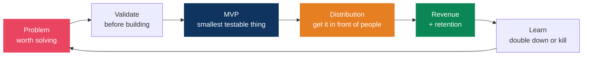
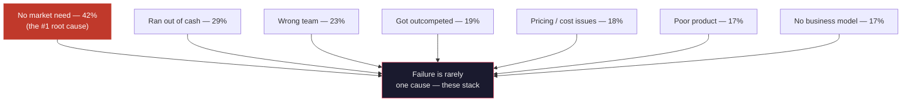
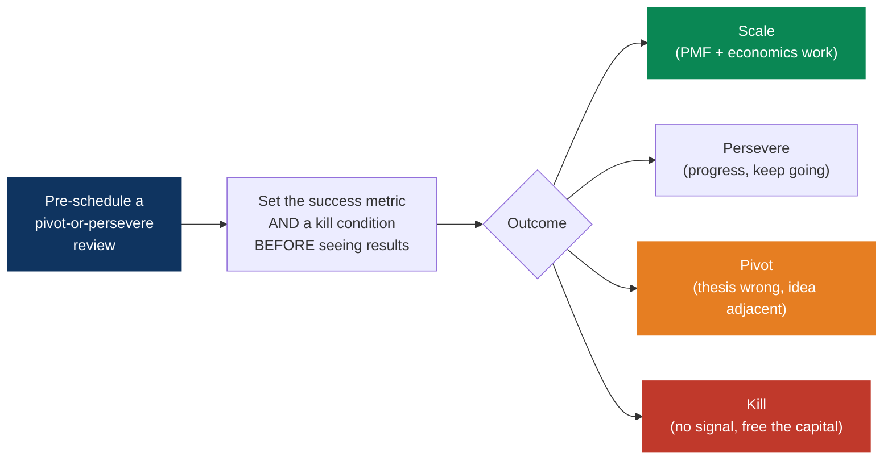
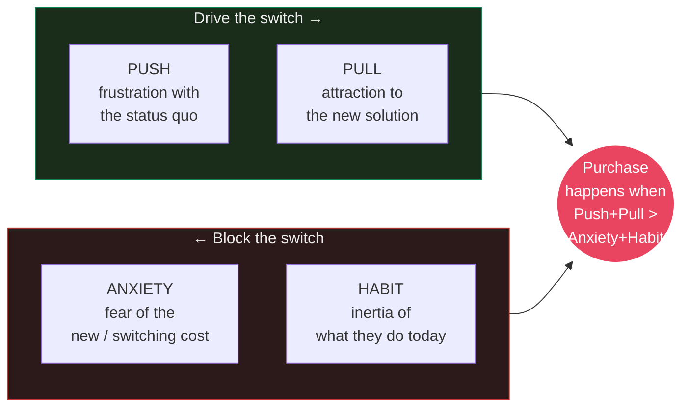
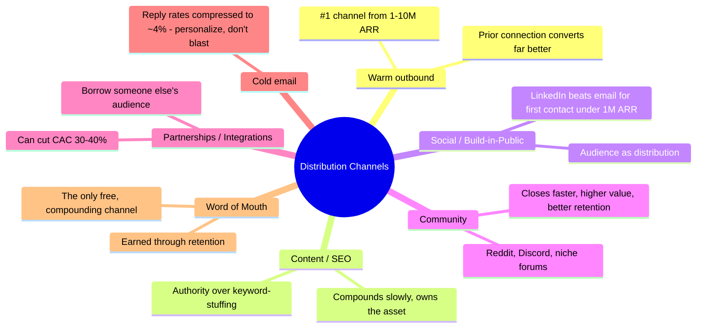
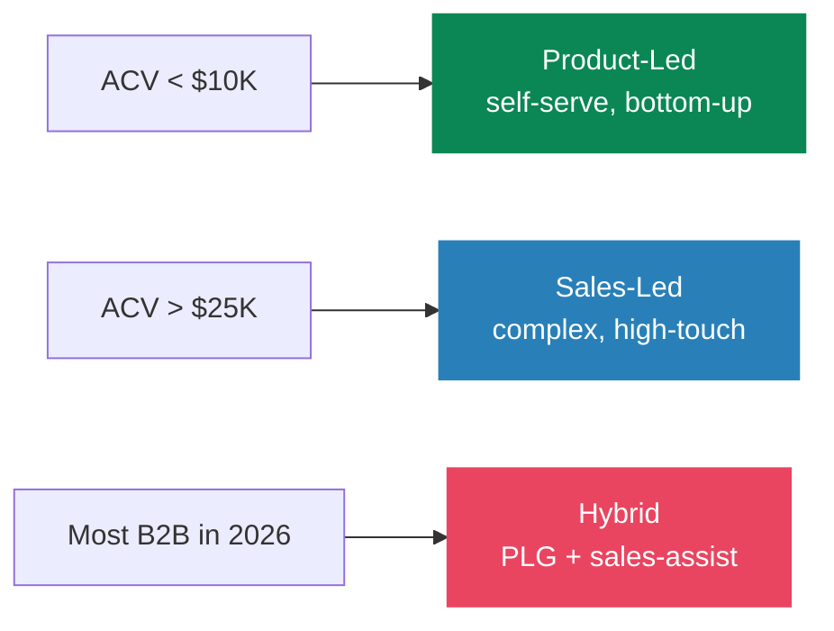
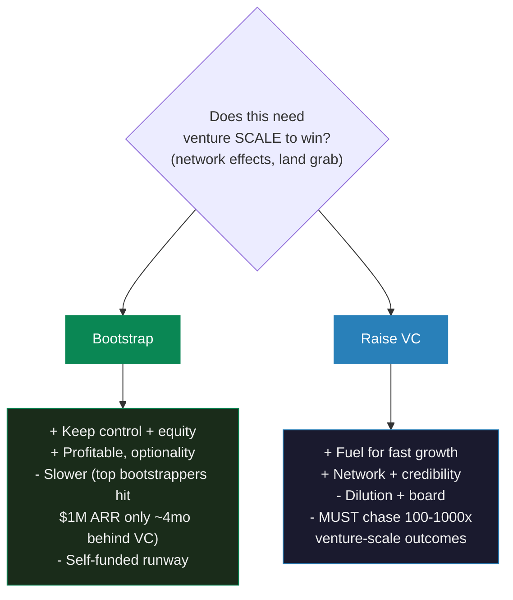

# Startup & Business Playbook

> Ideas are cheap. Distribution is everything. A worse product with better distribution beats a better product with none. This is the operating manual for turning side projects into businesses — written for a developer-founder building B2B in 2026.

## The Build → Sell Loop

> Connects to my [side projects](../hobbies/interests.md) — arkitekto.review and miming.io are live experiments in this loop. The [career growth flywheel](../career/growth-system.md) is the personal-brand engine that feeds distribution.

---

## My Founder Journey

Multiple swings, multiple misses — each one bought a lesson I couldn't have learned any other way. Failure isn't the opposite of building; it's the tuition. The data backs the reframe: in one survey of failed founders, **81% had pivoted at least once and 42% wished they'd pivoted sooner** — flexibility on the idea, conviction on the mission.

| Venture | When | What it was | What I took from it |
|---------|------|-------------|---------------------|
| **ShopMe** | ~2022 (co-founded with a friend) | First startup | Co-founder dynamics, the gap between *building* and *selling* |
| **callhenk.com** | ~2025 | Second venture | _(capture the real lesson — why it stalled, what I'd do differently)_ |
| **Current focus** | 2026 | Building a **B2B** product — still exploring the problem space | Validate demand *before* building; pick a channel early |

> **Why B2B now**: businesses pay for ROI, contracts recur, and 100 customers at $100/mo beats chasing 10,000 consumers at $1 (see [Pricing](#pricing)). The hard part isn't the build — it's [validating the right problem](#idea-validation-before-you-build-anything) before writing code.

### What second-time founders do differently

Research on repeat founders (NFX, byFounders) is consistent — the shift that matters most is **from product-obsession to distribution-obsession**:

- **First-timers ask "what should I build?" Second-timers ask "who will I sell to, through what channel?"** — and bake go-to-market (ICP, positioning, first funnel) into *week one*, not month six.
- **Validate with currency, not compliments.** A signed LOI, a deposit, or a paid pilot is the only "yes" that counts. Verbal enthusiasm is a compliment, not a commitment.
- **Carry the assets forward.** Every failed venture should leave a reusable asset: a validated ICP, a channel that converts, an audience, or a sharp thesis about *why* demand was thin. That's the compounding return on failure.

---

## Why Startups Fail (and How to Fail Well)

You can't avoid every trap, but you can avoid the *common* ones. The canonical CB Insights post-mortem analysis ranks the killers — note they sum past 100% because failure is almost always **multi-causal and compounding**:

> CB Insights' larger 2024 re-analysis reframed it: ~70% "ran out of capital" — but that's the *death certificate*, not the disease. The root causes were **poor product-market fit (43%)**, **bad timing (29%)**, and **unsustainable unit economics (19%)**.

### The four traps that matter most

**1. No market need — the building-before-validating trap.** The most common *and* most preventable killer. It happens when you fall in love with a solution and skip demand validation. Antidote: get target buyers to commit *currency* before you write production code.

**2. Premature scaling — the #1 killer in the data.** Startup Genome studied 3,200+ startups: **74% failed from premature scaling** — hiring, paid acquisition, or infrastructure built *ahead of* product-market fit. No prematurely-scaled startup passed 100,000 users; balanced ones grew ~20x faster. **Don't pour fuel on a fire that isn't lit.**

**3. Co-founder conflict — 65% of failures are "people problems"** (Wasserman, *The Founder's Dilemmas*). De-risk it up front:
- **4-year vesting with a 1-year cliff** on every founder — non-negotiable, so a departing founder's equity reverts.
- **Treat equity as dynamic** — 73% of teams split equity within a month, before they know who actually contributes. Revisit at milestones.
- **Write down roles, decision rights, and who's CEO.** Teams of friends are *less* stable than strangers because friends dodge the hard conversations. Have them — money, control, time, exit — *before* incorporating.

**4. Distribution failure — great product, no go-to-market.** Products without distribution fade quietly. Find what's already working at small scale and *amplify* it rather than inventing a new channel.

### Default alive or default dead (Paul Graham)

Run this math monthly: *at constant expenses and current revenue growth, do we reach profitability on the cash we have left?* Yes = **default alive**, No = **default dead**. The decisive variable is **growth rate, not just runway**.

- Ideal runway **18-24 months** (12 minimum); start raising with **9-12 months** left.
- **Burn multiple** (net burn ÷ net new ARR) **< 2x**; software gross margins **> 70%**.
- Knowing your status *early* lets you cut burn while you still have options.

### Pivot, persevere, or kill — decide before the data

- **Separate "demoralized-quit" from "rational-kill."** PG: "Startups rarely die in mid keystroke. So keep typing." Most deaths are demoralization wearing a financial mask.
- **Beat sunk cost with the outsider test:** "If a new CEO took over today, knowing only the facts, would they keep going?" Past spend is irrelevant to that answer.
- **Pre-commit the criteria** (Eric Ries): put the decision on the calendar *with* its metric and kill condition defined in advance — it neutralizes bias when you're emotionally invested.

---

## Idea Validation (Before You Build Anything)

The most expensive mistake is building something nobody wants. AI tools collapsed most MVPs to a weekend — so the bottleneck is no longer *can you build it*, it's *should you*. Validate demand, not feasibility.

### The Mom Test (Rob Fitzpatrick)

Ask about their life, not your idea. Good customer questions can't be answered with a compliment.

| ❌ Bad question (invites lies) | ✅ Good question (surfaces truth) |
|---|---|
| "Would you use an app that does X?" | "Walk me through the last time you faced this problem." |
| "Do you think this is a good idea?" | "What have you tried to solve it? What did it cost you?" |
| "Would you pay for this?" | "What are you spending on this today (time / money / tools)?" |

> **Rule**: Talk about *their* problem and past behavior, never your solution or hypotheticals. Hypotheticals produce false positives because saying "yes" costs them nothing.

**B2B additions — follow the money and map the room:** ask "Whose budget pays for this?" and "Who else can kill the deal?" In B2B you must separate the **economic buyer**, the **user/champion**, and the **blockers** — they're rarely the same person.

**Real vs. fake problem signals:**
- **Painkiller, not vitamin.** Don't ask "do you have problem X" (false positive). Ask them to list and *rank* their top challenges unprompted — if your problem isn't in their **top 1-2**, the pain won't fund a purchase.
- **They already built a workaround** — spreadsheets, manual ops, a duct-taped tool, a hired contractor. An existing line-item cost = a real problem with a budget.

### Jobs To Be Done — the Four Forces (Bob Moesta)

Frame around the *progress* the customer wants, not your tech. A switch only happens when the forces are asymmetric toward change:

> Reconstruct a *real recent purchase* in a "switch interview." Your job isn't just to add Pull (features) — it's to actively reduce Anxiety (free trials, migration help, guarantees) and break Habit. With varied sampling, ~10 switch interviews per job reveal the pattern.

### How many interviews, and the green light

- **Discovery interviews:** 5 is the floor (below that you can't separate signal from one person's taste); **10-20** is the sweet spot for pattern recognition.
- **Green light to build/automate:** willingness-to-pay or trial conversion **≥ 15-25%**; **≥ 30%** of users return within 30 days; feature requests **converging** on the same areas; the problem repeatedly ranked in customers' **top 1-2**.

### Do things that don't scale (the B2B version)

- **Concierge MVP:** *you* are the software — deliver the outcome manually before building it. B2B expects high-touch, so this is natural cover.
- **Manual onboarding:** hand-onboard the first **30-50** customers so the automated flow you eventually build targets the *real* sticking points.
- **Design partners:** recruit **3-7** early customers — diverse enough to represent the market, focused enough to give real input. Frame as "founding customers," but charge — free deals permanently anchor the value at zero.
- **Paid pilots:** a 30-day pilot, scoped to one team and a defined "quick win," then expand. Paid beats free because it validates willingness-to-pay.

### Common validation mistakes

Building before validating · asking hypothetical/leading questions · pitching instead of listening · confusing verbal interest with PMF · targeting too broad an ICP out of FOMO · mistaking a vitamin for a painkiller.

---

## Product–Market Fit & the Fit Ladder

**The leading signal (Sean Ellis / Superhuman "40% test"):** ask users "How would you feel if you could no longer use this?" — **> 40% "very disappointed"** indicates PMF. It works *before* revenue scales (Slack measured 51%).

**The lagging B2B signals:** paid pilots converting to annual contracts, customers expanding seats/usage, and **net revenue retention > 100%**. Today ~40% of new ARR at healthy SaaS comes from *existing* customers — expansion-from-base is itself a PMF marker. **Don't scale before this is real.**

---

## Business Models

| Model | How it makes money | Best for | Watch out for |
|-------|-------------------|----------|---------------|
| **SaaS / subscription** | Recurring fee | Tools with ongoing value | Churn kills you; retention is everything |
| **Usage-based** | Pay per unit consumed | APIs, infra, AI products | Revenue is lumpy/unpredictable |
| **Marketplace** | Take rate on transactions | Connecting two sides | Cold-start / chicken-and-egg |
| **Transactional** | Per-purchase | One-off needs | Constant re-acquisition cost |
| **Ads / attention** | Monetize an audience | Content, media (e.g. influencer) | Needs large reach to matter |
| **Services → product** | Bill hours, productize later | Bootstrapping with cash flow | Trading time for money doesn't scale |

> **Recurring revenue compounds; one-off revenue resets to zero every month.** Prefer models where last month's work still pays this month.

---

## Pricing

Most founders underprice. Price on **value delivered**, not cost-plus.

- **Charge from day one** — payment is the truest validation; free users give feedback paying users won't.
- **Pick a value metric** that scales with the value the customer *receives* (workflows run, resolutions, records processed) — not your cost, and increasingly not seats.
- **Good / Better / Best tiering** — three tiers mapped to distinct personas; anchor with a high tier so the middle becomes the obvious choice; gate features by willingness-to-pay. See [negotiation anchoring](../career/growth-system.md#negotiation-research-backed).
- **Push annual** for cash and retention (≈2 months free as the discount); keep monthly for self-serve entry.
- **Raise prices** — the most reversible experiment you can run. New customers first, grandfather existing ones.
- **B2B > B2C for early revenue** — businesses pay for ROI; consumers resist paying.

### The hybrid + AI-pricing shift (2025-2026)

The market moved hard toward **hybrid pricing** — Kyle Poyar's data shows it jumped from 27% → 41% of B2B companies in a year, while pure seat-based fell to ~15%. The dominant pattern is **platform fee + credits**: a base subscription for predictability, plus usage/credits that capture upside and let you monetize new features by tuning conversion rates instead of rewriting the price page.

> **AI pricing is different — and seats punish you.** AI features carry real variable cost (≈$230K of inference per $1M of AI revenue), pulling gross margins from ~80% toward ~52%. Companies that kept *per-seat* pricing on AI saw ~40% lower gross margins than those on usage/outcome pricing. **Outcome-based** is emerging (Intercom's Fin charges ~$0.99/resolution) but must be *measurable*. Practical default: a **hybrid with a floor above your inference cost** plus usage caps to protect both sides.

---

## Distribution & Go-to-Market

> "If you build it, they will come" is the most expensive lie in tech. Decide your channel *before* you build.

### Founder-led sales first

- **You must sell the first 10-20 deals yourself** to find a repeatable, predictable motion before hiring a salesperson. The first 10-50 customers almost always come from your **network** — ex-colleagues, industry contacts, friends-of-friends.
- **"Pretend to be a consultant" (YC):** pick one customer and build until they're *extremely* satisfied; their peers will then want it too. Onboard each one by hand (the "Collison install").
- **Niche down hard:** "AI tooling *for accountants*," not "a SaaS for everyone." The zero-to-first-1,000 playbook is intense focus on a beachhead where you can be 10x better, then expand.

### Which motion?

> Pick ONE channel and get good at it before adding a second. PLG stalls at enterprise procurement; pure sales-led is too slow for bottom-up expansion — so most settle into **hybrid**.

---

## Metrics That Matter

Vanity metrics (signups, pageviews, followers) feel good and mean little. Track the ones tied to survival.

| Metric | What it tells you | Healthy / Target (2025-26) |
|--------|------------------|----------------------------|
| **MRR / ARR** | Recurring revenue | Growing month over month |
| **NRR** (net revenue retention) | Expansion vs. churn in existing base | 100-110% early; 110-120% strong; >120% best-in-class |
| **Logo / gross churn** | Customers leaving | Logo ~3.5% B2B avg; GRR ≥ 90% healthy |
| **LTV : CAC** | Lifetime value vs. cost to acquire | ≥ 3:1 (5:1 top quartile) |
| **CAC payback** | Months to recoup acquisition cost | < 12 mo SMB, < 18-24 mo enterprise |
| **Magic number** | Sales-efficiency of GTM spend | ≥ 1.0 (> 2.0 top quartile) |
| **Rule of 40** | growth % + profit margin % | ≥ 40 (only ~11-30% of SaaS hit it) |
| **Burn multiple** | Net burn ÷ net new ARR | < 1.5 (< 1.0 elite) |

> **Retention is the foundation.** Acquisition with bad retention is pouring water into a leaky bucket — fix the bucket first. And mind Goodhart's Law ([engineering principles](../engineering/principles.md#the-laws-every-senior-engineer-should-know)): once a metric becomes the target, it stops being a good metric.

---

## Bootstrapping vs Venture Capital

> **VC is rocket fuel, not free money** — only take it if the business *needs* venture scale (winner-take-all markets, network effects). VC math only works with a path to 100-1,000x; most software businesses are better off bootstrapped — profitable, owned, and yours. ChartMogul data shows top-quartile bootstrappers reach $1M ARR only ~4 months behind VC-backed peers, keeping 100% equity. **Default to bootstrapping; raise only when capital is the actual constraint.**

---

## The Solo and AI Founder Playbook (2026)

The leverage shift is structural, not hype: **you're no longer a coder who's faster — you're a manager of AI capacity.** A solopreneur stack (Cursor/Claude Code for code, Claude/ChatGPT for strategy, v0/Bolt/Lovable for UI, Zapier/Make for ops) runs ~$200-500/mo and replaces what once needed 5-10 hires. Proof: Base44 — 250K users, profitable in 6 months, sold to Wix for $80M (2025) with a tiny team; Pieter Levels' ~$3M+ ARR solo portfolio. Solo-founded startups rose from ~24% (2019) to ~36% of new startups (2025).

> Caveat: the median solo founder still earns ~$3K/mo. AI raises the *ceiling*, not the floor — focus and distribution still decide outcomes.

### The frameworks that fit a developer-founder

- **Stair-Step Approach (Rob Walling):** don't start at "venture SaaS." **Step 1** — one simple product, one channel (a micro-SaaS, plugin, or tool) to learn product + marketing + acquisition. **Step 2** — stack products until they replace your income. **Step 3** — go all-in on a recurring-revenue SaaS. Most founders fail by skipping Step 1.
- **Audience-first / Embedded Entrepreneur (Arvid Kahl):** reverse the idea-first trap — *delay the idea*, start with **who** you'll serve, embed where they hang out, discover the painful problem, and **build with them**. As a technical founder, coding should come *last*. A pre-existing audience is the durable moat (Levels' Photo AI worked because he'd spent 10+ years building 600K+ followers first). This is the whole thesis behind **miming.io**.
- **Build in public** — not vanity: it's the distribution channel *and* the accountability substitute for a missing co-founder.

### Cheap validation ladder (cheapest first)

1. **Landing-page / smoke test** — describe the offer, collect emails. Fastest legs-check.
2. **Fake-door / waitlist / pre-order** — measure a real conversion action.
3. **Pre-sales / paid pilot** — take real money before building.
4. **Concierge / Wizard-of-Oz** — deliver the value by hand, automate only once demand and workflow are proven.

### Solo-founder pitfalls

- **Burnout is the #1 failure predictor** (above strategy) — ~70% of solo founders fail within 2 years vs. ~40% of teams. Protect [recovery and focus](../focus/flow-state-protocol.md) as deliberately as you protect build time.
- **Accountability gap** — no co-founder to poke holes. Mitigate with build-in-public timelines, peer communities (Indie Hackers, MicroConf), and a mentor/accountability partner.
- **Doing too much** — delegate to AI, cut scope ruthlessly, and let profitability discipline gate growth so you don't scale prematurely.

---

## The Solo / Indie Founder Reality (Summary)

- **Stay lean** — low burn = long runway = more shots on goal. Profitability is freedom.
- **Sell before you build** — pre-sales, waitlists, and landing-page tests validate demand at near-zero cost.
- **Leverage > hours** — code and content replicate at zero marginal cost (Naval's [permissionless leverage](../career/growth-system.md#naval-ravikants-3-forms-of-leverage)). One person + AI + distribution is a real company in 2026.
- **Ship in public, charge early, iterate fast** — most product decisions are [two-way doors](../career/growth-system.md#bezos-two-way-doors), so move.
- **Done and shipped beats perfect and hidden** — distribution and feedback only start after you launch.

## References

- Rob Fitzpatrick — *The Mom Test* (customer validation) · [YC: How to Talk to Users](https://www.ycombinator.com/library/Iq-how-to-talk-to-users)
- Eric Ries — *The Lean Startup* (build-measure-learn, MVP, pivot-or-persevere)
- Bob Moesta — *Demand-Side Sales* / Jobs To Be Done, the Four Forces
- Steve Blank — *The Four Steps to the Epiphany* (customer development)
- Alex Hormozi — *$100M Offers* / *$100M Leads* (pricing, offers, distribution)
- Peter Thiel — *Zero to One* (monopoly, moats, contrarian bets)
- Rob Walling — *Start Small, Stay Small* + the [Stair-Step Approach](https://robwalling.com/essays/2015/03/26/the-stair-step-method-of-bootstrapping) (MicroConf)
- Arvid Kahl — *The Embedded Entrepreneur* / *Zero to Sold* (audience-first)
- Noam Wasserman — *The Founder's Dilemmas* ([co-founder / equity / vesting](https://hbr.org/2008/02/the-founders-dilemma))
- Paul Graham — [Do Things That Don't Scale](https://paulgraham.com/ds.html) · [Default Alive or Default Dead](https://paulgraham.com/aord.html) · [How Not to Die](https://paulgraham.com/die.html)
- [CB Insights — Top Reasons Startups Fail](https://www.cbinsights.com/research/report/startup-failure-reasons-top/) · [Startup Genome — Premature Scaling](https://startupgenome.com/articles/a-deep-dive-into-the-anatomy-of-premature-scaling-new-infographic)
- [NFX — Why Second-Time Founders Win](https://www.nfx.com/post/second-time-founders-win-avoid-common-mistakes)
- Kyle Poyar / Growth Unhinged — [2025 State of B2B Monetization](https://www.growthunhinged.com/p/2025-state-of-b2b-monetization) · [Bessemer — AI Pricing Playbook](https://www.bvp.com/atlas/the-ai-pricing-and-monetization-playbook)
- Y Combinator — [Startup School](https://www.startupschool.org/) (free) · [Indie Hackers](https://www.indiehackers.com/) · Lenny's Newsletter
- April Dunford — *Obviously Awesome* (positioning) · Sean Ellis — the [40% PMF test](https://www.lennysnewsletter.com/p/how-to-know-if-youve-got-productmarket)
- Related: [Career Growth System](../career/growth-system.md), [Hobbies & Side Projects](../hobbies/interests.md)
