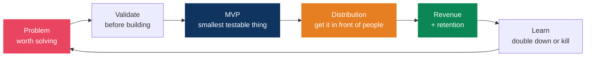
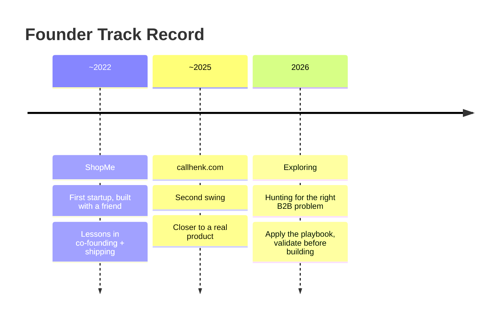
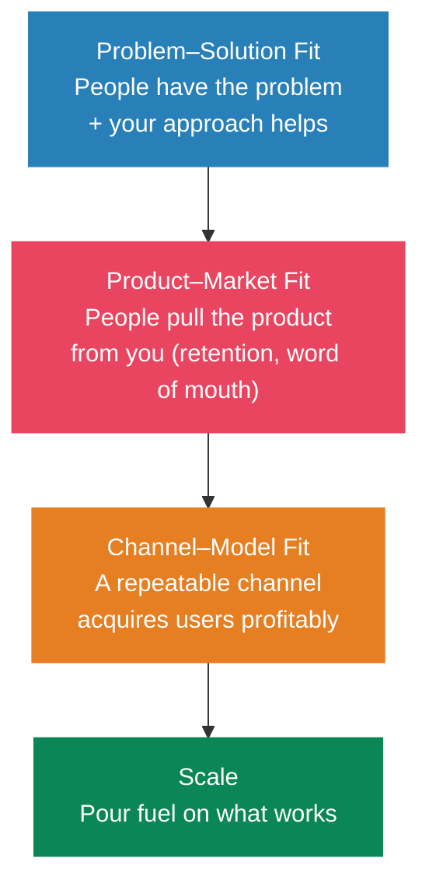
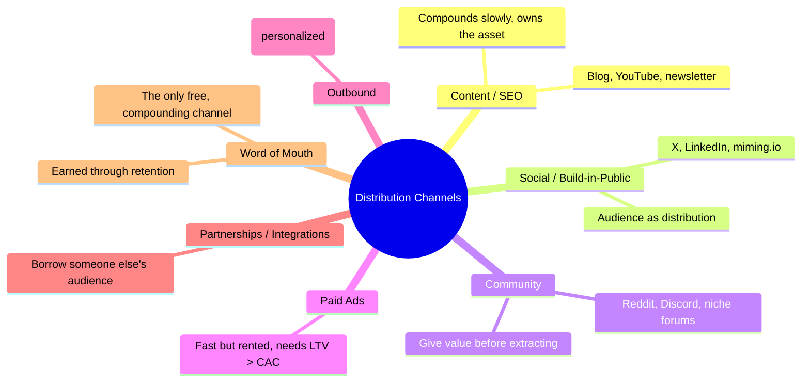
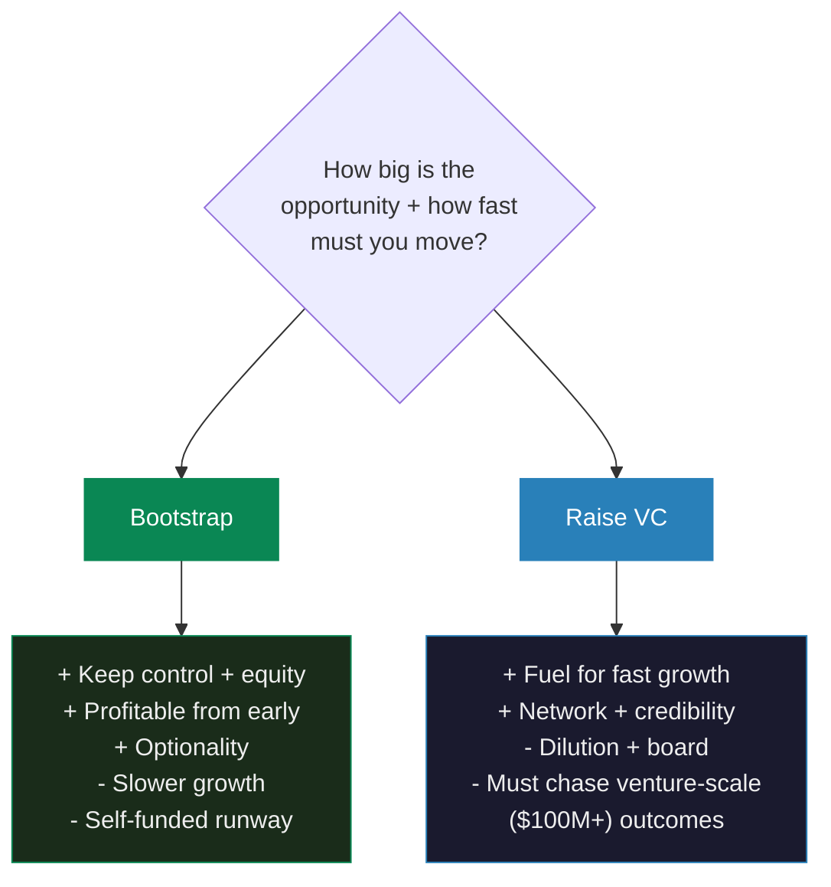

# Startup & Business Playbook

> Ideas are cheap. Distribution is everything. A worse product with better distribution beats a better product with none. This is the operating manual for turning side projects into businesses.

## The Build → Sell Loop

> Connects to my [side projects](../hobbies/interests.md) — arkitekto.review and miming.io are live experiments in this loop. The [career growth flywheel](../career/growth-system.md) is the personal-brand engine that feeds distribution.

---

## My Founder Journey

Multiple swings, multiple misses — each one bought a lesson I couldn't have learned any other way. Failure isn't the opposite of building; it's the tuition.

| Venture | When | What it was | What I took from it |
|---------|------|-------------|---------------------|
| **ShopMe** | ~2022 (co-founded with a friend) | First startup | Co-founder dynamics, the gap between building and selling |
| **callhenk.com** | ~2025 | Second venture | _(capture the real lesson — why it stalled, what I'd do differently)_ |
| **Current focus** | 2026 | Building a **B2B** product — still exploring the problem space | Validate demand *before* building; pick a channel early |

> **Why B2B now**: businesses pay for ROI, contracts recur, and 100 customers at $100/mo beats chasing 10,000 consumers at $1 (see [Pricing](#pricing)). The hard part isn't the build — it's [validating the right problem](#idea-validation-before-you-build-anything) before writing code. **Failed startups aren't sunk cost — they're pattern-matching data for the next one.**

---

## Idea Validation (Before You Build Anything)

The most expensive mistake is building something nobody wants. Validate first.

### The Mom Test (Rob Fitzpatrick)

Ask about their life, not your idea. Good customer questions can't be answered with flattery.

| ❌ Bad question (invites lies) | ✅ Good question (surfaces truth) |
|---|---|
| "Would you use an app that does X?" | "Walk me through the last time you faced this problem." |
| "Do you think this is a good idea?" | "What have you tried to solve it? What did it cost you?" |
| "Would you pay for this?" | "What are you spending on this today (time/money/tools)?" |

> **Rule**: Talk about *their* problem and past behavior, never your solution or hypotheticals. Commitment (time, money, reputation) is the only real signal — everything else is a compliment.

### Fit Ladder

> **Don't scale before PMF.** The clearest PMF signal: you'd be genuinely upset if the product disappeared, and so would your users (Sean Ellis test — >40% of users would be "very disappointed" without it).

---

## Business Models

| Model | How it makes money | Best for | Watch out for |
|-------|-------------------|----------|---------------|
| **SaaS / subscription** | Recurring fee | Tools with ongoing value | Churn kills you; need retention |
| **Marketplace** | Take rate on transactions | Connecting two sides | Cold-start / chicken-and-egg |
| **Transactional** | Per-purchase | One-off needs | Constant re-acquisition cost |
| **Ads / attention** | Monetize audience | Content, media (e.g. influencer) | Needs large reach to matter |
| **Usage-based** | Pay per unit consumed | APIs, infra, AI products | Revenue is lumpy/unpredictable |
| **Services → product** | Bill hours, productize later | Bootstrapping with cash flow | Trading time for money doesn't scale |

> **Recurring revenue compounds; one-off revenue resets to zero every month.** Prefer models where last month's work still pays this month.

---

## Pricing

Most founders underprice. Price on **value delivered**, not cost-plus.

- **Charge from day one** — free users give feedback that paying users won't; payment is the truest validation.
- **Anchor high, offer tiers** — a premium tier makes the middle tier look reasonable (decoy effect). See [negotiation anchoring](../career/growth-system.md#negotiation-research-backed).
- **Price per value metric** — seats, usage, outcomes — whatever scales with the customer's success.
- **Raise prices** — the most reversible experiment you can run. New customers first, grandfather existing ones if needed.
- **B2B > B2C for early revenue** — businesses pay for ROI; consumers resist paying. Selling to 100 businesses at $100/mo beats 10,000 consumers at $1.

---

## Distribution & Go-to-Market

> "If you build it, they will come" is the most expensive lie in tech. Decide your channel *before* you build.

- **Pick ONE channel** and get good at it before adding a second. Spreading thin across five channels beats none of them.
- **Founder-led distribution first** — sell it yourself, by hand, until you understand exactly why people buy. Don't automate what you don't understand.
- **Build an audience before you need it** — [building in public](../career/growth-system.md#building-in-public) turns your journey into a distribution engine. This is the whole thesis behind miming.io.

---

## Metrics That Matter

Vanity metrics (signups, pageviews, followers) feel good and mean little. Track the ones tied to survival.

| Metric | What it tells you | Healthy signal |
|--------|------------------|----------------|
| **MRR / ARR** | Recurring revenue | Growing month over month |
| **Churn** | % leaving per month | < 5% monthly (B2C), < 2% (B2B) |
| **LTV : CAC** | Lifetime value vs cost to acquire | ≥ 3 : 1 |
| **CAC payback** | Months to recoup acquisition cost | < 12 months |
| **Activation rate** | % reaching the "aha" moment | Trend up as onboarding improves |
| **Net revenue retention** | Expansion vs churn in existing base | > 100% means you grow even with zero new signups |

> **Retention is the foundation.** Acquisition with bad retention is pouring water into a leaky bucket — fix the bucket first. Goodhart's Law applies: see [engineering principles](../engineering/principles.md#the-laws-every-senior-engineer-should-know) — once a metric becomes the target, it stops being a good metric.

---

## Bootstrapping vs Venture Capital

> **VC is rocket fuel, not free money** — only take it if the business *needs* venture scale to win (winner-take-all markets, network effects, land grabs). Most software side projects are better off bootstrapped: profitable, owned, and yours. Default to bootstrapping; raise only when capital is the actual constraint.

---

## Moats (Why You Win Long-Term)

Anyone can copy features. Durable advantage comes from things that compound and resist copying:

- **Network effects** — product gets better as more people use it (marketplaces, social)
- **Switching costs** — data, workflows, and integrations that make leaving painful
- **Brand & trust** — the default choice in a category (earned, slow, durable)
- **Economies of scale** — lower unit costs as you grow
- **Proprietary data / process** — a flywheel competitors can't replicate
- **Distribution advantage** — an audience or channel rivals can't cheaply buy

> Features are table stakes and get copied in weeks. Distribution, brand, and compounding data are what actually defend a business.

---

## The Solo / Indie Founder Reality

For one-person businesses and side projects (the arena I operate in):

- **Stay lean** — low burn = long runway = more shots on goal. Profitability is freedom.
- **Sell before you build** — pre-sales, waitlists, and landing-page tests validate demand with near-zero cost.
- **Leverage > hours** — code and content replicate at zero marginal cost (Naval's [permissionless leverage](../career/growth-system.md#naval-ravikants-3-forms-of-leverage)). One person + AI + distribution is a viable company in 2026.
- **Ship in public, charge early, iterate fast** — the [two-way-door](../career/growth-system.md#bezos-two-way-doors) mindset: most product decisions are reversible, so move.
- **Done and shipped beats perfect and hidden** — distribution and feedback only start after you launch.

## References

- Rob Fitzpatrick — *The Mom Test* (customer validation)
- Eric Ries — *The Lean Startup* (build-measure-learn, MVP)
- Alex Hormozi — *$100M Offers* / *$100M Leads* (pricing, offers, distribution)
- Peter Thiel — *Zero to One* (monopoly, moats, contrarian bets)
- Paul Graham — [Essays](https://paulgraham.com/articles.html) (startups, "Do Things That Don't Scale")
- Y Combinator — [Startup School](https://www.startupschool.org/) (free curriculum)
- Sean Ellis — Product–Market Fit survey (the 40% test)
- April Dunford — *Obviously Awesome* (positioning)
- Related: [Career Growth System](../career/growth-system.md), [Hobbies & Side Projects](../hobbies/interests.md)
