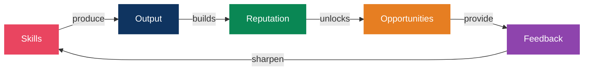
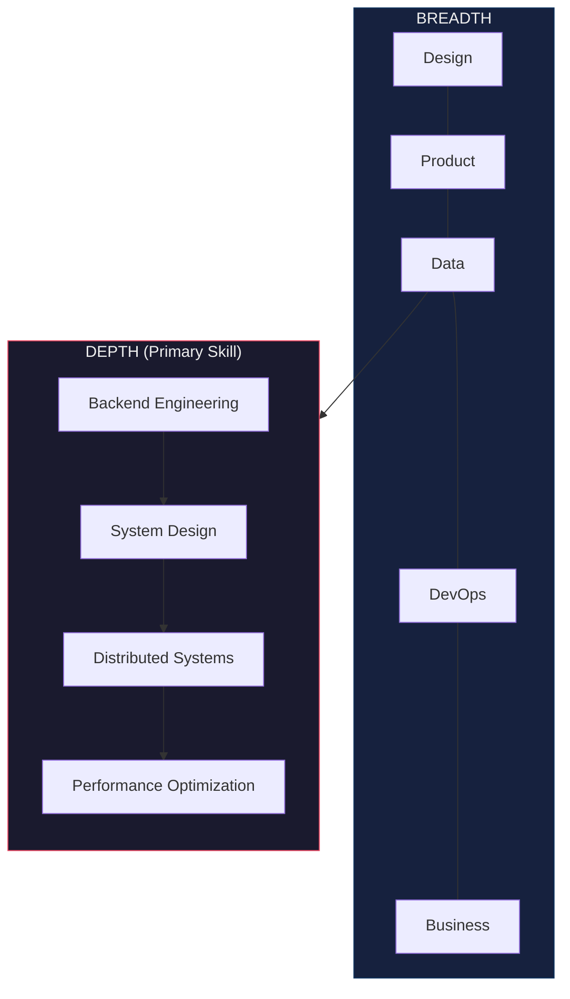
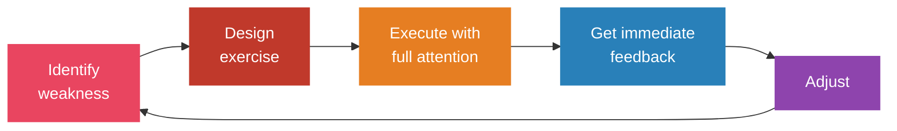
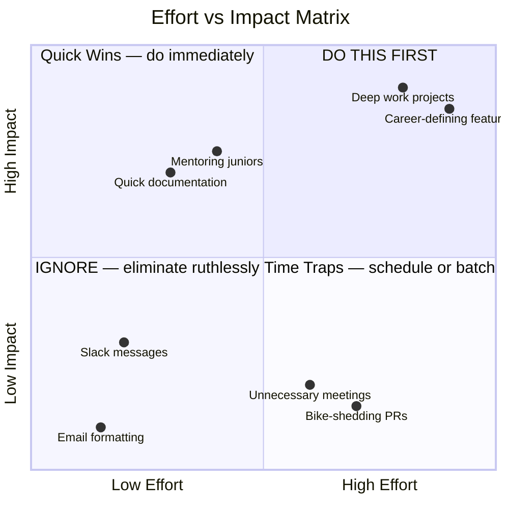
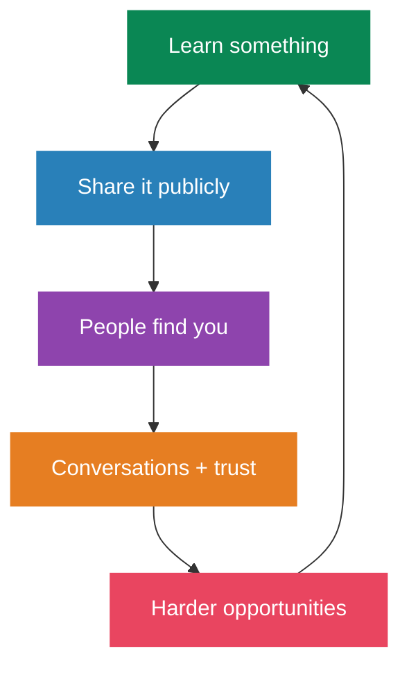
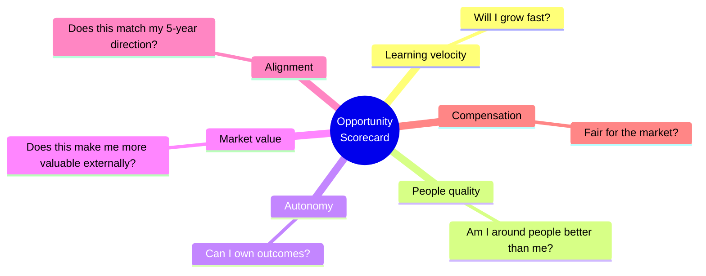

# Career Growth System

> Your career is not a ladder. It's a portfolio of bets, skills, and relationships that compound over time.

## The Growth Framework

> The flywheel: better skills → better output → more visibility → more opportunities → harder problems → better skills

## Skill Acquisition Protocol

### The T-Shape Model

Go deep in 1-2 areas, then broad across adjacent skills.

### Deliberate Practice (Not Just Reps)

> 10,000 hours of autopilot = mediocrity. 1,000 hours of deliberate practice = elite.

## Leverage: Work on the Right Things

Not all work compounds equally. Prioritize high-leverage activities.

## Building in Public

Visibility compounds. Your best work means nothing if nobody knows about it.

- Write about what you learn (blog, Twitter/X, LinkedIn)
- Share your process, not just results
- Open-source your side projects
- Speak at meetups (start small, local)
- Help others publicly — it builds trust and reach

## Networking That Actually Works

Forget "networking events." Build real relationships.

1. **Give first**: Help people with no expectation of return
2. **Be specific**: "I'm working on X" beats "I'm a developer"
3. **Follow up**: One coffee meeting means nothing without follow-up
4. **Curate your circle**: You are the average of the 5 people you spend the most time with
5. **Weak ties matter**: Your next opportunity comes from acquaintances, not close friends (Granovetter's research)

## Career Decision Framework

When evaluating opportunities, rate each 1-10:

| Career Stage | Maximize |
|---|---|
| Early career | Learning velocity |
| Mid career | Leverage + autonomy |
| Late career | Impact + alignment |

## Weekly Career Review (30 min, Sunday)

- What did I learn this week?
- What high-leverage work did I do?
- What low-value work should I eliminate?
- Who did I help? Who helped me?
- What's my #1 priority next week?

## References

- Cal Newport — *So Good They Can't Ignore You*
- Naval Ravikant — *The Almanack of Naval Ravikant*
- Paul Graham — Essays (paulgraham.com)
- Patrick McKenzie (patio11) — Career advice essays
- Sahil Bloom — Career growth frameworks (Twitter/X, newsletter)
