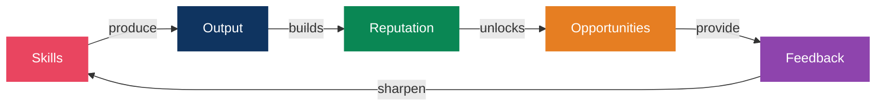
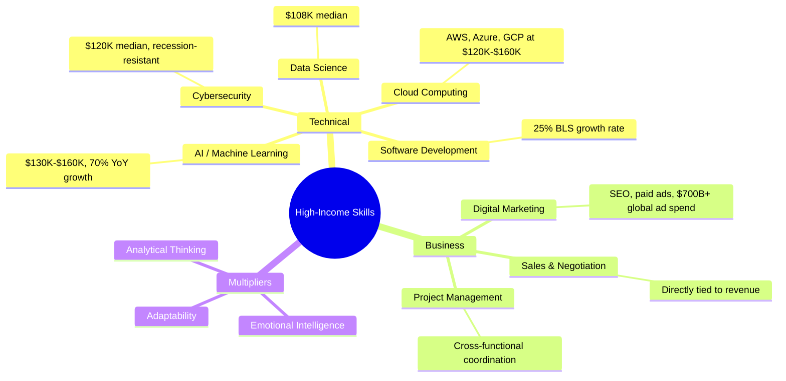
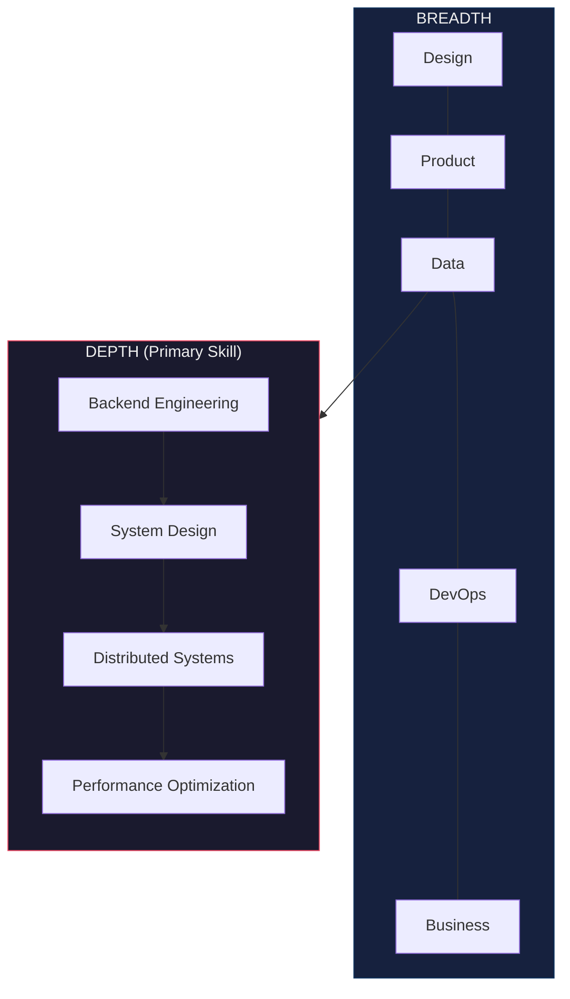
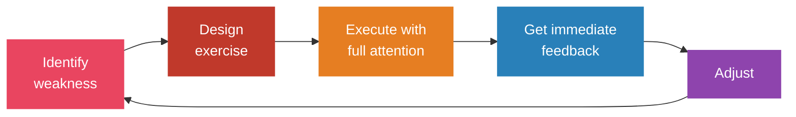
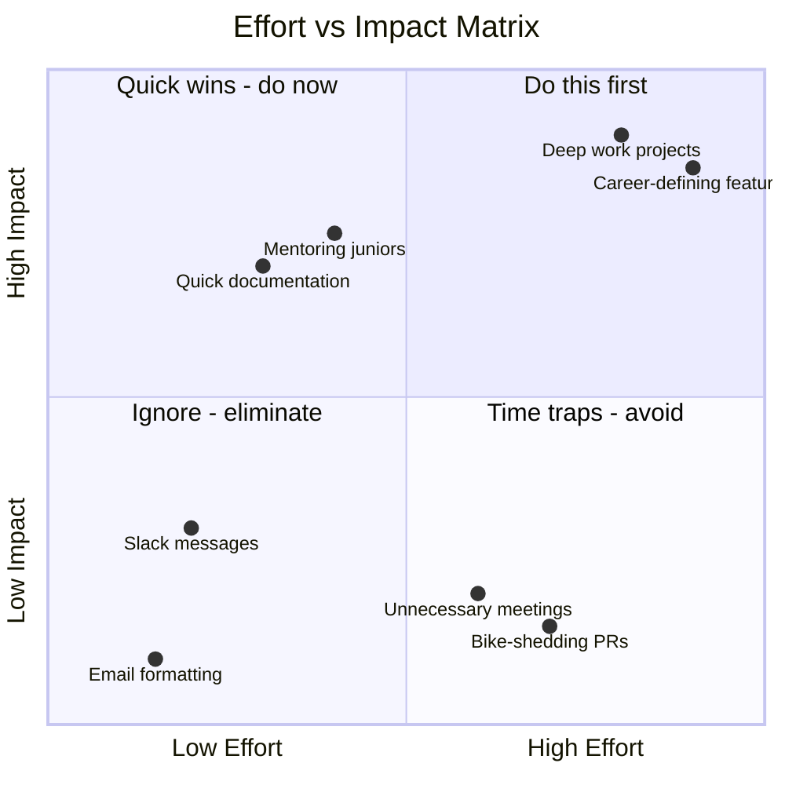
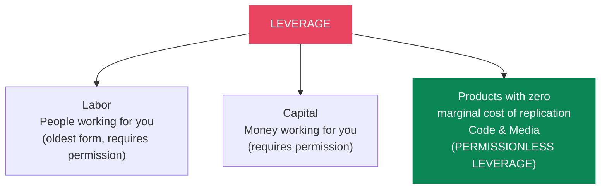
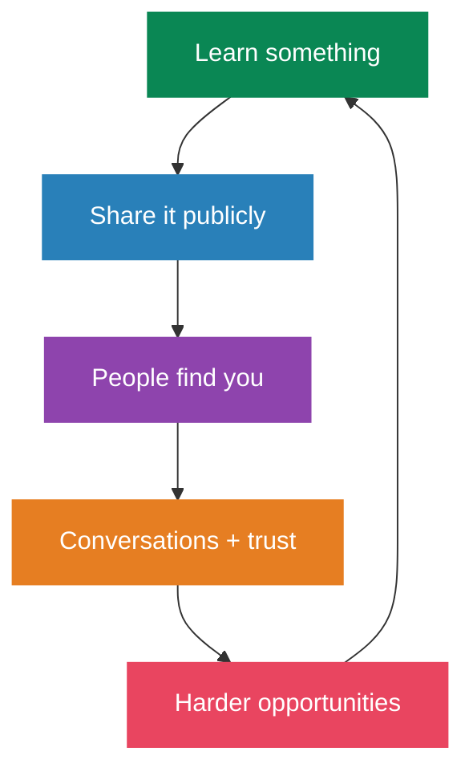
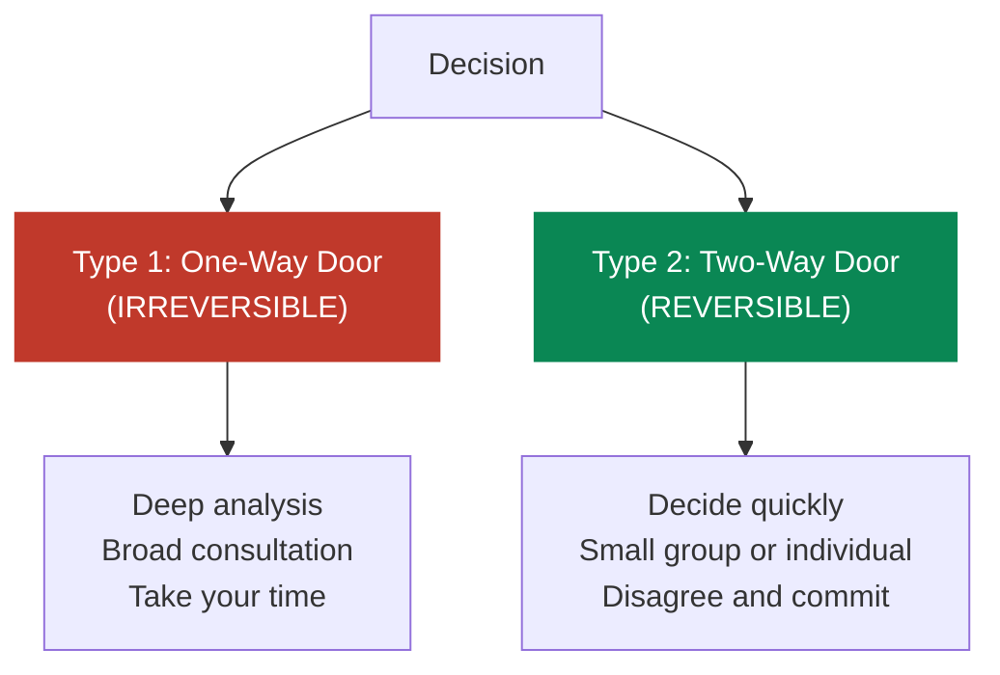
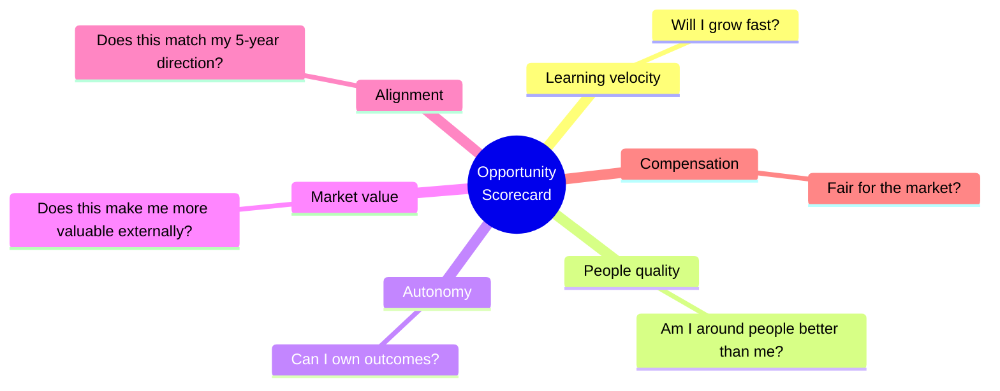

# Career growth system

What carries between jobs is the skills you built and the people who know your work. This is how I try to build both on purpose instead of by accident.

## The growth framework

---

## Skill acquisition

### High-income skills (2024-2025)

Pick one technical skill (AI/ML or cybersecurity) and pair it with one business skill (sales or marketing). Plenty of people have one half. The overlap is where you stop being interchangeable.

### The T-shape model

Go deep in one or two areas, then broad across the adjacent ones.

### Deliberate practice, not just reps

> Ten thousand hours on autopilot buys you ten thousand hours of the same mistake. A thousand hours with attention and feedback beats it.

---

## Leverage: work on the right things

Not all work compounds equally, so prioritize the work that does.

### Naval Ravikant's three forms of leverage

> Specific knowledge is found by pursuing your genuine curiosity. If society can train you for it, it can train someone else to replace you. (Naval Ravikant)

---

## Building in public

Visibility compounds. Your best work means nothing if nobody knows about it.

### What works in 2025

Niche down harder than feels comfortable. Being the person people call about one specific problem beats being generally competent at everything.

There are already more personal brands than anyone needs. What's short supply is someone who obviously has a reason for doing it beyond attention.

Consistency beats virality: three to five posts a week on one platform, and lead with something useful. Share the failures too, not just the wins. Watching someone work through a problem builds more trust than a polished result does.

Short-form buys reach, long-form builds authority, so run both. In practice that means LinkedIn for professional writing, X for real-time building in public, and YouTube or a newsletter for the long-form work that keeps paying out.

---

## Negotiation (research-backed)

### The science

Anchoring is real. Candidates who asked for $100K were offered an average of $35,385, against $32,463 in the control group. The first number sets the frame, so make sure it's yours.

Bring it up first. Studies show candidates who raise salary before the employer does tend to earn more.

Collaborating beats compromising. Compromising and accommodating strategies were not linked to salary gains at all. Problem-solving for mutual benefit was.

### Specific tactics

1. Ask 5-15% above your target. It leaves room to move and still reads as informed.
2. Use ranges rather than a single number, framed with market data.
3. Start early. Begin salary conversations three to four months before you need an answer.
4. Negotiate the whole package. If salary is capped, go after signing bonus, equity, remote flexibility, PTO, title, or professional development budget.
5. Never take the first offer. It's the floor.

---

## Cold outreach and networking (2025)

### What works

Personalized first lines lift response rates by 2-3x. Leading with value (a mini audit, a template, some data) gets 2.5x more responses than selling directly.

Use more than one channel. LinkedIn, then email, then a call. Three or more channels yields roughly 19% engagement. LinkedIn cold messages get 7-15% reply rates, about double typical cold email, and highly personalized sequences push past 25%.

Tuesday is the best day at 24.9% engagement, with Monday behind it. 62.5% of opens happen between 9 AM and 3 PM.

### For genuine networking, not sales

1. Comment meaningfully on someone's work for two or three weeks before you DM them.
2. Offer something specific: an introduction, a resource, real feedback on what they made.
3. Keep the first message under three sentences.
4. Give first, without expecting anything back.
5. Weak ties matter. Your next opportunity comes from acquaintances rather than close friends (Granovetter).
6. Curate your circle. You're the average of the five people you spend the most time with.

---

## Decision-making frameworks

### Bezos: two-way doors

> Most decisions are Type 2 and get treated like Type 1. That's where the slow execution comes from.

### Other frameworks

| Framework | When to use | How |
|---|---|---|
| **Regret Minimization** (Bezos) | Major life decisions | Project to age 80: "Will I regret not trying this?" |
| **10/10/10 Rule** (Suzy Welch) | Emotional decisions | How will I feel in 10 minutes? 10 months? 10 years? |
| **Inversion** (Munger) | Strategy | Ask "What would guarantee failure?" and avoid those things |
| **Second-Order Thinking** | Complex decisions | Ask "And then what?" at least 3 levels deep |
| **Eisenhower Matrix** | Daily prioritization | Urgent/important grid. Do, schedule, delegate, or eliminate |

---

## Mental models from top performers

### Charlie Munger: latticework

> "80 or 90 important models will carry about 90% of the freight in making you a worldly-wise person."

Draw from psychology, economics, physics and biology rather than thinking inside one domain.

Inversion: what would guarantee failure? Avoid that. Second-order thinking: and then what? Circle of competence: know what you know, and more importantly what you don't.

### Elon Musk: first principles

Break the problem down to fundamental truths and reason up from there. At SpaceX, instead of accepting that rockets cost $65M, he asked what rockets are made of. Raw materials came to roughly 2% of the industry price, so they built rockets in-house at a fraction of the cost.

### Naval Ravikant: compound interest applies to everything

> "Compound interest applies to relationships, learning, and reputation, not just money."

Seek wealth, meaning assets that earn while you sleep, rather than money or status. Status is zero-sum. Wealth creation isn't. Specific knowledge plus leverage plus accountability is the equation.

---

## Career decision framework

When evaluating an opportunity, rate each of these 1-10:

| Career stage | Maximize |
|---|---|
| Early career | Learning velocity |
| Mid career | Leverage + autonomy |
| Late career | Impact + alignment |

---

## Weekly career review (30 min, Sunday)

- What did I learn this week?
- What high-leverage work did I do?
- What low-value work should I cut?
- Who did I help? Who helped me?
- What's my number one priority next week?

## References

- Cal Newport, *So Good They Can't Ignore You*
- Naval Ravikant, *The Almanack of Naval Ravikant*
- Paul Graham, essays (paulgraham.com)
- Charlie Munger, *Poor Charlie's Almanack*
- James Clear, mental models (jamesclear.com/mental-models)
- Patrick McKenzie (patio11), career advice essays
- Sahil Bloom, career growth frameworks (newsletter)
- Harvard PON, salary negotiation research
- University of Idaho, anchoring effect study
- Granovetter, "The Strength of Weak Ties"
- Coursera, IMD, Nexford, 2025 high-income skills data
