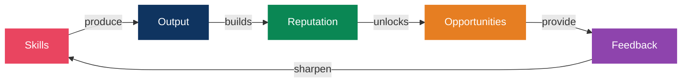
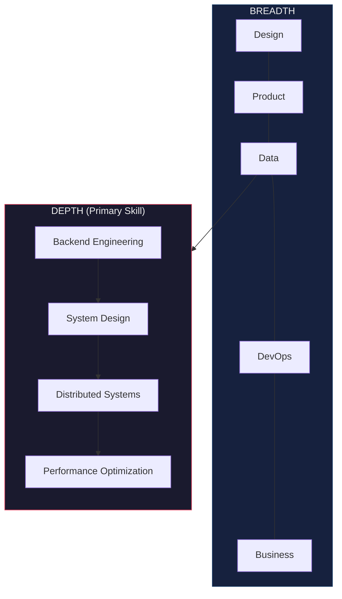
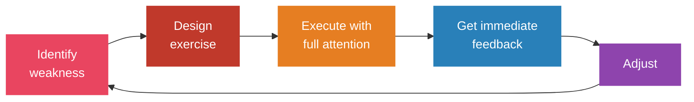
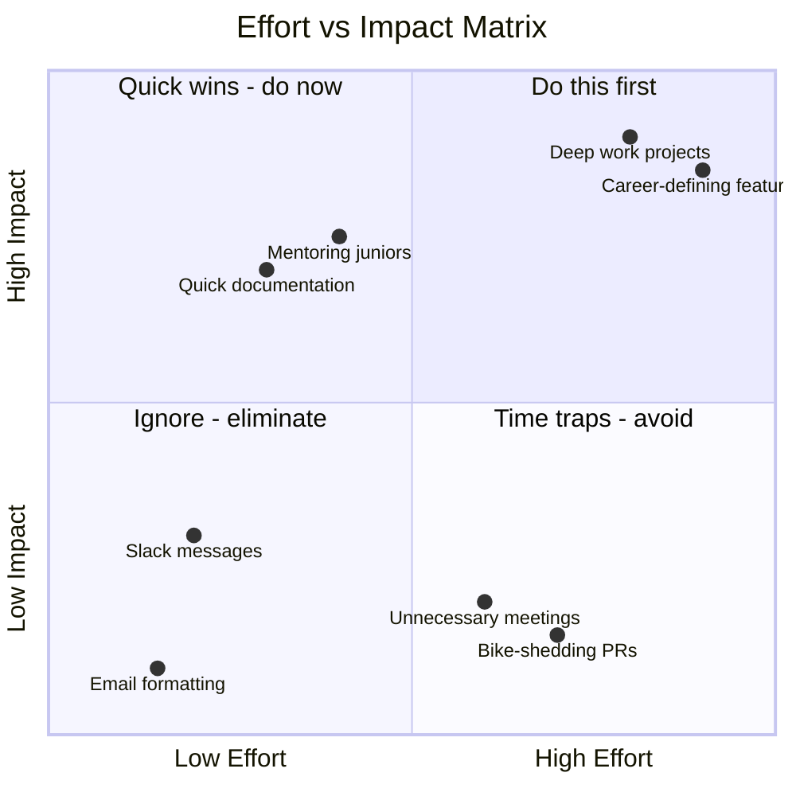
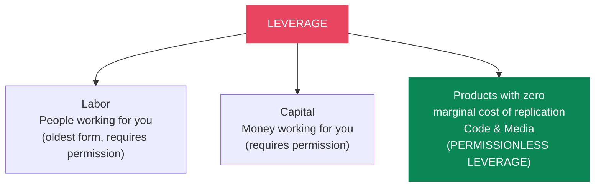
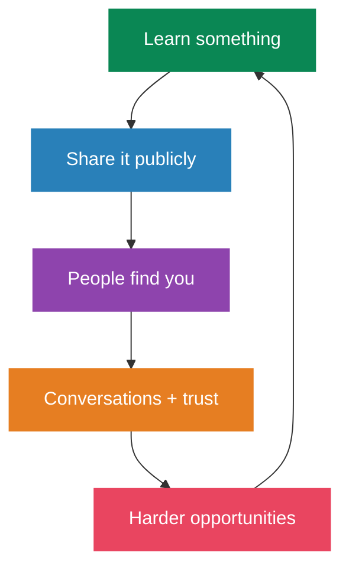
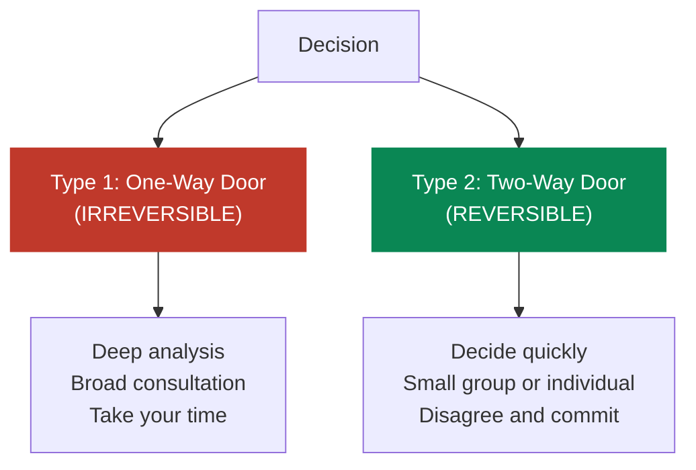
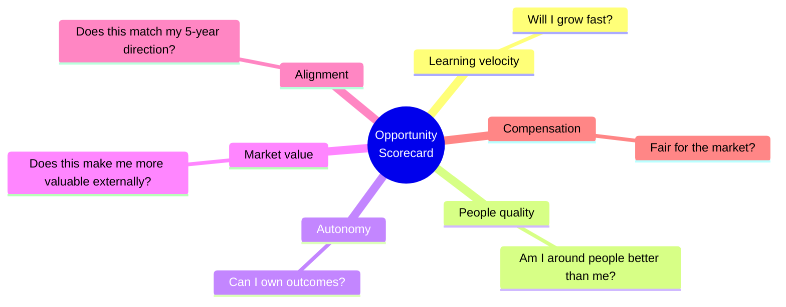

# Career Growth System

> Your career is not a ladder. It's a portfolio of bets, skills, and relationships that compound over time.

## The Growth Framework

> The flywheel: better skills → better output → more visibility → more opportunities → harder problems → better skills

---

## Skill Acquisition

### High-Income Skills (2024-2025)

> **Strategy**: Pick one technical skill (AI/ML or cybersecurity) and pair it with one business skill (sales or marketing). The intersection is where the highest leverage sits.

### The T-Shape Model

Go deep in 1-2 areas, then broad across adjacent skills.

### Deliberate Practice (Not Just Reps)

> 10,000 hours of autopilot = mediocrity. 1,000 hours of deliberate practice = elite.

---

## Leverage: Work on the Right Things

Not all work compounds equally. Prioritize high-leverage activities.

### Naval Ravikant's 3 Forms of Leverage

> **Specific knowledge** is found by pursuing your genuine curiosity. If society can train you for it, it can train someone else to replace you. — Naval Ravikant

---

## Building in Public

Visibility compounds. Your best work means nothing if nobody knows about it.

### What Works in 2025

- **Niche down aggressively** — be the go-to expert for a specific challenge, not a generalist
- **Purpose over self-promotion** — the market is saturated with personal brands but starving for purpose-driven voices
- **Consistency beats virality** — 3-5x/week on one platform, value-first approach
- **Document your process** — share wins AND failures. Building in public builds trust faster than polished outcomes
- **Mix short-form (reach) with long-form (authority)** — tweets get eyeballs, blog posts/videos build depth
- **Platform strategy**: LinkedIn for professional thought leadership, X/Twitter for real-time building in public, YouTube/Newsletter for compounding long-form content

---

## Negotiation (Research-Backed)

### The Science

- **Anchoring effect**: Candidates who asked for $100K were offered an average of $35,385 vs $32,463 in the control group. The first number anchors everything — always anchor high
- **Initiate the conversation**: Studies show candidates who bring up salary first tend to earn more
- **Collaborating > Compromising**: Compromising and accommodating strategies were NOT linked to salary gains. Problem-solving for mutual benefit yields the best outcomes

### Specific Tactics

1. **Ask 5-15% above your target** — gives room to negotiate while appearing informed
2. **Use ranges, not single numbers** — frame your ask using market data ranges
3. **Start early** — begin salary conversations 3-4 months before you need an answer
4. **Negotiate the total package** — if salary is capped, negotiate signing bonus, equity, remote flexibility, PTO, title, professional development budget
5. **Never accept the first offer** — it's almost always the floor, not the ceiling

---

## Cold Outreach & Networking (2025)

### What Works

- **Personalized first lines** increase response rates by 2-3x
- **Value-first approach** (mini audits, templates, data) receives 2.5x more responses than direct selling
- **Multi-channel**: LinkedIn → email → call. 3+ channels yields ~19% engagement rate
- **LinkedIn cold messages**: 7-15% reply rates (2x typical cold email). Highly personalized sequences push past 25%
- **Best day**: Tuesday (24.9% engagement), then Monday. 62.5% of opens between 9 AM - 3 PM

### For Genuine Networking (Not Sales)

1. Comment meaningfully on someone's content for 2-3 weeks before DMing
2. Offer something specific: an introduction, a resource, or genuine feedback on their work
3. Keep initial messages under 3 sentences
4. **Give first**: Help people with no expectation of return
5. **Weak ties matter**: Your next opportunity comes from acquaintances, not close friends (Granovetter's research)
6. **Curate your circle**: You are the average of the 5 people you spend the most time with

---

## Decision-Making Frameworks

### Bezos: Two-Way Doors

> **Most decisions are Type 2**, but people treat them like Type 1 — causing slow execution and missed opportunities.

### Other Frameworks

| Framework | When to Use | How |
|---|---|---|
| **Regret Minimization** (Bezos) | Major life decisions | Project to age 80: "Will I regret not trying this?" |
| **10/10/10 Rule** (Suzy Welch) | Emotional decisions | How will I feel in 10 minutes? 10 months? 10 years? |
| **Inversion** (Munger) | Strategy | Ask "What would guarantee failure?" and avoid those things |
| **Second-Order Thinking** | Complex decisions | Ask "And then what?" at least 3 levels deep |
| **Eisenhower Matrix** | Daily prioritization | Urgent/important grid. Do, schedule, delegate, or eliminate |

---

## Mental Models from Top Performers

### Charlie Munger — Latticework

> "80 or 90 important models will carry about 90% of the freight in making you a worldly-wise person."

Draw from multiple disciplines (psychology, economics, physics, biology) rather than thinking within a single domain.

- **Inversion**: What would guarantee failure? Avoid those things
- **Second-Order Thinking**: "And then what?"
- **Circle of Competence**: Know what you know — and more importantly, what you don't

### Elon Musk — First Principles

Break problems to fundamental truths and reason up. At SpaceX: instead of accepting rockets cost $65M, asked "What are rockets made of?" Raw materials were ~2% of industry price → built rockets in-house at a fraction of cost.

### Naval Ravikant — Compound Interest Applies to Everything

> "Compound interest applies to relationships, learning, and reputation — not just money."

- Seek **wealth** (assets that earn while you sleep), not money or status
- Status is zero-sum; wealth creation is positive-sum
- Specific knowledge + leverage + accountability = wealth

---

## Career Decision Framework

When evaluating opportunities, rate each 1-10:

| Career Stage | Maximize |
|---|---|
| Early career | Learning velocity |
| Mid career | Leverage + autonomy |
| Late career | Impact + alignment |

---

## Weekly Career Review (30 min, Sunday)

- What did I learn this week?
- What high-leverage work did I do?
- What low-value work should I eliminate?
- Who did I help? Who helped me?
- What's my #1 priority next week?

## References

- Cal Newport — *So Good They Can't Ignore You*
- Naval Ravikant — *The Almanack of Naval Ravikant*
- Paul Graham — Essays (paulgraham.com)
- Charlie Munger — *Poor Charlie's Almanack*
- James Clear — Mental models (jamesclear.com/mental-models)
- Patrick McKenzie (patio11) — Career advice essays
- Sahil Bloom — Career growth frameworks (newsletter)
- Harvard PON — Salary negotiation research
- University of Idaho — Anchoring effect study
- Granovetter — "The Strength of Weak Ties"
- Coursera, IMD, Nexford — 2025 high-income skills data
