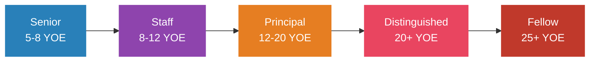
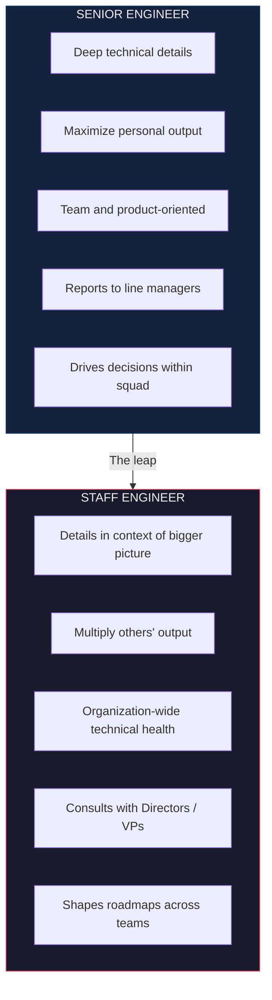
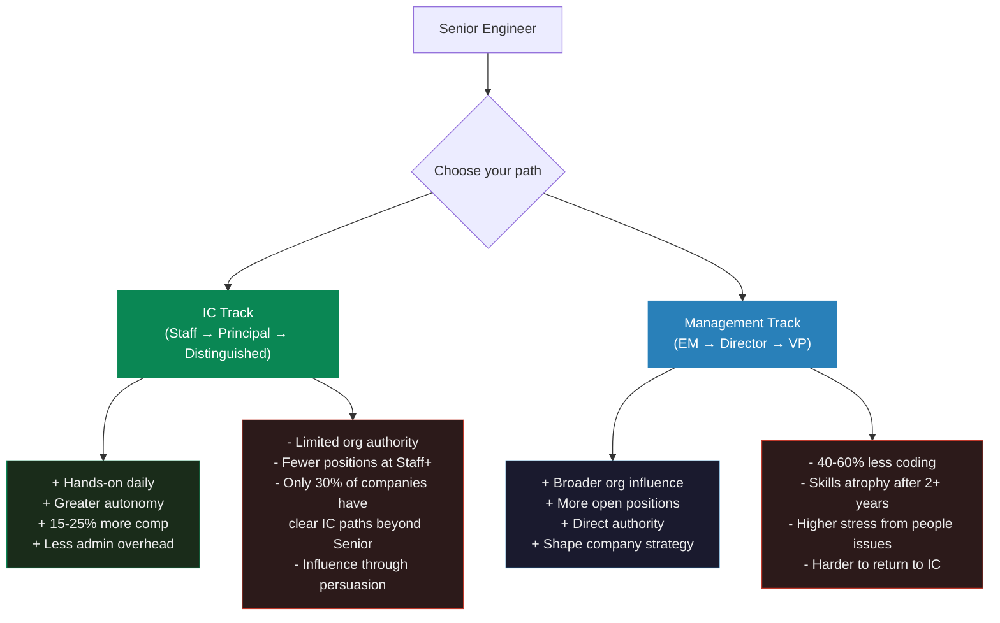
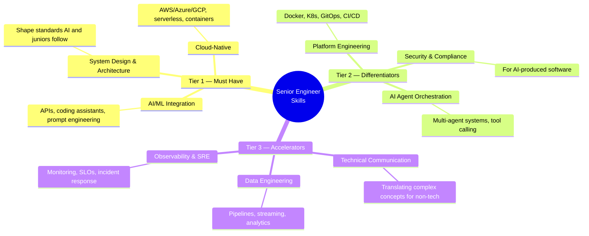

# Senior Engineer Career Roadmap

> The gap between Senior and Staff is not about writing better code. It's about multiplying the output of everyone around you.

## The Career Ladder

| Level | Scope | Key Shift | Management Equivalent |
|-------|-------|-----------|----------------------|
| **Senior** | Team / product area | Maximize your own output | Tech Lead |
| **Staff** | Multi-team / org-wide | Multiply others' output | Engineering Manager |
| **Principal** | Company-wide | Shape technical strategy | Director of Engineering |
| **Distinguished** | Company / industry-wide | Define industry practices | VP Engineering |
| **Fellow** | Industry-defining | Advance the field | SVP / CTO |

> Only ~15-20% of seniors make Staff. There's no standardized leveling across companies — Google's L6 ≠ Meta's E6. Use [Levels.fyi](https://www.levels.fyi/blog/swe-level-framework.html) for cross-company comparison.

---

## What Separates Each Level

### Senior → Staff (3-5 years at Senior)

This is where most engineers plateau. The shift is fundamental:

**How to make the leap:**
- Lead cross-team technical initiatives
- Write RFCs and design docs that become templates others follow
- Mentor senior engineers (not just juniors)
- Demonstrate org-wide impact — not just shipping features but improving how the org ships
- Present at internal tech talks, lead architecture reviews
- Set technical standards and coding practices

### Staff → Principal (4-7 years at Staff)

Requires fundamentally different skills beyond technical prowess:
- Cross-organizational collaboration
- Business mindset — understanding revenue, cost, and strategy implications
- Architecture decisions spanning multiple domains
- Industry recognition (conference talks, publications, open source)

### Principal → Distinguished (rare, 5-10+ years)

Impact must span the entire company or industry. Distinguished engineers are typically published authors, keynote speakers, and recognized industry experts.

---

## IC Track vs Management Track

> **70% of developers prefer staying technical long-term.** Switch to management only if you genuinely enjoy mentoring, hiring, and organizational design. Moving IC → management is easier than the reverse.

---

## Salary Benchmarks (2024-2025, Levels.fyi)

> These are top-payer snapshots and drift quickly — top-of-market numbers have crept higher since (e.g. OpenAI and Databricks now sit well above the figures below). Treat them as a directional floor for the top tier, and check [Levels.fyi](https://www.levels.fyi/) for live data.

### Senior Engineer Total Comp (Top Payers)

| Company | Level | Median Total Comp |
|---------|-------|-------------------|
| Databricks | L5 | $600,000 |
| Roblox | IC4 | $532,000 |
| Netflix | L5 | $520,000 |
| StubHub | L5 | $500,000 |

### Staff Engineer Total Comp

| Company | Level | Median Total Comp |
|---------|-------|-------------------|
| OpenAI | L5 | $860,000 |
| Databricks | L6 | $815,000 |
| Broadcom | ICB6 | $796,000 |
| Snowflake | IC4 | $750,000 |

### Principal Engineer Total Comp

| Company | Level | Median Total Comp |
|---------|-------|-------------------|
| Meta | E7 | $1,455,000 |
| Oracle | IC-6 | $1,435,000 |
| Uber | Sr. Staff | $940,000 |
| Airbnb | G11 | $924,000 |

> At senior levels, base salary is only 40-60% of total comp. Stock/equity dominates. AI/ML specialization commands a 10-30% premium.

---

## Technical Skills That Matter in 2025

> **Addy Osmani (Google):** The role of the senior engineer is shifting from "person who writes the most code" to "person who ensures the right code gets written."

---

## Building Your Tech Brand

### Internal (Most Important for Promotions)

- Write RFCs and design docs that become templates
- Lead architecture reviews and set technical standards
- Mentor broadly — not just your team
- Present at internal tech talks and lunch-and-learns

### External (Career Insurance)

- **Blog**: Share solutions to hard problems, architectural decisions, lessons learned. 1-2 posts/month
- **Conferences**: Start with local meetups and lightning talks → regional conferences → keynotes
- **Open source**: Contribute to projects you use professionally. Documentation contributions are underrated
- **Build in public**: Share your journey on LinkedIn/X/dev.to

### Communities

- [StaffEng.com](https://staffeng.com/) — Stories from Staff, Principal, and Distinguished engineers
- [Rands Leadership Slack](https://randsinrepose.com/welcome-to-rands-leadership-slack/) — #staff-principal-engineering channel
- [LeadDev](https://leaddev.com/) — Annual StaffPlus conference
- [The Pragmatic Engineer](https://www.pragmaticengineer.com/) — #1 newsletter for senior engineers

---

## System Design Preparation

### Best Resources (Ranked)

1. **Grokking the Modern System Design Interview** (Educative.io)
2. **ByteByteGo** by Alex Xu — *System Design Interview Vol. 1 & 2*
3. **The System Design Primer** (GitHub, by Donne Martin) — free
4. **InterviewReady.io** — purpose-built for tight timelines
5. **Interviewing.io's Senior Engineer Guide**

### The RESHADED Framework (45-minute interview)

### Patterns to Master

Microservices, event-driven architectures, sharding, CQRS, distributed caching, rate limiting, consistent hashing, leader election, pub/sub messaging.

---

## Remote Work Optimization

Async-first remote teams report **22% increase in engineering productivity**. 78% of dev teams now operate across multiple time zones.

**Senior remote engineer best practices:**
- Write self-contained RFCs that reduce synchronous meetings
- Use Loom for complex explanations instead of live meetings
- Establish clear Slack norms around response expectations
- Combine structured sync rituals (weekly syncs, retros) with async-first defaults
- Measure by output, not hours

> The skills that make you effective async — clear thinking, good writing, self-direction — are exactly what organizations value in Staff+ engineers.

---

## Side Project & Open Source Strategy

- Contribute to projects you use professionally — builds relevant expertise and visibility
- Focus on high-growth areas: AI tooling, developer infrastructure, observability
- Documentation contributions are high visibility, low barrier
- Build complete, deployed projects — not half-finished experiments
- Use side projects to learn emerging tech before it's needed at work

## References

- Tanya Reilly — *The Staff Engineer's Path*
- Will Larson — *Staff Engineer* + *An Elegant Puzzle*
- Camille Fournier — *The Manager's Path*
- [StaffEng.com](https://staffeng.com/) — Staff+ career stories
- [The Pragmatic Engineer](https://www.pragmaticengineer.com/) — Newsletter
- [LeadDev](https://leaddev.com/) — Engineering leadership
