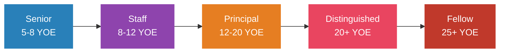
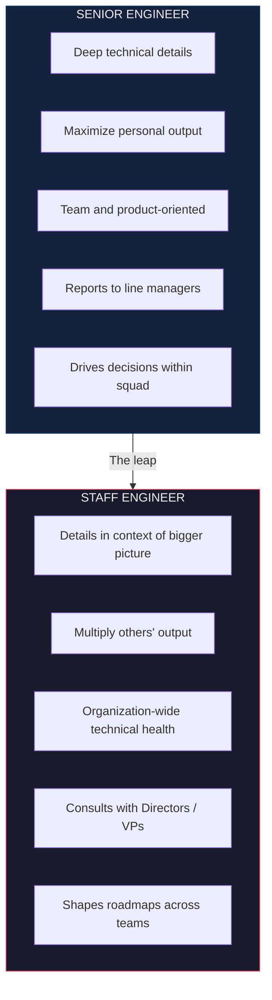
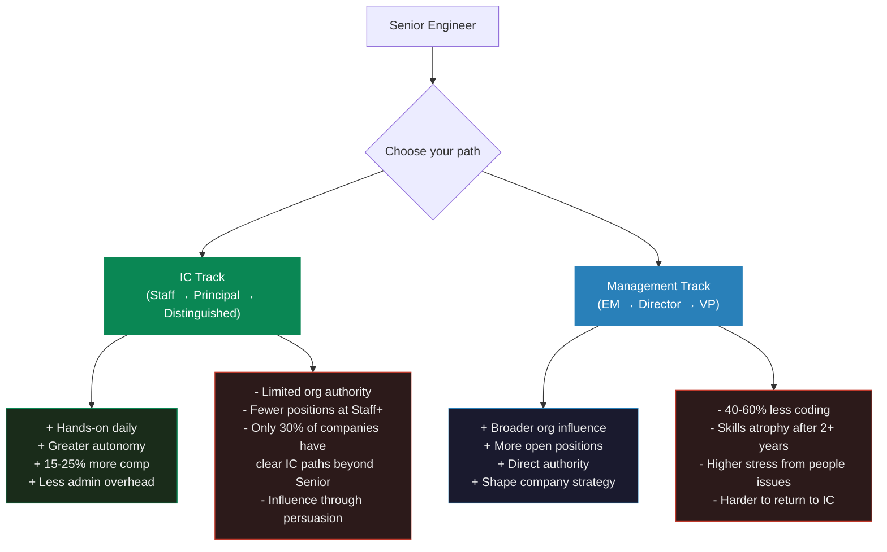
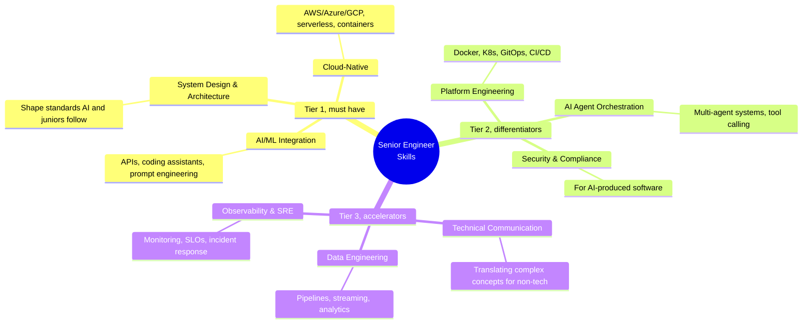

# Senior engineer career roadmap

The gap between Senior and Staff is measured in what happens to everyone else's output when you're on the team.

## The career ladder

| Level | Scope | Key shift | Management equivalent |
|-------|-------|-----------|----------------------|
| **Senior** | Team / product area | Maximize your own output | Tech Lead |
| **Staff** | Multi-team / org-wide | Multiply others' output | Engineering Manager |
| **Principal** | Company-wide | Shape technical strategy | Director of Engineering |
| **Distinguished** | Company / industry-wide | Define industry practices | VP Engineering |
| **Fellow** | Industry-defining | Advance the field | SVP / CTO |

> Only about 15-20% of seniors make Staff. Leveling isn't standardized either, so Google's L6 is not Meta's E6. Use [Levels.fyi](https://www.levels.fyi/blog/swe-level-framework.html) to compare across companies.

---

## What separates each level

### Senior to Staff (3-5 years at Senior)

This is where most engineers plateau, because the job changes rather than getting harder.

How to make the leap:

- Lead technical initiatives that cross team boundaries
- Write RFCs and design docs other people end up copying
- Mentor senior engineers, not only juniors
- Show org-wide impact by improving how the org ships, not just by shipping
- Present at internal tech talks and lead architecture reviews
- Set the technical standards and coding practices

### Staff to Principal (4-7 years at Staff)

Technical ability stops being the differentiator here. What matters is cross-organizational collaboration, a business mindset (revenue, cost, strategy), architecture decisions spanning several domains, and recognition outside the company through talks, publications, or open source.

### Principal to Distinguished (rare, 5-10+ years)

Impact has to span the whole company or the industry. Distinguished engineers are usually published authors, keynote speakers, and recognized experts in their field.

---

## IC track vs management track

> 70% of developers prefer to stay technical long-term. Switch to management only if you actually enjoy mentoring, hiring, and organizational design. Going IC to management is easier than coming back.

---

## Salary benchmarks (2024-2025, Levels.fyi)

> These are top-payer snapshots and they drift fast. Top-of-market numbers have crept higher since, with OpenAI and Databricks now sitting well above the figures below. Treat these as a directional floor for the top tier and check [Levels.fyi](https://www.levels.fyi/) for live data.

### Senior engineer total comp (top payers)

| Company | Level | Median total comp |
|---------|-------|-------------------|
| Databricks | L5 | $600,000 |
| Roblox | IC4 | $532,000 |
| Netflix | L5 | $520,000 |
| StubHub | L5 | $500,000 |

### Staff engineer total comp

| Company | Level | Median total comp |
|---------|-------|-------------------|
| OpenAI | L5 | $860,000 |
| Databricks | L6 | $815,000 |
| Broadcom | ICB6 | $796,000 |
| Snowflake | IC4 | $750,000 |

### Principal engineer total comp

| Company | Level | Median total comp |
|---------|-------|-------------------|
| Meta | E7 | $1,455,000 |
| Oracle | IC-6 | $1,435,000 |
| Uber | Sr. Staff | $940,000 |
| Airbnb | G11 | $924,000 |

> At these levels base salary is only 40-60% of total comp. Stock dominates. AI/ML specialization adds a 10-30% premium.

---

## Technical skills that matter in 2025

> Addy Osmani (Google): the role of the senior engineer is shifting from "person who writes the most code" to "person who ensures the right code gets written."

---

## Building your tech brand

### Internal (this is what gets you promoted)

- Write RFCs and design docs that become templates
- Lead architecture reviews and set technical standards
- Mentor broadly, not just inside your team
- Present at internal tech talks and lunch-and-learns

### External (career insurance)

Blog about the hard problems and the architectural calls you made, roughly one or two posts a month. Start speaking at local meetups and lightning talks, then regional conferences. Contribute to open source projects you already use at work, where documentation contributions are underrated and easy to land. Share the journey on LinkedIn, X, or dev.to.

### Communities

- [StaffEng.com](https://staffeng.com/), stories from Staff, Principal and Distinguished engineers
- [Rands Leadership Slack](https://randsinrepose.com/welcome-to-rands-leadership-slack/), the #staff-principal-engineering channel
- [LeadDev](https://leaddev.com/), and the annual StaffPlus conference
- [The Pragmatic Engineer](https://www.pragmaticengineer.com/), the newsletter most senior engineers end up reading

---

## System design preparation

### Best resources, ranked

1. **Grokking the Modern System Design Interview** (Educative.io)
2. **ByteByteGo** by Alex Xu, *System Design Interview Vol. 1 & 2*
3. **The System Design Primer** (GitHub, by Donne Martin), free
4. **InterviewReady.io**, built for tight timelines
5. **Interviewing.io's Senior Engineer Guide**

### The RESHADED framework (45-minute interview)

### Patterns to master

Microservices, event-driven architectures, sharding, CQRS, distributed caching, rate limiting, consistent hashing, leader election, pub/sub messaging.

---

## Remote work optimization

Async-first remote teams report a 22% increase in engineering productivity, and 78% of dev teams now work across multiple time zones.

For a senior engineer working remote:

- Write self-contained RFCs so fewer meetings are needed
- Record a Loom for complex explanations instead of scheduling a call
- Agree on Slack norms for response expectations
- Keep a few structured sync rituals (weekly sync, retro) on top of async defaults
- Measure by output rather than hours

> The skills that make you effective async, clear thinking and good writing and self-direction, are the same ones organizations look for in Staff+ engineers.

---

## Side project and open source strategy

- Contribute to projects you already use at work. The expertise is relevant and the visibility is real.
- Aim at high-growth areas: AI tooling, developer infrastructure, observability.
- Documentation contributions are high visibility and low barrier.
- Finish and deploy things. Half-built experiments don't count.
- Use side projects to learn emerging tech before you need it at work.

## References

- Tanya Reilly, *The Staff Engineer's Path*
- Will Larson, *Staff Engineer* and *An Elegant Puzzle*
- Camille Fournier, *The Manager's Path*
- [StaffEng.com](https://staffeng.com/), Staff+ career stories
- [The Pragmatic Engineer](https://www.pragmaticengineer.com/), newsletter
- [LeadDev](https://leaddev.com/), engineering leadership
