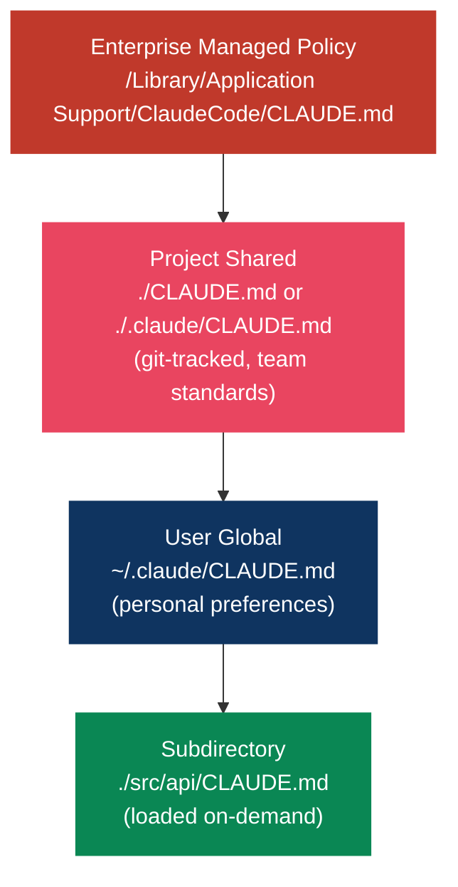
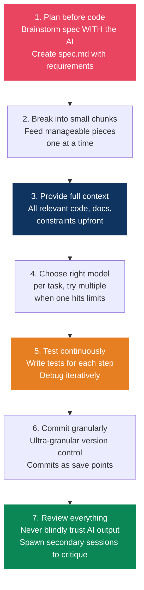
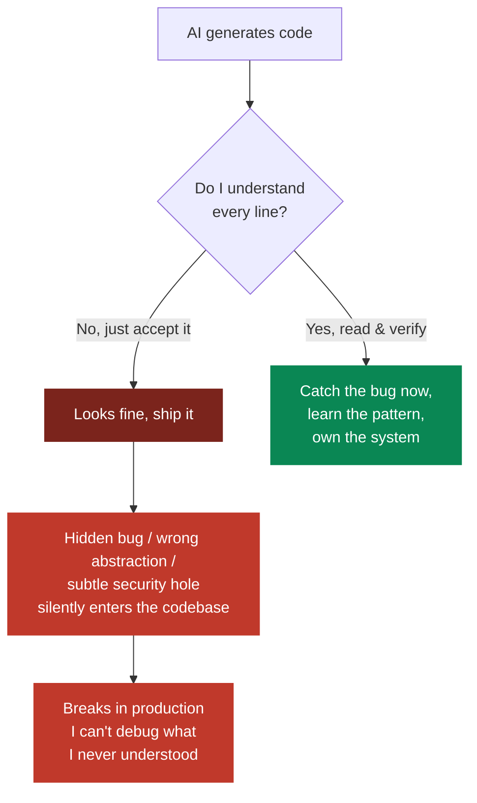

# Developer setup and AI workflows

> AI produces volume. The scarce skill is reviewing it well.

## Claude Code setup

### CLAUDE.md hierarchy



Keep each file under about 200 lines, since adherence drops as they get longer. Use `@path/to/import` to pull in other files, up to five hops. Run `/init` to generate a first draft from the codebase. Put topic-specific instructions in `.claude/rules/`, where path-scoped rules only load when Claude touches matching files.

### Keyboard shortcuts

| Shortcut | Function |
|----------|----------|
| `!` | Bash mode prefix (run shell directly) |
| `@` | Mention files/folders for context |
| `Esc` | Interrupt Claude |
| `Esc+Esc` | Open rewind/undo menu |
| `Option+T` / `Alt+T` | Toggle extended thinking |
| `Ctrl+O` | Verbose output (see reasoning) |
| `Shift+Tab` | Auto-accept mode |
| `Shift+Tab+Tab` | Plan mode |

### Custom commands

```bash
# Create parameterized commands
echo 'Fix issue #$ARGUMENTS per coding standards' > .claude/commands/fix-issue.md
# Usage: /fix-issue 123

echo 'Review the PR at $ARGUMENTS for security issues' > .claude/commands/security-review.md
# Usage: /security-review https://github.com/org/repo/pull/42
```

### Hooks

Prompt instructions are a request. Hooks actually run.

Auto-format on file write:

```json
{
  "hooks": {
    "PostToolUse": [{
      "matcher": "Write|Edit",
      "hooks": [{
        "type": "command",
        "command": "npx prettier --write \"$CLAUDE_FILE_PATH\""
      }]
    }]
  }
}
```

Block dangerous commands:

```json
{
  "hooks": {
    "PreToolUse": [{
      "matcher": "Bash",
      "hooks": [{
        "type": "command",
        "command": ".claude/hooks/block-destructive.sh"
      }]
    }]
  }
}
```

Exit code 0 allows, exit code 2 blocks.

### MCP servers

```bash
# Essential trio (covers 90% of dev needs)
claude mcp add github -- npx -y @github/github-mcp-server      # GitHub's official server
claude mcp add playwright -- npx -y @playwright/mcp            # Microsoft-maintained
claude mcp add context7 -- npx -y @upstash/context7-mcp        # Upstash, live library docs

# Additional useful servers
claude mcp add brave-search -e BRAVE_API_KEY=xxx -- npx -y @brave/brave-search-mcp-server
claude mcp add postgres -- npx -y @modelcontextprotocol/server-postgres   # community server
```

> Package names drift fast, so check the [MCP servers registry](https://github.com/modelcontextprotocol/servers) before installing. The older `@modelcontextprotocol/server-github` and `server-postgres` packages are archived now in favor of the maintained ones above.

### Permissions

```json
{
  "permissions": {
    "allowedTools": ["Read", "Write(src/**)", "Bash(git *)", "Bash(npm *)"],
    "deny": ["Read(.env*)", "Write(production.config.*)", "Bash(rm *)", "Bash(sudo *)"]
  }
}
```

### Efficiency tips

- Run separate sessions for separate tasks so context doesn't bloat
- `claude --continue` or `claude --resume` to pick up where you left off
- `!npm test` runs shell commands with fewer tokens than asking for it
- `MAX_THINKING_TOKENS=10000` sets the thinking budget
- Git worktrees for parallel development

---

## AI-assisted development workflow

### Addy Osmani's workflow



> AI drafts, engineers decide. 84% of developers now use or plan to use AI tools (Stack Overflow 2025 Developer Survey, up from 76% in 2024), with roughly half using them daily.

### Key principles

Write the spec with the AI before any code exists. Give it everything relevant upfront: code, docs, constraints. Switch models when one stalls, since they're good at different things. Use more than one agent, so something writes while something else critiques and tests. Then review all of it, because the volume is free and the judgment isn't.

---

## Read every line

> The moment you stop reading the code line by line, you stop being the engineer and become a passenger. AI writes the code, but you own it: in review, in production at 3 AM, and in whether you actually understand your own system.

Accepting code you don't understand feels fast. It isn't. You're borrowing time at a high rate, and the debt comes due in the worst possible debugging session.



### Why this matters more, not less, now

AI is a confident bullshitter. It produces plausible code that compiles and usually works, which is exactly what makes the failures dangerous. They aren't syntax errors you'd catch instantly. They're an off-by-one, a wrong default, a swallowed error, an N+1 query, a race condition, or a hallucinated API that happens to exist and does something else.

Volume hides defects. AI raises PR size by around 150%, and more code reviewed less carefully means more bugs getting through. The bottleneck moved from writing to verifying, which makes verification the senior skill. Addy Osmani's framing is that the job is now ensuring the right code gets written.

You can't review what you don't understand. "LGTM" on code you skimmed is theater. If you can't say why each line is there, you rubber-stamped it.

Security and correctness don't degrade gracefully either. A hallucinated package name (slopsquatting), a missing validation, an unsafe default: none of them announce themselves. They sit quietly until someone finds them.

And skill atrophy is real. Every line you accept without understanding is a rep you skipped. Over months, vibe coding erodes the exact judgment you need to catch the AI's mistakes in the first place.

### How to actually do it

1. Read it like a review you're accountable for, because you are. Every line: what does this do, why is it here, what happens at the edges (null, empty, huge, concurrent)?
2. If you don't understand a line, stop. Ask for an explanation, look it up, or rewrite it into something you do understand. Never let an unexplained line survive.
3. Trace the data and the failure paths, not just the happy path. Where does input come from? What's unvalidated? What error is being swallowed?
4. Verify the externals exist and behave as claimed: APIs, library functions, package names, flags. This is where hallucinations hide.
5. Work in small batches. Generate and review chunks you can hold in your head, not 800-line dumps, and commit granularly so each save point is understood.
6. Make the AI justify itself. Why this approach over X? What are the edge cases? What did you assume? A second session reviewing the first one's output catches a surprising amount.
7. Prove it with tests rather than vibes. If you can't write a test for it, you don't understand it well enough yet.

> The rule: if it's in your commit, you can explain every line of it. The keystrokes got cheap. The understanding is the job.

---

## Terminal and CLI setup

### The stack

```bash
# Install everything
brew install ghostty starship zoxide fzf ripgrep bat eza git-delta lazygit gh jq httpie tmux chezmoi
```

### Tool replacements

| Tool | Replaces | Why |
|------|----------|-----|
| **Ghostty** | Terminal.app / iTerm2 | GPU-accelerated, by Mitchell Hashimoto, free |
| **Starship** | Oh-My-Zsh themes | Faster, simpler, more portable prompt |
| **zoxide** | `cd` | Learns directory patterns, <1ms resolve |
| **fzf** | Manual searching | Fuzzy finder for history, files, directories |
| **ripgrep** | `grep` | 10-100x faster, respects .gitignore |
| **bat** | `cat` | Syntax highlighting, git integration |
| **eza** | `ls` | File icons, git status, tree view |
| **delta** | `diff` | Side-by-side comparison, syntax highlighting |
| **lazygit** | `git` CLI | TUI for staging, rebasing, cherry-picking |
| **gh** | Browser GitHub | Covers ~80% of github.com operations |
| **httpie** | `curl` | Human-friendly HTTP client |

### Shell config (~/.zshrc essentials)

```bash
# Starship prompt
eval "$(starship init zsh)"

# Zoxide (smart cd)
eval "$(zoxide init zsh)"

# Fzf (fuzzy finder)
source <(fzf --zsh)

# Aliases
alias ls="eza --icons"
alias cat="bat"
alias g="lazygit"
alias ..="cd .."
alias ...="cd ../.."
```

---

## Dotfiles management

### Chezmoi

```bash
chezmoi init
chezmoi add ~/.zshrc ~/.gitconfig ~/.config/starship.toml
chezmoi cd   # edit templates
chezmoi apply  # deploy changes
chezmoi update  # pull from remote + apply
```

Templates let one set of dotfiles adapt to different machines, secrets stay out of the repo, and it works across platforms.

### What to version control

```
~/.config/
├── starship.toml       # Prompt config
├── ghostty/config      # Terminal config
├── lazygit/config.yml  # Git TUI config
└── bat/config          # Cat replacement config

~/.zshrc                # Shell config
~/.gitconfig            # Git config
~/.claude/
├── CLAUDE.md           # AI assistant instructions
├── settings.json       # Claude Code settings
└── commands/           # Custom slash commands
```

---

## Git workflow

### Trunk-based development

What Google, Meta and most high-velocity teams do: everyone commits to main at least daily, feature branches live hours or days rather than weeks, and feature flags hide the incomplete work.

### Conventional commits

```
<type>: <description>

Types: feat, fix, refactor, docs, test, chore, perf, ci
```

Imperative mood: "Add login", not "Added login". The body explains why, since the diff already covers what.

### Lazygit power moves

- Interactive rebase: squash, fixup, drop and reorder visually with single keypresses
- Fixup commits: `git commit --fixup <hash>` then `git rebase -i --autosquash`
- Cherry-pick across branches: navigate to the commit, press `C`, switch branch, press `V`
- Conflict resolution: built-in merge tool that continues automatically once you're done

---

## CI/CD optimization (GitHub Actions)

Dependency caching, which typically cuts 60-80% off the run:

```yaml
- uses: actions/setup-node@v4
  with:
    node-version: '22'
    cache: 'pnpm'
```

Parallel jobs:

```yaml
jobs:
  lint:
    runs-on: ubuntu-latest
  test:
    runs-on: ubuntu-latest
  build:
    needs: [lint, test]  # runs after both pass
```

Path filters:

```yaml
on:
  push:
    paths-ignore: ['*.md', 'docs/**']
```

Shallow checkout:

```yaml
- uses: actions/checkout@v4
  with:
    fetch-depth: 1
```

Docker layer caching:

```yaml
- uses: docker/build-push-action@v5
  with:
    cache-from: type=gha
    cache-to: type=gha,mode=max
```

> One Next.js monorepo went from 14 minutes to 1 minute 45 seconds doing this, an 87% reduction.

---

## Monorepo tooling

| Tool | When | Complexity |
|------|------|------------|
| **pnpm workspaces** | Lightweight, no extra tooling | Low |
| **Turborepo** | Startups/mid-size, fast caching | Medium |
| **Nx** | 5+ teams, enforced boundaries, distributed CI | High |

Start with pnpm workspaces plus Turborepo. Move to Nx only when you actually need enforced architectural boundaries.

```
monorepo/
├── apps/              # Applications
├── packages/          # Shared packages
├── turbo.json         # Task pipeline config
└── pnpm-workspace.yaml
```

---

## tmux workflows

### IDE-like layout

Left pane at 80% for the editor, right pane at 20% for the terminal or test runner.

### Multi-project workflow

One session per project (`backend`, `frontend`, `infra`), switched instantly with `Ctrl+b s`. The sessionizer pattern, an fzf plus tmux script, makes project switching near-instant.

### Essential keybindings

| Key | Action |
|-----|--------|
| `Ctrl+b c` | New window |
| `Ctrl+b %` | Vertical split |
| `Ctrl+b "` | Horizontal split |
| `Ctrl+b s` | Session list |
| `Ctrl+b d` | Detach |
| `Ctrl+b [` | Scroll mode |

---

## Observability

### Structured logging

Log JSON with defined fields, not plain text.

```json
{
  "level": "error",
  "timestamp": "2025-03-31T10:15:30Z",
  "service": "api",
  "correlation_id": "abc-123",
  "message": "Payment processing failed",
  "user_id": "usr_456",
  "error": "timeout after 5000ms"
}
```

### Tool stack

| Layer | Tool |
|-------|------|
| Metrics | Prometheus |
| Visualization | Grafana |
| Logs | ELK/EFK or cloud logging |
| Tracing | OpenTelemetry |
| APM | Datadog / Elastic |

> Log every async boundary, every external call, and every step entry and exit. When something hangs at 3am, the last log line is the whole investigation.

## References

- [Addy Osmani, AI coding workflow](https://addyosmani.com/blog/ai-coding-workflow/)
- [Claude Code documentation](https://docs.anthropic.com/en/docs/claude-code)
- [Awesome Claude Code](https://github.com/hesreallyhim/awesome-claude-code)
- [MCP servers repository](https://github.com/modelcontextprotocol/servers)
- [Chezmoi, why use chezmoi](https://www.chezmoi.io/why-use-chezmoi/)
- [Bret Fisher, Sweet Shell 2026](https://www.bretfisher.com/blog/shell)
