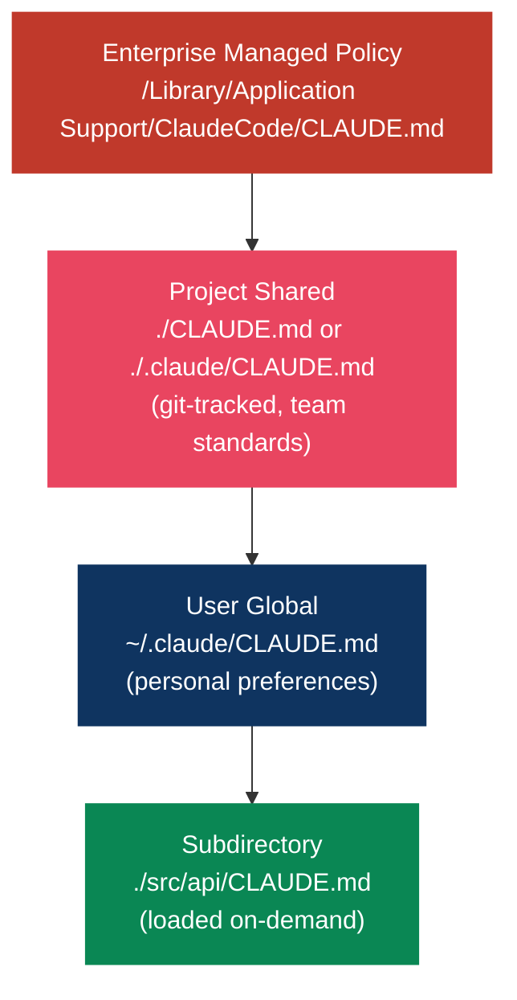
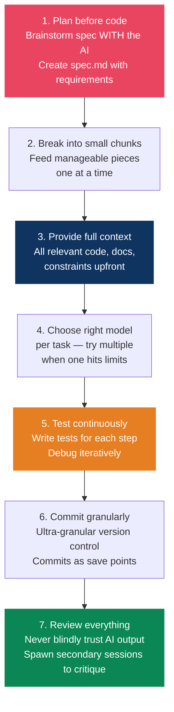

# Developer Setup & AI Workflows

> The best engineers in 2026 are exceptional reviewers — AI produces volume, humans ensure quality.

## Claude Code Setup

### CLAUDE.md Hierarchy



**Best practices:**
- Target under 200 lines per file — longer reduces adherence
- Use `@path/to/import` to import additional files (up to 5 hops)
- Run `/init` to auto-generate from your codebase
- Use `.claude/rules/` for modular, topic-specific instructions
- Path-scoped rules only load when Claude works with matching files

### Keyboard Shortcuts

| Shortcut | Function |
|----------|----------|
| `!` | Bash mode prefix (run shell directly) |
| `@` | Mention files/folders for context |
| `Esc` | Interrupt Claude |
| `Esc+Esc` | Open rewind/undo menu |
| `Option+T` / `Alt+T` | Toggle extended thinking |
| `Ctrl+O` | Verbose output (see reasoning) |
| `Shift+Tab` | Auto-accept mode |
| `Shift+Tab+Tab` | Plan mode |

### Custom Commands

```bash
# Create parameterized commands
echo 'Fix issue #$ARGUMENTS per coding standards' > .claude/commands/fix-issue.md
# Usage: /fix-issue 123

echo 'Review the PR at $ARGUMENTS for security issues' > .claude/commands/security-review.md
# Usage: /security-review https://github.com/org/repo/pull/42
```

### Hooks (Guaranteed Execution)

Unlike prompt instructions, hooks run deterministically.

**Auto-format on file write:**
```json
{
  "hooks": {
    "PostToolUse": [{
      "matcher": "Write|Edit",
      "hooks": [{
        "type": "command",
        "command": "npx prettier --write \"$CLAUDE_FILE_PATH\""
      }]
    }]
  }
}
```

**Block dangerous commands:**
```json
{
  "hooks": {
    "PreToolUse": [{
      "matcher": "Bash",
      "hooks": [{
        "type": "command",
        "command": ".claude/hooks/block-destructive.sh"
      }]
    }]
  }
}
```

Exit code 0 = allow, exit code 2 = block.

### MCP Servers

```bash
# Essential trio (covers 90% of dev needs)
claude mcp add github -- npx -y @modelcontextprotocol/server-github
claude mcp add playwright -- npx -y @anthropic-ai/mcp-server-playwright
claude mcp add context7 -- npx -y @anthropic-ai/mcp-server-context7

# Additional useful servers
claude mcp add brave-search -e BRAVE_API_KEY=xxx -- npx -y @anthropic-ai/mcp-server-brave-search
claude mcp add postgres -- npx -y @modelcontextprotocol/server-postgres
```

### Permissions (Lock Down)

```json
{
  "permissions": {
    "allowedTools": ["Read", "Write(src/**)", "Bash(git *)", "Bash(npm *)"],
    "deny": ["Read(.env*)", "Write(production.config.*)", "Bash(rm *)", "Bash(sudo *)"]
  }
}
```

### Efficiency Tips

- Start separate sessions for different tasks (avoids context bloat)
- Use `claude --continue` or `claude --resume` to continue work
- Use `!npm test` to run shell commands with fewer tokens
- Set `MAX_THINKING_TOKENS=10000` for thinking budget
- Use git worktrees for parallel development

---

## AI-Assisted Development Workflow

### The Senior Engineer's AI Workflow (Addy Osmani)



> **AI drafts, engineers decide.** 82% of professional developers now use AI assistants daily (Stack Overflow 2025), up from 48% in 2024.

### Key Principles

- **Spec first**: Write a detailed spec WITH the AI before any code
- **Context is king**: Supply all relevant code, docs, and constraints
- **Model "musical chairs"**: Different models excel at different tasks
- **Multi-agent**: One agent writes, another critiques, another tests
- **Trust but verify**: AI produces volume; you ensure quality

---

## Terminal & CLI Setup

### The Stack

```bash
# Install everything
brew install ghostty starship zoxide fzf ripgrep bat eza git-delta lazygit gh jq httpie tmux chezmoi
```

### Tool Replacements

| Tool | Replaces | Why |
|------|----------|-----|
| **Ghostty** | Terminal.app / iTerm2 | GPU-accelerated, by Mitchell Hashimoto, free |
| **Starship** | Oh-My-Zsh themes | Faster, simpler, more portable prompt |
| **zoxide** | `cd` | Learns directory patterns, <1ms resolve |
| **fzf** | Manual searching | Fuzzy finder for history, files, directories |
| **ripgrep** | `grep` | 10-100x faster, respects .gitignore |
| **bat** | `cat` | Syntax highlighting, git integration |
| **eza** | `ls` | File icons, git status, tree view |
| **delta** | `diff` | Side-by-side comparison, syntax highlighting |
| **lazygit** | `git` CLI | TUI for staging, rebasing, cherry-picking |
| **gh** | Browser GitHub | Covers ~80% of github.com operations |
| **httpie** | `curl` | Human-friendly HTTP client |

### Shell Config (~/.zshrc essentials)

```bash
# Starship prompt
eval "$(starship init zsh)"

# Zoxide (smart cd)
eval "$(zoxide init zsh)"

# Fzf (fuzzy finder)
source <(fzf --zsh)

# Aliases
alias ls="eza --icons"
alias cat="bat"
alias g="lazygit"
alias ..="cd .."
alias ...="cd ../.."
```

---

## Dotfiles Management

### Chezmoi (Recommended)

```bash
chezmoi init
chezmoi add ~/.zshrc ~/.gitconfig ~/.config/starship.toml
chezmoi cd   # edit templates
chezmoi apply  # deploy changes
chezmoi update  # pull from remote + apply
```

**Why Chezmoi**: Templates adapt one set of dotfiles to different machines. Store secrets safely. Cross-platform support.

### What to Version Control

```
~/.config/
├── starship.toml       # Prompt config
├── ghostty/config      # Terminal config
├── lazygit/config.yml  # Git TUI config
└── bat/config          # Cat replacement config

~/.zshrc                # Shell config
~/.gitconfig            # Git config
~/.claude/
├── CLAUDE.md           # AI assistant instructions
├── settings.json       # Claude Code settings
└── commands/           # Custom slash commands
```

---

## Git Workflow

### Trunk-Based Development

Used by Google, Meta, and most high-velocity teams:
- Everyone commits to main frequently (at least daily)
- Short-lived feature branches (hours to days, not weeks)
- Feature flags for incomplete work

### Conventional Commits

```
<type>: <description>

Types: feat, fix, refactor, docs, test, chore, perf, ci
```

Imperative mood: "Add login" not "Added login". Body explains the **why**, not the what.

### Lazygit Power Moves

- **Interactive rebase**: Visual squash, fixup, drop, reorder with keypresses
- **Fixup commits**: `git commit --fixup <hash>` then `git rebase -i --autosquash`
- **Cherry-pick across branches**: Navigate to commit, press `C`, switch branch, press `V`
- **Conflict resolution**: Built-in merge tool with automatic continue after resolving

---

## CI/CD Optimization (GitHub Actions)

### High-Impact Strategies

**1. Dependency caching (60-80% time reduction):**
```yaml
- uses: actions/setup-node@v4
  with:
    node-version: '22'
    cache: 'pnpm'
```

**2. Parallel jobs:**
```yaml
jobs:
  lint:
    runs-on: ubuntu-latest
  test:
    runs-on: ubuntu-latest
  build:
    needs: [lint, test]  # runs after both pass
```

**3. Path filters:**
```yaml
on:
  push:
    paths-ignore: ['*.md', 'docs/**']
```

**4. Shallow checkout:**
```yaml
- uses: actions/checkout@v4
  with:
    fetch-depth: 1
```

**5. Docker layer caching:**
```yaml
- uses: docker/build-push-action@v5
  with:
    cache-from: type=gha
    cache-to: type=gha,mode=max
```

> Real-world result: A Next.js monorepo went from 14 min to 1 min 45 sec (87% reduction).

---

## Monorepo Tooling

| Tool | When | Complexity |
|------|------|------------|
| **pnpm workspaces** | Lightweight, no extra tooling | Low |
| **Turborepo** | Startups/mid-size, fast caching | Medium |
| **Nx** | 5+ teams, enforced boundaries, distributed CI | High |

**Start with**: pnpm workspaces + Turborepo. Migrate to Nx only when you need enforced architectural boundaries.

```
monorepo/
├── apps/              # Applications
├── packages/          # Shared packages
├── turbo.json         # Task pipeline config
└── pnpm-workspace.yaml
```

---

## tmux Workflows

### IDE-Like Layout

- Left pane (80%): Editor
- Right pane (20%): Terminal/test runner

### Multi-Project Workflow

- One session per project (`backend`, `frontend`, `infra`)
- Switch instantly with `Ctrl+b s`
- **Sessionizer pattern**: fzf + tmux script for instant project switching

### Essential Keybindings

| Key | Action |
|-----|--------|
| `Ctrl+b c` | New window |
| `Ctrl+b %` | Vertical split |
| `Ctrl+b "` | Horizontal split |
| `Ctrl+b s` | Session list |
| `Ctrl+b d` | Detach |
| `Ctrl+b [` | Scroll mode |

---

## Observability

### Structured Logging

Always use JSON-formatted logs with defined fields — not plain text.

```json
{
  "level": "error",
  "timestamp": "2025-03-31T10:15:30Z",
  "service": "api",
  "correlation_id": "abc-123",
  "message": "Payment processing failed",
  "user_id": "usr_456",
  "error": "timeout after 5000ms"
}
```

### Tool Stack

| Layer | Tool |
|-------|------|
| Metrics | Prometheus |
| Visualization | Grafana |
| Logs | ELK/EFK or cloud logging |
| Tracing | OpenTelemetry |
| APM | Datadog / Elastic |

> **Rule**: Every async boundary, every external call, every step entry/exit should have a log line. When something hangs, the last log line tells you where it stopped.

## References

- [Addy Osmani — AI Coding Workflow](https://addyosmani.com/blog/ai-coding-workflow/)
- [Claude Code Documentation](https://docs.anthropic.com/en/docs/claude-code)
- [Awesome Claude Code](https://github.com/hesreallyhim/awesome-claude-code)
- [MCP Servers Repository](https://github.com/modelcontextprotocol/servers)
- [Chezmoi — Why Use Chezmoi](https://www.chezmoi.io/why-use-chezmoi/)
- [Bret Fisher — Sweet Shell 2026](https://www.bretfisher.com/blog/shell)
