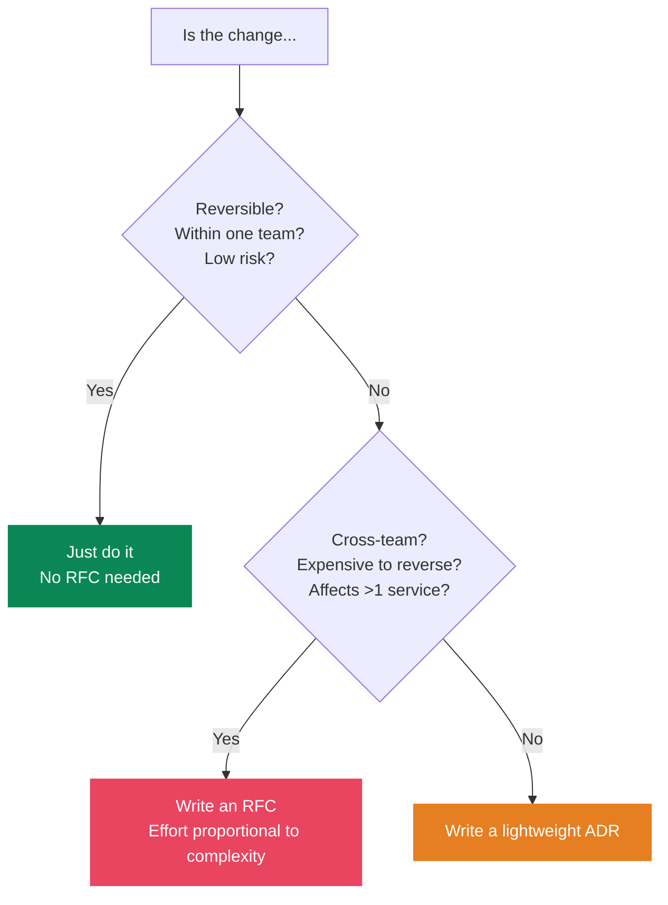
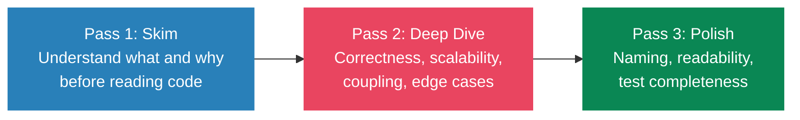
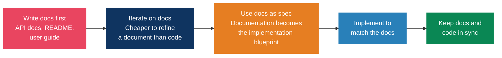
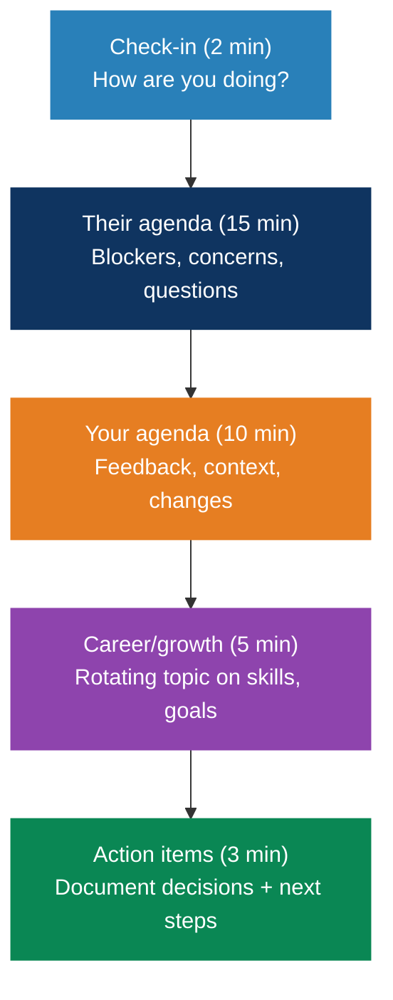

# Engineering Practices

> "From the perspective of a user, if a feature is not documented, then it doesn't exist." — Write the docs first.

## Architecture Decision Records (ADRs)

A short document capturing **one significant architectural decision**, its context, and consequences. Answers "why was this built this way?" months later.

### Template (Nygard Format)

```markdown
# ADR-001: [Title]

## Status
[Proposed | Accepted | Deprecated | Superseded by ADR-XXX]

## Context
What is the issue that motivates this decision?

## Decision
What is the change we are proposing/doing?

## Consequences
What becomes easier or harder as a result?
```

### When to Write an ADR

- Choosing a database, framework, or major library
- Defining API contracts or communication patterns
- Security architecture decisions
- Build vs. buy decisions
- Any decision expensive to reverse

### Best Practices

- **One decision per ADR** — never combine multiple decisions
- **Immutable once accepted** — supersede, never edit
- **Store in the repo** — `docs/adr/` alongside the code
- **Number sequentially** — `0001-use-postgres.md`
- **Write at decision time** — not retroactively
- **Keep them short** — 1-2 pages max
- **Review as a team** — 30-45 minute meetings max

---

## RFC (Request for Comments) Process

### Template

```markdown
# RFC: [Title]
Author: [Name]
Status: [Draft | In Review | Accepted | Rejected]
Reviewers: [Names]
Date: [YYYY-MM-DD]

## Summary
One paragraph explaining the proposal.

## Motivation
Why are we doing this? What problem does it solve?

## Detailed Design
Technical details of the proposal.

## Alternatives Considered
What other approaches were evaluated and why rejected?

## Dependencies & Impact
Services affected, migration path, performance, security.

## Rollout Plan
Deployment strategy and rollback plan.

## Open Questions
Unresolved issues for discussion.
```

### RFC vs Just Do It



### Process

1. Author writes draft RFC
2. Circulate for async review (3-7 days)
3. Reviewers leave inline comments
4. Author addresses comments, updates RFC
5. Decision meeting (if needed) or async approval
6. RFC accepted/rejected — becomes permanent record

---

## Code Review

### Google's Standard

> "Favor approving a CL once it is in a state where it definitely improves the overall code health of the system, even if it isn't perfect." There is no perfect code — only better code.

### The Three-Pass Approach



### What Senior Engineers Look For

- **Architectural impact**: Does this fit the bigger system? Does it introduce coupling?
- **Hidden complexity**: Will the next person understand this in 6 months?
- **Test quality**: Testing behavior, not implementation details?
- **Security**: Input validation, authentication, data exposure
- **Performance**: N+1 queries, unnecessary allocations, missing indexes

### Giving Feedback

- Use **"Nit:"** prefix for non-blocking suggestions
- **Ask questions** instead of demands: "What do you think about..." > "Change this to..."
- **Explain the why**: "This could cause N+1 queries because..." not just "Fix this"
- **Distinguish severity**: Blocking issues vs. suggestions vs. nits
- **Praise good code**: Positive feedback reinforces good patterns

### Receiving Feedback

- Assume good intent
- Separate ego from code
- Ask clarifying questions if unclear
- Focus on learning, not defending

### Process

- **Small PRs**: Under 400 lines — large PRs get superficial review
- **Respond within one business day**, ideally hours
- **Never let PRs stall** — escalate unresolved disagreements
- **Self-review first** before requesting review

---

## Incident Response & Postmortems

### Blameless Postmortem Philosophy (Google SRE)

> "When people feel safe, they tell you what really happened. When they're scared, they give you the sanitized version. Sanitized versions don't prevent repeat incidents."

### Postmortem Template

```markdown
# Incident Postmortem: [Title]
Date: [YYYY-MM-DD]
Severity: [SEV1-4]
Duration: [Start - End]

## Summary
One paragraph of what happened.

## Impact
Users affected, revenue impact, duration of degradation.

## Timeline
[Chronological events with timestamps]

## Root Cause
[Technical explanation — go beyond "human error"]

## Contributing Factors
[Tooling gaps, ambiguous runbooks, missing automation,
 insufficient testing, unclear ownership]

## What Went Well
[Things that helped detect/mitigate]

## What Went Wrong
[Process failures, not people failures]

## Action Items
| Action | Owner | Priority | Due Date |
|--------|-------|----------|----------|

## Lessons Learned
[Key takeaways for the org]
```

### Root Cause Analysis

- **Five Whys**: Ask "why?" repeatedly until you reach a systemic cause (not a human one)
- **Fishbone Diagrams**: Categorize causes into People, Process, Technology, Environment
- **Fault Tree Analysis**: Map out all possible failure paths

### Culture

- Leaders model blamelessness — publicly review their own mistakes
- Recognize and reward well-written postmortems
- Track action item completion — a postmortem without follow-through is theater
- Create postmortem newsletters and reading clubs

---

## Documentation-Driven Development

### The Process



### Why It Works

- **Forces clear thinking**: If you can't explain a feature clearly in writing, the design isn't clear yet
- **Catches design flaws early**: You realize mid-documentation that your approach won't work — before writing code
- **Low-cost iteration**: Changing a paragraph is orders of magnitude cheaper than changing code
- **Better API design**: Consumer-facing docs create outside-in design
- **AI amplifier**: Comprehensive docs make AI coding tools dramatically more effective. Detailed module docs = AI suggestions that fit perfectly into the project

### What to Document First

1. Public API contracts (endpoints, parameters, responses)
2. User-facing behavior and workflows
3. Configuration options and defaults
4. Error messages and troubleshooting
5. Architecture decisions (ADRs)

---

## Engineering Management for Tech Leads

### 1:1 Meeting Structure



### Key Principles

- **Psychological safety** is the #1 predictor of high-performing teams (Google's Project Aristotle)
- **Public credit, private blame** — celebrate wins loudly, address failures privately
- **Delegate outcomes, not tasks** — provide context without micromanaging
- **Guided problem-solving** — ask "What have you tried?" before offering solutions
- **Never skip 1:1s** — they are your most important meeting

### Team Health Signals

| Healthy | Warning |
|---------|---------|
| People volunteer for hard problems | Burnout signals |
| Speak up in meetings | Silence in retrospectives |
| Give each other direct feedback | High turnover |
| Celebrate wins together | Knowledge silos |
| Ownership mentality | "Not my problem" attitude |

---

## Best Engineering Blogs & Resources

### Tier 1: Essential

| Resource | Focus |
|----------|-------|
| **[The Pragmatic Engineer](https://www.pragmaticengineer.com/)** | #1 newsletter for senior engineers. Compensation, architecture, hiring, culture |
| **[LeadDev](https://leaddev.com/)** | Engineering leadership, scaling teams, software delivery |
| **[StaffEng](https://staffeng.com/)** | Staff+ engineering: archetypes, stories, career paths |
| **[Increment](https://increment.com/)** (Stripe) | Deep-dive magazines on single engineering topics |
| **[DORA](https://dora.dev/)** | DevOps research, metrics, annual State of DevOps report |

### Tier 2: Company Engineering Blogs

| Company | Known For |
|---------|-----------|
| Netflix | Distributed systems, resilience, chaos engineering |
| Uber | Scale, microservices, real-time systems |
| Stripe | API design, developer experience |
| Cloudflare | Networking, edge computing, security |
| Shopify | Ruby at scale, developer tooling |

### Tier 3: Newsletters

| Newsletter | Focus |
|------------|-------|
| **ByteByteGo** (Alex Xu) | System design, distributed systems |
| **TLDR** | Daily tech news digest |
| **Software Lead Weekly** | Engineering leadership |

### Key Books

| Book | Author | Why |
|------|--------|-----|
| *Designing Data-Intensive Applications* | Kleppmann | The distributed systems bible |
| *Staff Engineer* | Will Larson | Staff+ career guide |
| *An Elegant Puzzle* | Will Larson | Engineering management |
| *The Manager's Path* | Camille Fournier | Technical leadership ladder |
| *Accelerate* | Forsgren, Humble, Kim | The DORA research book |
| *A Philosophy of Software Design* | Ousterhout | Managing complexity |
| *Site Reliability Engineering* | Google | SRE practices (free online) |

## References

- [Google Engineering Practices](https://google.github.io/eng-practices/)
- [Google SRE Book](https://sre.google/sre-book/)
- [ADR GitHub](https://adr.github.io/)
- [LeadDev — RFC Guide](https://leaddev.com/software-quality/thorough-team-guide-rfcs)
- [Pragmatic Engineer — RFCs and Design Docs](https://newsletter.pragmaticengineer.com/p/rfcs-and-design-docs)
- [Fellow.ai — Engineering Management Principles](https://fellow.app/blog/principles-of-engineering-management/)
