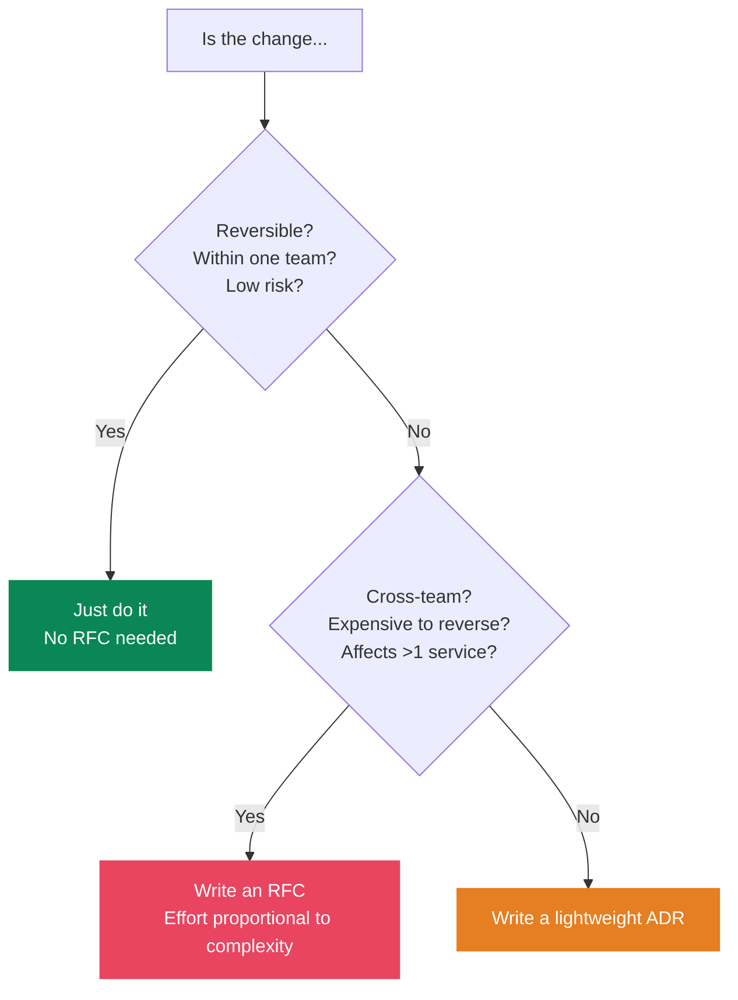
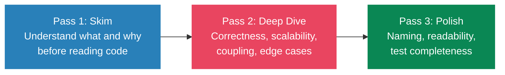
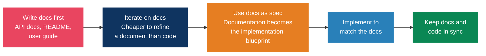
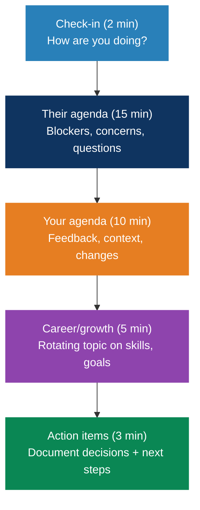

# Engineering practices

> "From the perspective of a user, if a feature is not documented, then it doesn't exist." So write the docs first.

## Architecture decision records (ADRs)

A short document capturing one significant architectural decision, its context, and what it cost you. It's what answers "why was this built this way?" nine months later.

### Template (Nygard format)

```markdown
# ADR-001: [Title]

## Status
[Proposed | Accepted | Deprecated | Superseded by ADR-XXX]

## Context
What is the issue that motivates this decision?

## Decision
What is the change we are proposing/doing?

## Consequences
What becomes easier or harder as a result?
```

### When to write one

- Choosing a database, framework, or major library
- Defining API contracts or communication patterns
- Security architecture decisions
- Build vs buy
- Anything expensive to reverse

### How to keep them useful

One decision per ADR, never a bundle. Once accepted they're immutable, so supersede rather than edit. Store them in the repo under `docs/adr/` next to the code, numbered sequentially (`0001-use-postgres.md`). Write them at decision time, not retroactively, keep them to a page or two, and review as a team in meetings no longer than 45 minutes.

---

## RFC process

### Template

```markdown
# RFC: [Title]
Author: [Name]
Status: [Draft | In Review | Accepted | Rejected]
Reviewers: [Names]
Date: [YYYY-MM-DD]

## Summary
One paragraph explaining the proposal.

## Motivation
Why are we doing this? What problem does it solve?

## Detailed Design
Technical details of the proposal.

## Alternatives Considered
What other approaches were evaluated and why rejected?

## Dependencies & Impact
Services affected, migration path, performance, security.

## Rollout Plan
Deployment strategy and rollback plan.

## Open Questions
Unresolved issues for discussion.
```

### RFC or just do it



### Process

1. Author writes a draft
2. Circulate for async review, three to seven days
3. Reviewers leave inline comments
4. Author addresses them and updates
5. Decision meeting if one is needed, otherwise async approval
6. Accepted or rejected, and either way it becomes a permanent record

---

## Code review

### Google's standard

> "Favor approving a CL once it is in a state where it definitely improves the overall code health of the system, even if it isn't perfect."

There's no perfect code, only better code than what's there now.

### The three-pass approach



### What to look for

Does this fit the bigger system, or does it introduce coupling you'll pay for later? Will the next person understand it in six months? Are the tests checking behavior or implementation details? Is input validated, auth handled, data not leaking? And the usual performance traps: N+1 queries, unnecessary allocations, missing indexes.

### Giving feedback

- Prefix non-blocking suggestions with "Nit:"
- Ask rather than demand. "What do you think about..." lands better than "Change this to..."
- Explain the why. "This could cause N+1 queries because..." beats "Fix this"
- Say which comments are blocking and which aren't
- Point out the good parts too. It's the cheapest way to reinforce a pattern

### Receiving feedback

Assume good intent, keep your ego out of the diff, ask when a comment is unclear, and treat it as learning rather than defense.

### Process

Keep PRs under 400 lines, because large ones get skimmed rather than reviewed. Respond within a business day, ideally hours. Don't let PRs stall, and escalate disagreements instead of letting them rot. Self-review before you request review.

---

## Incident response and postmortems

### Blameless postmortems (Google SRE)

> "When people feel safe, they tell you what really happened. When they're scared, they give you the sanitized version. Sanitized versions don't prevent repeat incidents."

### Template

```markdown
# Incident Postmortem: [Title]
Date: [YYYY-MM-DD]
Severity: [SEV1-4]
Duration: [Start - End]

## Summary
One paragraph of what happened.

## Impact
Users affected, revenue impact, duration of degradation.

## Timeline
[Chronological events with timestamps]

## Root Cause
[Technical explanation, go beyond "human error"]

## Contributing Factors
[Tooling gaps, ambiguous runbooks, missing automation,
 insufficient testing, unclear ownership]

## What Went Well
[Things that helped detect/mitigate]

## What Went Wrong
[Process failures, not people failures]

## Action Items
| Action | Owner | Priority | Due date |
|--------|-------|----------|----------|

## Lessons Learned
[Key takeaways for the org]
```

### Root cause analysis

- Five whys: keep asking until you reach a systemic cause rather than a person
- Fishbone diagrams: sort causes into people, process, technology, environment
- Fault tree analysis: map out the possible failure paths

### Culture

Leaders have to model this by reviewing their own mistakes in public. Recognize people who write good postmortems. Track whether action items actually get done, because a postmortem without follow-through is theater. Postmortem newsletters and reading clubs help spread what was learned.

---

## Documentation-driven development

### The process



### Why it works

Writing forces clarity. If you can't explain the feature in prose, the design isn't finished yet, and you usually find that out halfway through a paragraph rather than halfway through an implementation. Changing a paragraph costs almost nothing compared to changing code.

Writing consumer-facing docs first also produces better APIs, since you're designing from the outside in.

There's an AI angle too: detailed module docs make coding assistants noticeably more useful, because the suggestions actually fit the project.

### What to document first

1. Public API contracts (endpoints, parameters, responses)
2. User-facing behavior and workflows
3. Configuration options and defaults
4. Error messages and troubleshooting
5. Architecture decisions (ADRs)

---

## Engineering management for tech leads

### 1:1 structure



### Key principles

- Psychological safety is the strongest predictor of high-performing teams (Google's Project Aristotle)
- Credit in public, correct in private
- Delegate outcomes rather than tasks. Give context, then get out of the way
- Ask "what have you tried?" before offering the answer
- Never skip 1:1s. It's the meeting that matters most

### Team health signals

| Healthy | Warning |
|---------|---------|
| People volunteer for hard problems | Burnout signals |
| Speak up in meetings | Silence in retrospectives |
| Give each other direct feedback | High turnover |
| Celebrate wins together | Knowledge silos |
| Ownership mentality | "Not my problem" attitude |

---

## Blogs and resources worth following

### Tier 1

| Resource | Focus |
|----------|-------|
| **[The Pragmatic Engineer](https://www.pragmaticengineer.com/)** | Compensation, architecture, hiring, culture. The one most senior engineers read |
| **[LeadDev](https://leaddev.com/)** | Engineering leadership, scaling teams, software delivery |
| **[StaffEng](https://staffeng.com/)** | Staff+ engineering: archetypes, stories, career paths |
| **[Increment](https://increment.com/)** (Stripe) | Deep-dive magazines on single engineering topics |
| **[DORA](https://dora.dev/)** | DevOps research, metrics, annual State of DevOps report |

### Tier 2: company engineering blogs

| Company | Known for |
|---------|-----------|
| Netflix | Distributed systems, resilience, chaos engineering |
| Uber | Scale, microservices, real-time systems |
| Stripe | API design, developer experience |
| Cloudflare | Networking, edge computing, security |
| Shopify | Ruby at scale, developer tooling |

### Tier 3: newsletters

| Newsletter | Focus |
|------------|-------|
| **ByteByteGo** (Alex Xu) | System design, distributed systems |
| **TLDR** | Daily tech news digest |
| **Software Lead Weekly** | Engineering leadership |

### Key books

| Book | Author | Why |
|------|--------|-----|
| *Designing Data-Intensive Applications* | Kleppmann | The distributed systems bible |
| *Staff Engineer* | Will Larson | Staff+ career guide |
| *An Elegant Puzzle* | Will Larson | Engineering management |
| *The Manager's Path* | Camille Fournier | Technical leadership ladder |
| *Accelerate* | Forsgren, Humble, Kim | The DORA research book |
| *A Philosophy of Software Design* | Ousterhout | Managing complexity |
| *Site Reliability Engineering* | Google | SRE practices (free online) |

## References

- [Google Engineering Practices](https://google.github.io/eng-practices/)
- [Google SRE Book](https://sre.google/sre-book/)
- [ADR GitHub](https://adr.github.io/)
- [LeadDev, RFC guide](https://leaddev.com/software-quality/thorough-team-guide-rfcs)
- [Pragmatic Engineer, RFCs and design docs](https://newsletter.pragmaticengineer.com/p/rfcs-and-design-docs)
- [Fellow.ai, engineering management principles](https://fellow.app/blog/principles-of-engineering-management/)
