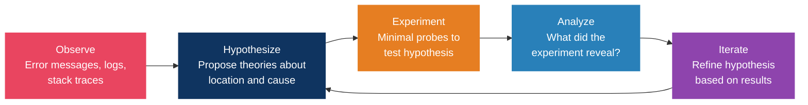
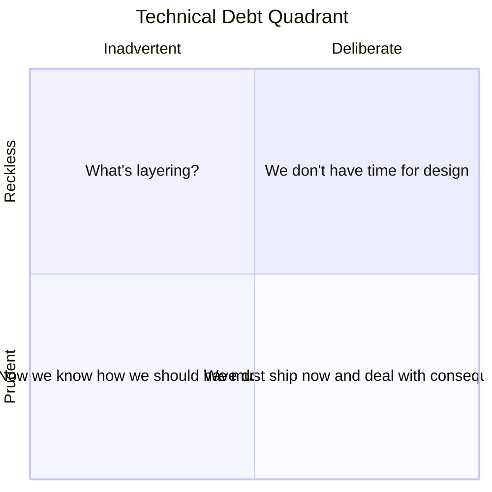
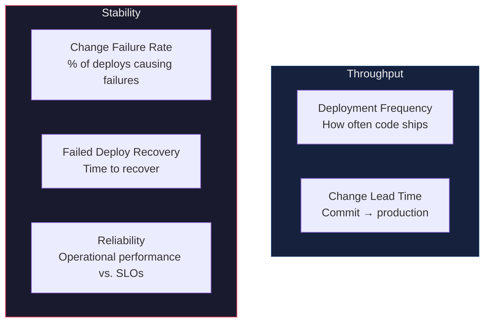

# Engineering principles and laws

> "A complex system that works is invariably found to have evolved from a simple system that worked." (Gall's Law)

## The classics

### SOLID

| Principle | Rule | In Practice |
|-----------|------|-------------|
| **S**ingle Responsibility | A class has one reason to change | One module, one concern |
| **O**pen/Closed | Open for extension, closed for modification | Use interfaces and composition |
| **L**iskov Substitution | Subtypes must be substitutable for base types | Don't break contracts in subclasses |
| **I**nterface Segregation | Many specific interfaces beat one general one | Clients shouldn't depend on methods they don't use |
| **D**ependency Inversion | Depend on abstractions, not concretions | Inject dependencies instead of hardcoding them |

### The essential four

| Principle | What It Means | Common Mistake |
|-----------|---------------|----------------|
| **DRY** | Every piece of *knowledge* has a single representation | DRY is about knowledge, not code. Similar-looking code may represent different concepts and should not be merged |
| **KISS** | Favor straightforward over clever | "Debugging is twice as hard as writing code. If you write code as cleverly as possible, you are by definition not smart enough to debug it." (Kernighan) |
| **YAGNI** | Don't build it until you need it | Speculative generality is one of the most expensive forms of waste |
| **Boy Scout Rule** | Leave every file better than you found it | Small improvements compound |

---

## The laws worth knowing

### The ones worth understanding properly

**Gall's Law** is the argument for MVPs and incremental architecture. You cannot design a complex working system from scratch. Every successful complex system started life as a successful simple one.

**Conway's Law**: if you want microservices, organize into small autonomous teams. Three teams gets you a three-component architecture whether you planned it or not. The inverse Conway maneuver is deliberately structuring teams to produce the architecture you want.

**Hyrum's Law**: with enough users, every observable behavior becomes something someone depends on. Performance characteristics, error message formats, timing quirks, all of it is a contract. Which means "non-breaking" changes deserve suspicion.

**Goodhart's Law**: make 100% coverage the target and you get meaningless tests. Make lines of code a metric and you get bloat. Make velocity a target and story points inflate. Metrics are indicators, never goals.

**Law of Leaky Abstractions** (Joel Spolsky): every abstraction leaks. ORMs leak SQL, HTTP leaks TCP, React leaks the DOM. You need to understand the layer under whatever you're using.

---

## Debugging mental models

### The scientific method for bugs

### Binary search for bugs

Insert probes at the midpoint of the suspected code path. Each probe eliminates about half the remaining possibilities, which turns debugging from O(n) into O(log n).

It works on large codebases (bisect modules), data pipelines (check the data at midpoints), and git history (`git bisect` to find the breaking commit).

### Debugging principles

- Don't jump straight into the code. Understand the thing before you fix it.
- Reproduce it before you claim it's resolved.
- Trust established code first. Libraries and compilers are more likely correct than what you wrote yesterday.
- Hunt for relatives. If you found one bug, similar ones are usually nearby.
- Explain it out loud. Rubber duck debugging works often enough to be worth the embarrassment.
- Rest. Tired debugging is mostly wasted debugging.
- Challenge your mental model. Most bugs exist because your model of the system was wrong.

> Senior engineers use intuition to form hypotheses and the scientific method to check them. Skipping either one is how you spend three days on a typo.

---

## Technical debt management

### The friction formula

**Priority = frequency of change × carrying cost per change × risk of failure**

### Debt quadrant (Martin Fowler)

### Practical categories

| Type | Description | Action |
|------|-------------|--------|
| **Friction Debt** (high interest, low risk) | Slows every feature | Pay down iteratively during regular work |
| **Ticking Bomb** (high interest, high risk) | Could cause outages | Prioritize as dedicated work items |
| **Sleeping Debt** (low interest, high risk) | Rarely touched but dangerous | Schedule periodic review |
| **Cosmetic Debt** (low interest, low risk) | Ugly but harmless | Ignore or fix opportunistically |

### Pay-down strategies

1. Allocate 20% of each sprint to debt reduction.
2. Boy Scout Rule: leave every file better than you found it.
3. Run dedicated debt sprints quarterly.
4. Use the strangler fig pattern to replace legacy components gradually. No big-bang rewrites.
5. Refactor in context, meaning the code you're already touching for a feature.
6. Keep a visible, prioritized debt backlog and review it in sprint planning.

> If 40% of sprint capacity goes to maintenance, you're paying a 40% tax on engineering payroll for zero new value. Most companies carry debt costing 20-40% of their technology's value.

---

## DORA metrics

### The five metrics

> The classic DORA model is four metrics: deploy frequency, lead time, change failure rate, and failed-deployment recovery time. Reliability was added as the fifth in 2021. They're a balanced set, so gaming one in isolation (Goodhart again) defeats the point.

### Performance benchmarks

| Metric | Elite | High | Medium | Low |
|--------|-------|------|--------|-----|
| Deploy Frequency | Multiple/day | Weekly-Monthly | Monthly-Biannually | <1/6 months |
| Lead Time | <1 hour | 1 day-1 week | 1 week-1 month | >1 month |
| Change Failure Rate | <5% | 5-10% | 10-15% | >15% |
| Time to Restore | <1 hour | <1 day | <1 week | >1 week |

> Speed and stability aren't a tradeoff. Elite teams are good at both at the same time, which is the whole finding.

### What not to measure

Lines of code rewards bloat. Number of commits rewards splitting work rather than doing it. Hours worked rewards presence. Individual velocity destroys collaboration.

> AI coding assistants raise individual output, 21% more tasks and 98% more PRs, while organizational delivery metrics stay flat. Average PR size also grows 154%. AI amplifies individual throughput without automatically improving team delivery.

---

## Production readiness checklist

### Observability
- [ ] Structured logging with correlation IDs
- [ ] Metrics dashboards (latency p50/p95/p99, error rate, throughput)
- [ ] Alerting with sane thresholds and escalation paths
- [ ] Distributed tracing enabled
- [ ] Health check endpoints (`/healthz`, `/readyz`)

### Reliability
- [ ] Graceful degradation under load
- [ ] Circuit breakers for external dependencies
- [ ] Retry logic with exponential backoff and jitter
- [ ] Timeouts on all external calls
- [ ] Rate limiting on public endpoints
- [ ] Load testing with expected traffic patterns

### Security
- [ ] No hardcoded secrets. Credentials live in a secrets manager
- [ ] Vulnerability scans on dependencies, critical CVEs resolved
- [ ] Data encrypted at rest and in transit
- [ ] Auth and authz verified
- [ ] Input validation on all user-facing endpoints
- [ ] CORS, CSP and security headers configured

### Deployment
- [ ] Rollback procedure documented and tested
- [ ] Blue/green or canary deployment configured
- [ ] Zero-downtime database migration strategy
- [ ] Feature flags for risky changes

### Data
- [ ] Backup and restore procedure tested
- [ ] Data retention policies defined
- [ ] PII handling compliant with regulations
- [ ] Connection pooling configured
- [ ] Query performance validated (no N+1, proper indexes)

### Documentation
- [ ] API documentation complete
- [ ] Architecture diagram current
- [ ] On-call runbook written
- [ ] SLA/SLO/SLI defined

## References

- [Hacker Laws (GitHub)](https://github.com/dwmkerr/hacker-laws), a comprehensive list of engineering laws
- Martin Fowler, technical debt quadrant
- Google SRE Book, production readiness and postmortem culture (free online)
- DORA.dev, DevOps research and metrics
- Nicole Forsgren et al., *Accelerate*
- John Ousterhout, *A Philosophy of Software Design*
- Joel Spolsky, the Law of Leaky Abstractions
- MIT 6.031, debugging methodology
