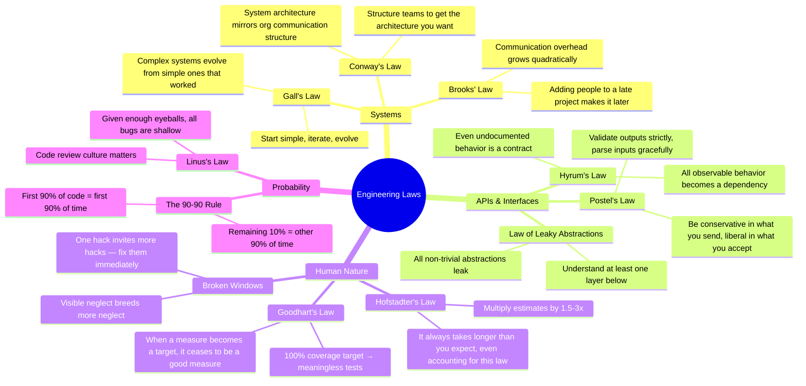
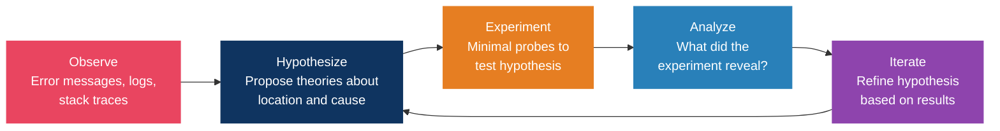
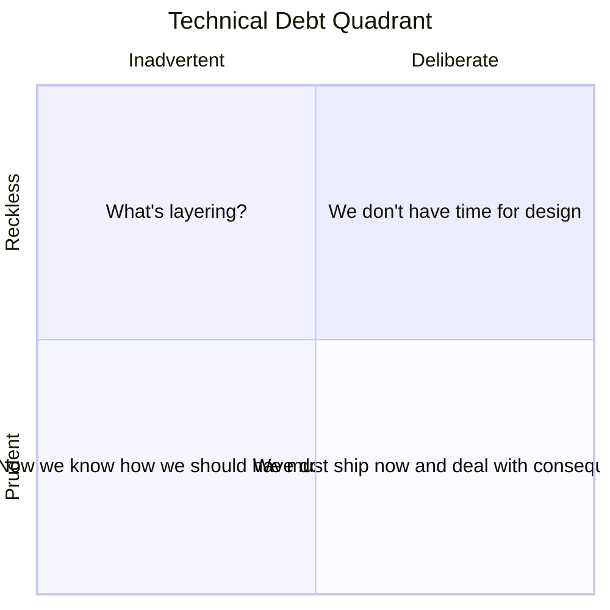
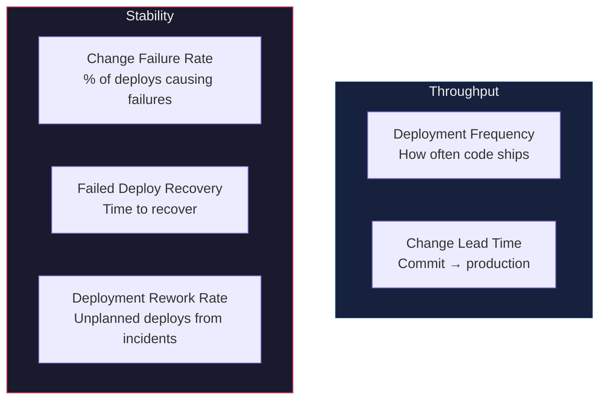

# Engineering Principles & Laws

> "A complex system that works is invariably found to have evolved from a simple system that worked." — Gall's Law

## The Classics

### SOLID

| Principle | Rule | In Practice |
|-----------|------|-------------|
| **S**ingle Responsibility | A class has one reason to change | One module = one concern |
| **O**pen/Closed | Open for extension, closed for modification | Use interfaces and composition |
| **L**iskov Substitution | Subtypes must be substitutable for base types | Don't break contracts in subclasses |
| **I**nterface Segregation | Many specific interfaces > one general | Clients shouldn't depend on methods they don't use |
| **D**ependency Inversion | Depend on abstractions, not concretions | Inject dependencies, don't hardcode them |

### The Essential Four

| Principle | What It Means | Common Mistake |
|-----------|---------------|----------------|
| **DRY** | Every piece of *knowledge* has a single representation | DRY is about knowledge, not code. Similar-looking code may represent different concepts and should NOT be merged |
| **KISS** | Favor straightforward over clever | "Debugging is twice as hard as writing code. If you write code as cleverly as possible, you are by definition not smart enough to debug it." — Kernighan |
| **YAGNI** | Don't implement until actually needed | Speculative generality is one of the most expensive forms of waste |
| **Boy Scout Rule** | Leave every file better than you found it | Small improvements compound over time |

---

## The Laws Every Senior Engineer Should Know

### Deep Dives

**Gall's Law** — The theoretical foundation for MVPs and incremental architecture. You cannot design a complex working system from scratch. Every successful complex system started as a successful simple system.

**Conway's Law** — If you want microservices, organize into small autonomous teams. Three teams = three-component architecture. The "Inverse Conway Maneuver" deliberately structures teams to produce the desired architecture.

**Hyrum's Law** — With enough users, ALL observable behavior becomes depended on. Every performance characteristic, error message format, and timing quirk is a contract. Implication: be extremely careful with "non-breaking" changes.

**Goodhart's Law** — When code coverage becomes a 100% target, you get meaningless tests. When lines of code become a metric, you get bloat. When velocity becomes a target, you get inflated story points. Use metrics as *indicators*, never as *goals*.

**Law of Leaky Abstractions** (Joel Spolsky) — Every abstraction leaks. ORMs leak SQL. HTTP leaks TCP. React leaks the DOM. You must understand the layer below whatever you use.

---

## Debugging Mental Models

### The Scientific Method for Bugs

### Binary Search for Bugs

Insert probes at the midpoint of the suspected code path. Each probe eliminates ~50% of possible locations. Transforms debugging from O(n) to O(log n).

Works for:
- Large codebases (bisect modules/components)
- Data pipelines (check data at midpoints)
- Git history (`git bisect` to find the breaking commit)

### Key Debugging Principles

- **Resist jumping into code immediately** — understand before fixing
- **Reproduction is non-negotiable** before claiming resolution
- **Trust established code first** — libraries and compilers are more likely correct than your code
- **Hunt for relatives** — if you found one bug, check for similar bugs elsewhere
- **Rubber duck debugging** — explaining the problem often reveals the solution
- **Rest effectively** — fatigue is the enemy of debugging
- **Challenge your mental model** — most bugs exist because your model of the system was wrong

> Senior engineers use both intuition (to form hypotheses) and the scientific method (to validate them).

---

## Technical Debt Management

### The Friction Formula

**Priority = Frequency of change × Carrying cost per change × Risk of failure**

### Debt Quadrant (Martin Fowler)

### Practical Categories

| Type | Description | Action |
|------|-------------|--------|
| **Friction Debt** (High interest, low risk) | Slows every feature | Pay down iteratively during regular work |
| **Ticking Bomb** (High interest, high risk) | Could cause outages | Prioritize as dedicated work items |
| **Sleeping Debt** (Low interest, high risk) | Rarely touched but dangerous | Schedule periodic review |
| **Cosmetic Debt** (Low interest, low risk) | Ugly but harmless | Ignore or fix opportunistically |

### Pay-Down Strategies

1. **The 20% Rule**: Allocate 20% of each sprint to debt reduction
2. **Boy Scout Rule**: Leave every file better than you found it
3. **Debt Sprints**: Dedicated quarterly sprints focused on debt
4. **Strangler Fig**: Gradually replace legacy components (no big-bang rewrites)
5. **Refactor in Context**: Refactor code you're already changing for a feature
6. **Tech Debt Backlog**: Maintain a visible, prioritized backlog reviewed in sprint planning

> If 40% of sprint capacity goes to maintenance, you're paying a 40% tax on engineering payroll for zero new value. Most companies carry debt costing 20-40% of their technology's value.

---

## DORA Metrics (Developer Productivity)

### The Five Metrics

### Performance Benchmarks

| Metric | Elite | High | Medium | Low |
|--------|-------|------|--------|-----|
| Deploy Frequency | Multiple/day | Weekly-Monthly | Monthly-Biannually | <1/6 months |
| Lead Time | <1 hour | 1 day-1 week | 1 week-1 month | >1 month |
| Change Failure Rate | <5% | 5-10% | 10-15% | >15% |
| Time to Restore | <1 hour | <1 day | <1 week | >1 week |

> **Key insight**: Speed and stability are NOT tradeoffs. Elite teams excel at both simultaneously.

### What NOT to Measure

- Lines of code (rewards bloat)
- Number of commits (rewards small commits over meaningful ones)
- Hours worked (rewards presence over productivity)
- Individual velocity (destroys collaboration)

> AI coding assistants increase individual output (21% more tasks, 98% more PRs) but organizational delivery metrics stay flat. AI also increases average PR size by 154%. Lesson: AI amplifies individual throughput but doesn't automatically improve team delivery.

---

## Production Readiness Checklist

### Observability
- [ ] Structured logging with correlation IDs
- [ ] Metrics dashboards (latency p50/p95/p99, error rate, throughput)
- [ ] Alerting with appropriate thresholds and escalation paths
- [ ] Distributed tracing enabled
- [ ] Health check endpoints (`/healthz`, `/readyz`)

### Reliability
- [ ] Graceful degradation under load
- [ ] Circuit breakers for external dependencies
- [ ] Retry logic with exponential backoff and jitter
- [ ] Timeouts for all external calls
- [ ] Rate limiting on public endpoints
- [ ] Load testing with expected traffic patterns

### Security
- [ ] No hardcoded secrets — credentials in secrets manager
- [ ] Vulnerability scans on dependencies (critical CVEs resolved)
- [ ] Data encrypted at rest and in transit
- [ ] Auth/authz verified
- [ ] Input validation on all user-facing endpoints
- [ ] CORS, CSP, and security headers configured

### Deployment
- [ ] Rollback procedure documented and tested
- [ ] Blue/green or canary deployment configured
- [ ] Zero-downtime database migration strategy
- [ ] Feature flags for risky changes

### Data
- [ ] Backup and restore procedure tested
- [ ] Data retention policies defined
- [ ] PII handling compliant with regulations
- [ ] Connection pooling configured
- [ ] Query performance validated (no N+1, proper indexes)

### Documentation
- [ ] API documentation complete
- [ ] Architecture diagram current
- [ ] On-call runbook written
- [ ] SLA/SLO/SLI defined

## References

- [Hacker Laws (GitHub)](https://github.com/dwmkerr/hacker-laws) — Comprehensive list of engineering laws
- Martin Fowler — Technical debt quadrant
- Google SRE Book — Production readiness, postmortem culture (free online)
- DORA.dev — DevOps research and metrics
- Nicole Forsgren et al. — *Accelerate* (the DORA research book)
- John Ousterhout — *A Philosophy of Software Design*
- Joel Spolsky — The Law of Leaky Abstractions
- MIT 6.031 — Debugging methodology
