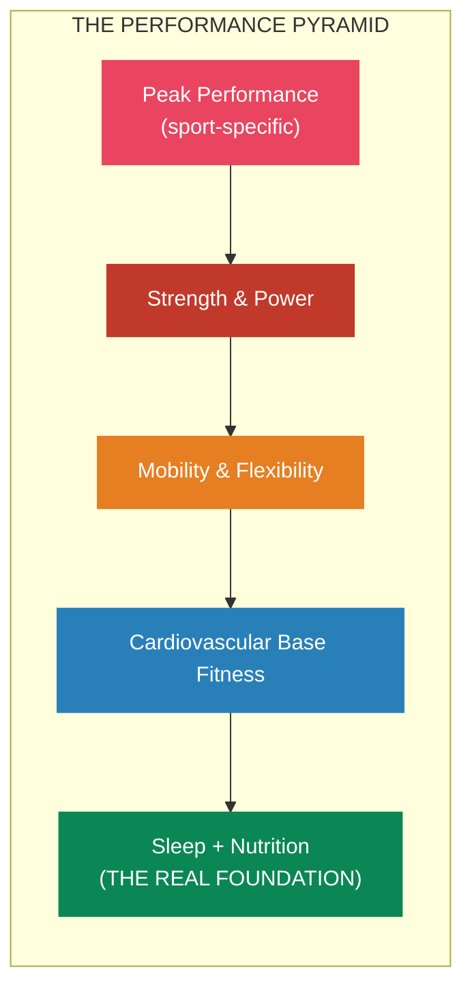
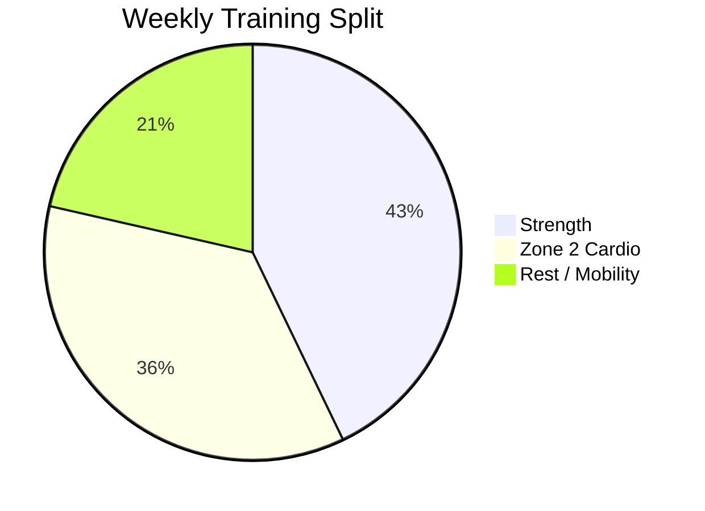
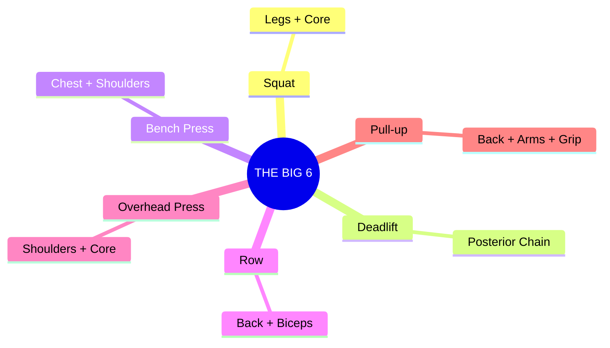
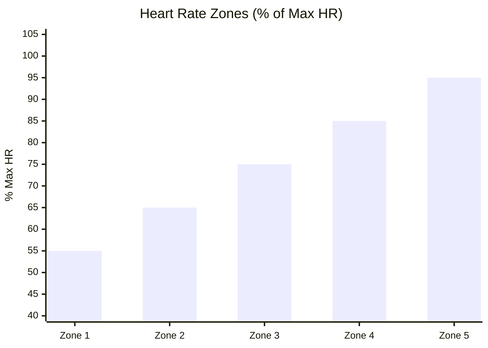
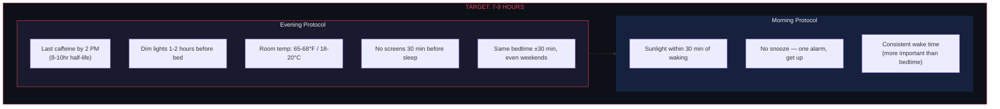
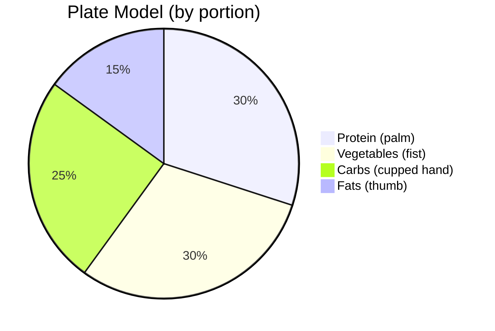

# Training Protocol

> Physical capacity is the foundation of mental performance. You cannot out-think a broken body.

## Training Philosophy

## Weekly Structure

| Day | Focus | Duration | Intensity |
|-----|-------|----------|-----------|
| Mon | Strength (Push/Legs) | 60 min | High |
| Tue | Zone 2 Cardio | 30-45 min | Low |
| Wed | Strength (Pull/Legs) | 60 min | High |
| Thu | Zone 2 Cardio | 30-45 min | Low |
| Fri | Strength (Full Body) | 45-60 min | Moderate |
| Sat | Long Zone 2 or Active Recovery | 45-60 min | Low |
| Sun | Rest / Mobility | 20-30 min | Very Low |

## Strength Training Essentials

Focus on compound movements. These give you 80% of the results:

**Progressive overload** is the only law: gradually increase weight, reps, or volume over time.

## Cardio: Zone 2 is King

Zone 2 = conversational pace. You can talk but not sing.

- Builds mitochondrial density (cellular energy factories)
- Improves fat oxidation
- Enhances recovery between sessions
- Reduces all-cause mortality more than any other exercise type

**Target**: 150-180 min/week of Zone 2 (walking, cycling, easy jogging)

| Zone | % Max HR | Description |
|------|----------|-------------|
| Zone 1 | 50-60% | Very easy, recovery |
| **Zone 2** | **60-70%** | **THE MONEY ZONE — do most cardio here** |
| Zone 3 | 70-80% | Moderate, "grey zone" — least efficient |
| Zone 4 | 80-90% | Hard, threshold work |
| Zone 5 | 90-100% | Max effort, sprint intervals |

## Sleep Protocol (Non-Negotiable)

Sleep is not a luxury. It's the single highest-ROI performance intervention.

## Nutrition Fundamentals

Don't overcomplicate this. 80% of results come from:

1. **Protein**: 0.7-1g per lb bodyweight daily (muscle repair + satiety)
2. **Whole foods**: If it grew or had a mother, eat it
3. **Hydration**: Half your bodyweight (lbs) in oz of water daily
4. **Consistency**: A decent plan followed daily beats a perfect plan followed sometimes

## Recovery Checklist

Recovery is where adaptation happens. Training is the stimulus; recovery is the response.

- [ ] 7-9 hours sleep
- [ ] Adequate protein intake
- [ ] Hydrated (clear/light yellow urine)
- [ ] 1-2 rest days per week
- [ ] Deload week every 4-6 weeks (reduce volume 40-50%)
- [ ] Manage stress (chronic stress = chronic cortisol = poor recovery)

## References

- Dr. Andy Galpin — Huberman Lab series on fitness
- Dr. Peter Attia — *Outlive* (longevity-focused training)
- Jeff Nippard — Evidence-based training (YouTube)
- Renaissance Periodization — Volume landmarks and programming
- Dr. Matthew Walker — *Why We Sleep*
