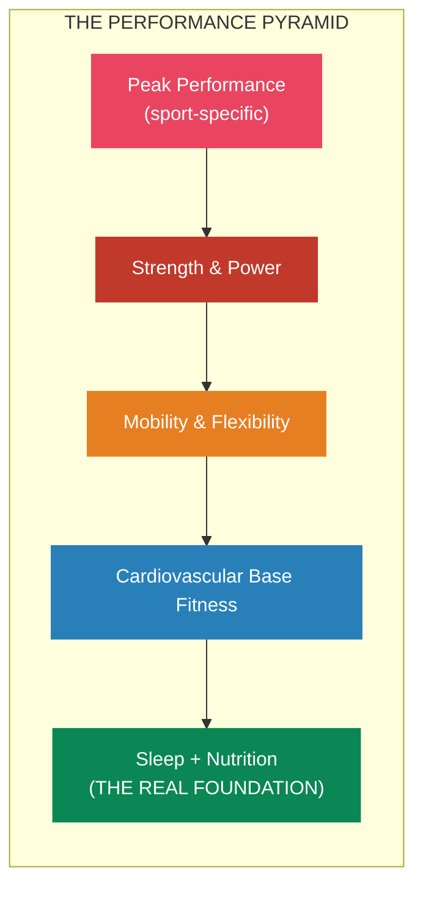
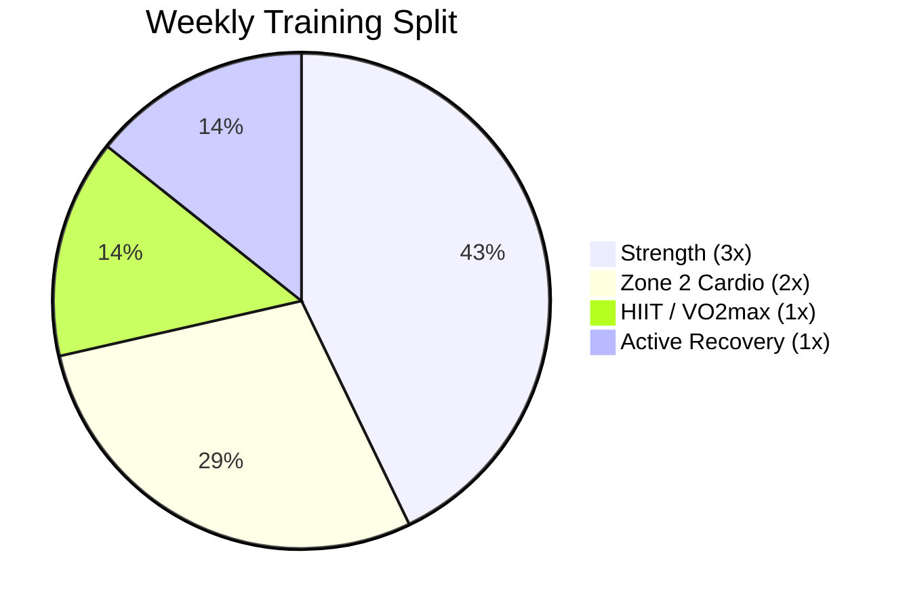
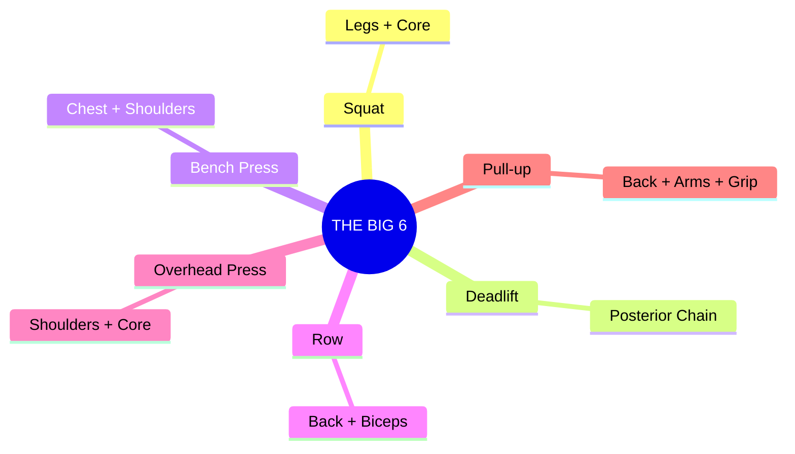
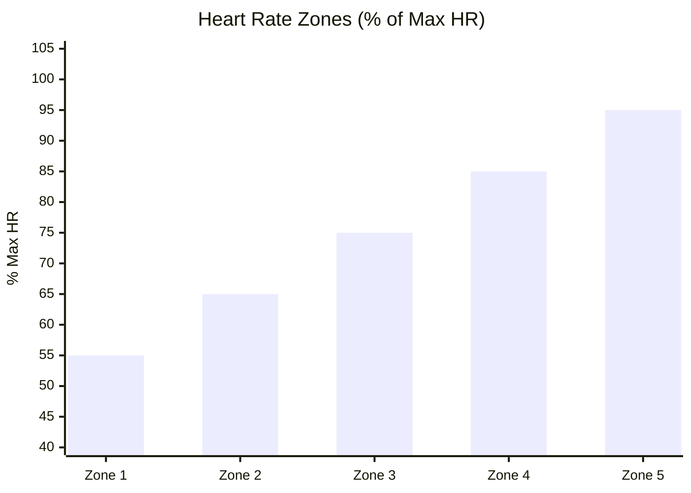
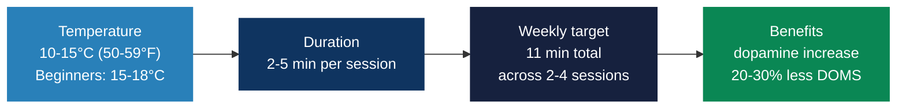
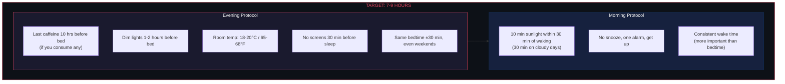
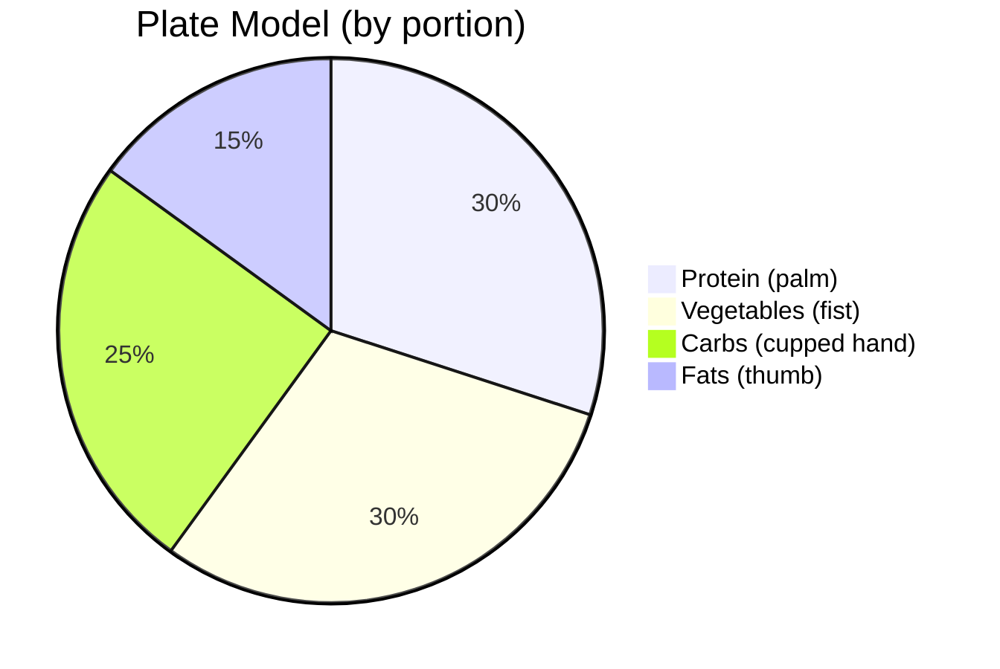

# Training protocol

> You can't out-think a broken body. Physical capacity is what mental performance runs on.

## Training philosophy

## Weekly structure (polarized training)

80% Zone 2, 20% high intensity. It's the split elite endurance athletes actually use.

| Day | Focus | Duration | Intensity |
|-----|-------|----------|-----------|
| Mon | Strength (Upper) + 10 min mobility | 60 min | High |
| Tue | Zone 2 Cardio | 60-90 min | Low |
| Wed | Strength (Lower) + 10 min mobility | 60 min | High |
| Thu | HIIT / VO2max intervals | 30-40 min | Very High |
| Fri | Strength (Full Body) + 10 min mobility | 45-60 min | Moderate |
| Sat | Zone 2 Cardio (long session) | 60-90 min | Low |
| Sun | Active Recovery / Mobility / Walk | 30-60 min | Very Low |

---

## Strength training

### The big six

### Hypertrophy principles (2024-2025 research)

Volume: 10-20 hard sets per muscle group per week, with diminishing returns past about 20 sets (2024 meta-regression).

Frequency: twice a week per muscle group is enough. Going to three adds very little once volume is equated.

Intensity: take sets close to failure, 0-3 reps in reserve. Newer evidence suggests lower volume at higher intensity may work just as well.

Progressive overload: periodically raising volume from a baseline produced greater adaptations than holding volume static (2024 Journal of Applied Physiology).

Full range of motion: run every lift through the complete range. That alone matches or beats static stretching for flexibility (2023 meta-analysis).

Split type barely matters. PPL, upper/lower and full-body produce similar results at equated volume (2025 study).

So pick whatever split lets you hit 10-20 hard sets per muscle group per week, train each muscle at least twice, and take sets close to failure. The rest is preference.

### Grip strength as a longevity marker

Grip strength is one of the strongest predictors of all-cause mortality, more predictive than blood pressure or alcohol intake.

Targets: men 40+ kg, ideally 50+. Women 25+ kg, ideally 35+.

To train it, do dead hangs for three sets accumulating two minutes or more, farmer's carries for three sets of 30-60 seconds with real weight, and fat grip attachments on your pulling exercises. Two or three times a week.

---

## Cardio: Zone 2 and VO2max

### Zone 2, the longevity base

Zone 2 sits just below the first lactate threshold, around 1-2 mmol/L blood lactate. You can hold a conversation, but it isn't easy.

| Zone | % Max HR | Description |
|------|----------|-------------|
| Zone 1 | 50-60% | Very easy, recovery |
| **Zone 2** | **60-70%** | **The base. Do most cardio here** |
| Zone 3 | 70-80% | "Grey zone", least efficient |
| Zone 4 | 80-90% | Threshold work |
| Zone 5 | 90-100% | Max effort, sprint intervals |

Run 45-90 minutes per session, since under 30 minutes doesn't induce meaningful mitochondrial adaptations. Three or four sessions a week, 150-180 minutes total.

One 2025 caveat: a narrative review found Zone 2 is not uniquely superior for mitochondrial capacity, and higher intensities produce greater VO2max improvements. Polarized still wins, meaning mostly Zone 2 with some genuinely hard work.

### VO2max

VO2max is the single strongest predictor of all-cause mortality, with a larger impact than smoking, diabetes or heart disease. The lowest-fit group carries roughly 5x the mortality risk of the elite-fitness group (Mandsager et al., JAMA 2018, over 122,000 patients). It drops about 10% per decade after 25 in the sedentary, closer to 5% if you train, and training slows or reverses that.

The Norwegian 4x4 protocol:

1. Four minutes at 90-95% max HR
2. Three minutes active recovery
3. Repeat four times
4. Twice a week

VO2max targets (ml/kg/min):

| Age | Men (Good / Excellent) | Women (Good / Excellent) |
|---|---|---|
| 30s | 40-48 / 48+ | 34-40 / 40+ |
| 40s | 36-44 / 44+ | 30-36 / 36+ |
| 50s | 32-40 / 40+ | 28-34 / 34+ |

---

## Cold and heat exposure

### Cold plunge

> Important: cold water immersion right after strength training may attenuate hypertrophy, since it blunts satellite-cell activation and anabolic signaling. The often-quoted "~25%" comes from one small 2015 study, and a 2024 meta-analysis found only a small, low-certainty effect. The mechanism is real enough that it isn't worth the gamble. Wait 6-8 hours after resistance training, or keep plunges on rest and cardio days. Worth knowing too: the 250% dopamine spike people cite comes from about an hour in 14°C water, not a 2-5 minute plunge, so expect a smaller bump.

### Sauna

Finnish sauna runs 80-100°C (176-212°F), infrared around 60°C. Sessions are 15-20 minutes traditional, 30-40 minutes infrared. Four to seven sessions a week gets the most cardiovascular benefit.

The Finnish KIHD study, following more than 2,300 men for around 20 years, found 4-7 sessions a week associated with a 40% reduction in all-cause mortality compared to one session a week. It's also linked to lower dementia, Alzheimer's and cardiovascular disease risk.

---

## Breathing techniques

### Nasal breathing (default)

Breathing through your nose produces nitric oxide in the paranasal sinuses, a vasodilator that improves oxygen uptake. A 2025 study found faster muscle reoxygenation during recovery. You also get better air filtration, more diaphragmatic engagement and lower blood pressure.

Use it for all Zone 2 and moderate work, and switch to mouth breathing above 80% VO2max.

### Wim Hof method (pre-workout priming)

1. 30 deep breaths, inhaling fully and exhaling passively
2. Exhale and hold for one to two minutes
3. Three rounds

A 2024 systematic review suggests it may reduce inflammation via increased epinephrine. Never do it near water or while driving.

### Physiological sigh

Double inhale through the nose, then a long exhale through the mouth. It activates the parasympathetic nervous system within seconds, which makes it the fastest way to come down. Good post-workout, before sleep, or in acute stress.

---

## Mobility

Full range of motion resistance training improves flexibility about as well as dedicated stretching (2023 meta-analysis), so stretching is supplementary rather than primary.

1. Full ROM resistance training. Run every lift through the complete range. This is the one that matters.
2. Dynamic stretching pre-workout: 5-10 minutes on the movement patterns you're about to train.
3. Static stretching post-workout: hold 30-60 seconds per stretch. Don't static stretch before maximal effort, since it temporarily reduces force output.
4. Daily: 90/90 hip switches for two or three minutes, controlled articular rotations for every major joint for five to ten minutes, plus wall slides and band pull-aparts for the thoracic spine and shoulders.

---

## Sleep protocol

Sleep is the highest-return intervention on this entire list.

### Sleep stack

| Supplement | Dosage | Timing | Evidence |
|---|---|---|---|
| **Magnesium glycinate** | 200-400mg | 30-60 min before bed | Improved insomnia scores vs placebo. Glycine itself promotes sleep |
| **Tart cherry extract** | 480mg extract or 8oz juice | Evening | Natural melatonin plus anthocyanins. +25 min total sleep, +15 min deep sleep |
| **Glycine** | 3g | Before bed | Improved subjective sleep quality, less next-day fatigue |
| **L-theanine** | 200mg | Before bed | Promotes relaxation without sedation |
| **Apigenin** (chamomile) | 50mg | Before bed | Mild sleep-promoting effect |

> Melatonin isn't a good first choice. It's a chronobiotic that shifts timing rather than a sedative, which makes it useful for jet lag and less useful for ongoing sleep quality.

---

## Nutrition

Don't overcomplicate this. Most of the result comes from the basics:

### Protein timing (2024-2025 research)

Total daily intake for hypertrophy is 1.6-2.2g per kg of bodyweight. Spread it across three to five meals at 0.4-0.55g/kg each, since even distribution beats loading it all into one meal. Post-workout, 20-40g within two hours is plenty. The old 30-minute window was never real. Before sleep, 30-40g of casein supports overnight muscle protein synthesis.

### Meal timing

Early time-restricted eating has the strongest metabolic evidence: an 8 AM to 2 PM window improved insulin sensitivity, lipid profiles and weight regulation. Front-load your calories, since eating late (after 9 PM) worsens metabolic outcomes.

If hypertrophy is the goal, skip fasting. Hitting your calories and protein inside a restricted window is harder than it's worth.

### Gut health

Aim for 30+ grams of fiber a day from diverse plants, targeting 30 or more different plant foods a week. Eat fermented foods daily: yogurt, kefir, kimchi, sauerkraut. A Stanford study found they increased microbial diversity more than a high-fiber diet alone. Add prebiotic foods like garlic, onions, leeks, asparagus, bananas and oats. Avoid heavy NSAID use, unnecessary antibiotics and artificial sweeteners.

---

## Supplement stack

### Tier 1 (strong evidence)

| Supplement | Dosage | Key Benefit | Notes |
|---|---|---|---|
| **Creatine monohydrate** | 5g daily | Muscle, brain, strength | Most studied supplement there is. No loading needed |
| **Vitamin D3** | 2,000-4,000 IU daily | Immune, bone, mood | Take with fat. Target 40-60 ng/mL blood level. Pair with K2 |
| **Magnesium** | 200-400mg daily (chelated) | Sleep, recovery, 300+ enzyme reactions | Glycinate for sleep, L-threonate for cognition. Take evening |
| **Omega-3 (EPA/DHA)** | 2-4g combined EPA+DHA daily | Anti-inflammatory, brain, heart | Min 1g EPA for anti-inflammatory effect |

### Tier 2 (good evidence)

| Supplement | Dosage | Key Benefit |
|---|---|---|
| **Ashwagandha (KSM-66)** | 600mg daily | Cortisol reduction, recovery |
| **Zinc** | 15-30mg daily | Testosterone support, immune |
| **Vitamin K2 (MK-7)** | 100-200mcg daily | Calcium metabolism (pair with D3) |

---

## Recovery checklist

Training is the stimulus. Recovery is where the adaptation happens.

- [ ] 7-9 hours sleep in an 18-20°C room
- [ ] Adequate protein (1.6-2.2g/kg)
- [ ] Hydrated (clear or light yellow urine)
- [ ] 1-2 rest days per week
- [ ] Deload week every 4-6 weeks (cut volume 40-50%)
- [ ] Stress managed, since chronic cortisol wrecks recovery
- [ ] Morning sunlight (10 min within 30 min of waking)
- [ ] Daily supplements (creatine, D3+K2, omega-3, magnesium)

---

## Quick-reference weekly protocol

| Day | Training | Recovery/Optimization |
|---|---|---|
| Mon | Strength (Upper) + 10 min mobility | Morning sunlight, sauna PM |
| Tue | Zone 2 cardio (60-90 min) | Cold plunge OK (no strength conflict) |
| Wed | Strength (Lower) + 10 min mobility | Sauna PM |
| Thu | HIIT / VO2max intervals (Norwegian 4x4) | Cold plunge OK |
| Fri | Strength (Full Body) + 10 min mobility | Sauna PM |
| Sat | Zone 2 cardio (60-90 min) | Cold plunge + sauna contrast OK |
| Sun | Active recovery / long walk / yoga | Sauna, full mobility routine |

## References

- Dr. Andy Galpin, Huberman Lab fitness series
- Dr. Peter Attia, *Outlive*
- Dr. Matthew Walker, *Why We Sleep*
- Jeff Nippard, evidence-based training (YouTube)
- Renaissance Periodization, volume landmarks and programming
- Andrew Huberman, cold exposure, sauna and breathing protocols
- Finnish KIHD study (Laukkanen et al.), sauna and mortality (2,300+ men, ~20 years)
- Journal of Applied Physiology (2024), progressive overload studies
- Norwegian University of Science and Technology, 4x4 interval protocol
- Stanford (2021), fermented foods and gut microbial diversity
