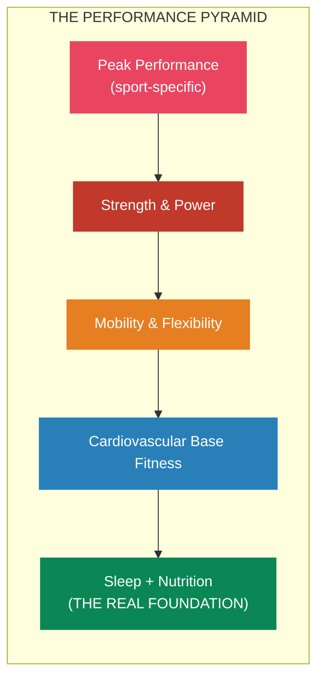
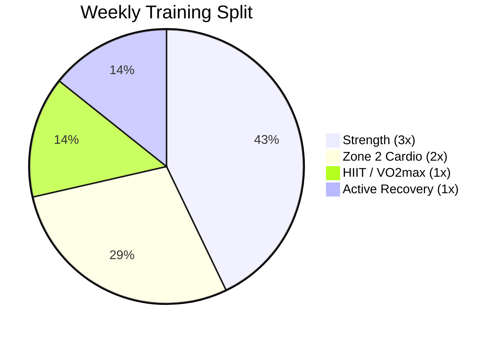
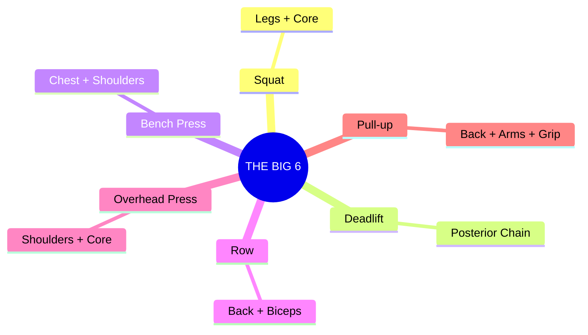
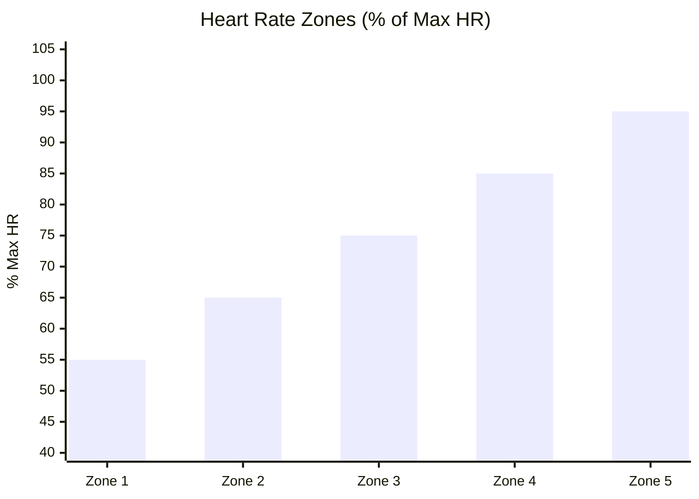
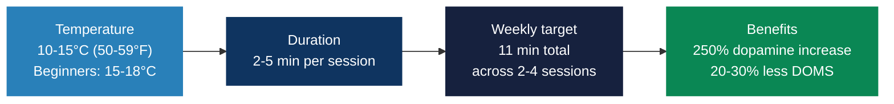
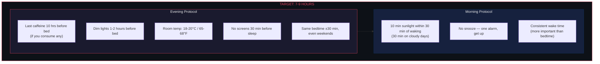
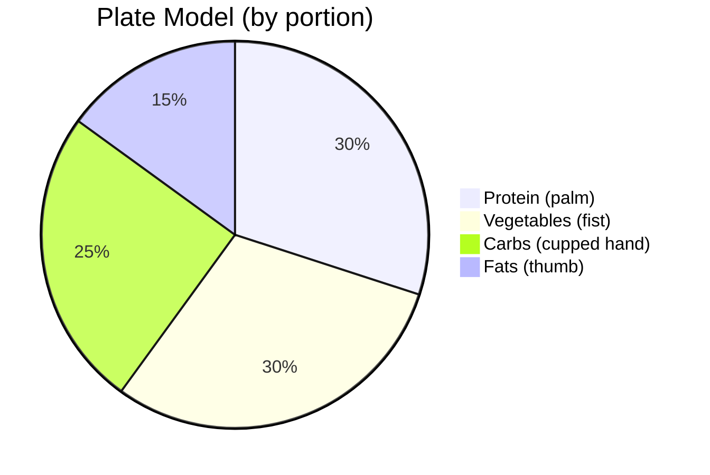

# Training Protocol

> Physical capacity is the foundation of mental performance. You cannot out-think a broken body.

## Training Philosophy

## Weekly Structure (Polarized Training)

The gold standard: **80% Zone 2, 20% high intensity.** This is what elite endurance athletes use.

| Day | Focus | Duration | Intensity |
|-----|-------|----------|-----------|
| Mon | Strength (Upper) + 10 min mobility | 60 min | High |
| Tue | Zone 2 Cardio | 60-90 min | Low |
| Wed | Strength (Lower) + 10 min mobility | 60 min | High |
| Thu | HIIT / VO2max intervals | 30-40 min | Very High |
| Fri | Strength (Full Body) + 10 min mobility | 45-60 min | Moderate |
| Sat | Zone 2 Cardio (long session) | 60-90 min | Low |
| Sun | Active Recovery / Mobility / Walk | 30-60 min | Very Low |

---

## Strength Training

### The Big 6

### Evidence-Based Hypertrophy Principles (2024-2025 Research)

- **Volume**: 10-20 hard sets per muscle group per week. Diminishing returns beyond ~20 sets (2024 meta-regression)
- **Frequency**: 2x per week per muscle group is sufficient. Going to 3x yields minimal additional growth if volume is equated
- **Intensity**: Take sets close to failure (0-3 RIR — reps in reserve). Emerging evidence suggests lower volume with higher intensity may be equally effective
- **Progressive overload**: Periodically increasing volume from a baseline produced greater adaptations than maintaining static volume (2024 Journal of Applied Physiology)
- **Full ROM**: Perform all lifts through complete range of motion — this alone matches or exceeds static stretching for flexibility gains (2023 meta-analysis)
- **Split type doesn't matter much**: PPL, upper/lower, and full-body all produce similar results when total volume is equated (2025 study)

> **Bottom line**: Pick whatever split lets you accumulate 10-20 hard sets per muscle group per week. Train each muscle at least 2x/week. Take sets close to failure.

### Grip Strength: The Longevity Marker

Grip strength is one of the **strongest predictors of all-cause mortality** — more predictive than blood pressure or alcohol intake.

**Targets**: Men 40+ kg (ideally 50+). Women 25+ kg (ideally 35+).

**How to train it**:
- Dead hangs: 3 sets, accumulate 2+ minutes total
- Farmer's carries: 3 sets x 30-60 seconds, heavy
- Fat grip attachments on pulling exercises
- Frequency: 2-3x per week

---

## Cardio: Zone 2 + VO2max

### Zone 2 (The Longevity Base)

Zone 2 = just below first lactate threshold (~1-2 mmol/L blood lactate). You can talk but it's not easy.

| Zone | % Max HR | Description |
|------|----------|-------------|
| Zone 1 | 50-60% | Very easy, recovery |
| **Zone 2** | **60-70%** | **THE BASE — do most cardio here** |
| Zone 3 | 70-80% | "Grey zone" — least efficient |
| Zone 4 | 80-90% | Threshold work |
| Zone 5 | 90-100% | Max effort, sprint intervals |

**Protocol**: 45-90 min per session (under 30 min doesn't induce meaningful mitochondrial adaptations). 3-4 sessions/week, 150-180 min total.

**2025 nuance**: A narrative review found Zone 2 is NOT uniquely superior for mitochondrial capacity — higher intensities produce greater VO2max improvements. The best approach is **polarized**: mostly Zone 2 + some high intensity.

### VO2max (The #1 Longevity Predictor)

**VO2max is the single strongest predictor of all-cause mortality** — larger impact than smoking, diabetes, or heart disease. Bottom 25th percentile carries **4x mortality risk** vs top 2.5%. It declines ~10% per decade after 25 — training can slow or reverse this.

**The Norwegian 4x4 Protocol** (gold standard):
1. 4 minutes at 90-95% max HR
2. 3 minutes active recovery
3. Repeat 4 times
4. Do this 2x per week

**VO2max Targets (ml/kg/min)**:
| Age | Men (Good / Excellent) | Women (Good / Excellent) |
|---|---|---|
| 30s | 40-48 / 48+ | 34-40 / 40+ |
| 40s | 36-44 / 44+ | 30-36 / 36+ |
| 50s | 32-40 / 40+ | 28-34 / 34+ |

---

## Cold & Heat Exposure

### Cold Plunge

> **CRITICAL**: Cold water immersion immediately after strength training **blunts hypertrophy by ~25%** over 12 weeks. It attenuates satellite cell activation and anabolic signaling. Wait 6-8 hours after resistance training, or save cold plunges for rest/cardio days.

### Sauna

- **Temperature**: 80-100°C (176-212°F) for Finnish sauna. 60°C for infrared
- **Duration**: 15-20 min per session (traditional). 30-40 min (infrared)
- **Frequency**: 4-7 sessions/week for maximum cardiovascular benefit
- **Finnish study (25,000+ men, 20 years)**: 4-7 sauna sessions/week → **40% reduction in all-cause mortality** vs 1 session/week
- Also linked to reduced dementia, Alzheimer's, and cardiovascular disease risk

---

## Breathing Techniques

### Nasal Breathing (Default)

- Produces **nitric oxide** in paranasal sinuses → vasodilator that improves oxygen uptake
- Faster muscle reoxygenation during recovery (2025 study)
- Better air filtration, increased diaphragmatic engagement, lower blood pressure
- **Use for**: All Zone 2 and moderate work. Switch to mouth breathing at >80% VO2max

### Wim Hof Method (Pre-Workout Priming)

1. 30 deep breaths (inhale fully, exhale passively)
2. Exhale and hold breath for 1-2 minutes
3. Repeat 3 rounds
- May reduce inflammation via increased epinephrine (2024 systematic review)
- Never practice near water or while driving

### Physiological Sigh (Fastest Calm-Down)

- Double inhale through nose → long exhale through mouth
- Activates parasympathetic nervous system within seconds
- Best for: post-workout recovery, pre-sleep, acute stress

---

## Mobility (Evidence-Based)

**Key finding**: Full ROM resistance training improves flexibility comparably to dedicated stretching (2023 meta-analysis). Stretching is supplementary, not primary.

1. **Full ROM resistance training** (most important) — do all lifts through complete range
2. **Dynamic stretching pre-workout**: 5-10 min, movement patterns you'll train
3. **Static stretching post-workout**: Hold 30-60 sec per stretch. Do NOT static stretch before maximal effort (temporarily reduces force output)
4. **Daily**: 90/90 hip switches (2-3 min), Controlled Articular Rotations (CARs) for every major joint (5-10 min), wall slides + band pull-aparts for thoracic/shoulder mobility

---

## Sleep Protocol (Non-Negotiable)

Sleep is the single highest-ROI performance intervention.

### Evidence-Based Sleep Stack

| Supplement | Dosage | Timing | Evidence |
|---|---|---|---|
| **Magnesium glycinate** | 200-400mg | 30-60 min before bed | Improved insomnia scores vs placebo. Glycine itself promotes sleep |
| **Tart cherry extract** | 480mg extract or 8oz juice | Evening | Contains natural melatonin + anthocyanins. +25 min total sleep, +15 min deep sleep |
| **Glycine** | 3g | Before bed | Improved subjective sleep quality and reduced next-day fatigue |
| **L-theanine** | 200mg | Before bed | Promotes relaxation without sedation |
| **Apigenin** (chamomile) | 50mg | Before bed | Mild sleep-promoting effect |

> **Avoid melatonin as first-line** — it's a chronobiotic (shifts timing), not a sedative. Useful for jet lag, less so for ongoing sleep quality.

---

## Nutrition

Don't overcomplicate this. 80% of results come from basics:

### Protein Timing (2024-2025 Research)

- **Total daily**: 1.6-2.2g per kg bodyweight for hypertrophy
- **Distribution**: Spread across 3-5 meals with 0.4-0.55g/kg per meal. Even distribution beats loading all protein in one meal
- **Post-workout**: 20-40g within 2 hours (window is wider than the old "30 min" myth)
- **Pre-sleep**: 30-40g casein before bed benefits overnight muscle protein synthesis

### Meal Timing

- **Early time-restricted eating** shows strongest metabolic benefits: eating window of 8 AM - 2 PM improved insulin sensitivity, lipid profiles, and weight regulation
- **Front-load calories**: Majority of daily calories earlier in the day. Late eating (after 9 PM) worsens metabolic outcomes
- **Don't fast if hypertrophy is the primary goal** — harder to get adequate calories and protein in a restricted window

### Gut Health

- **30+ grams fiber daily** from diverse plant sources (aim for 30+ different plant foods per week)
- **Fermented foods daily**: yogurt, kefir, kimchi, sauerkraut (Stanford study: increased microbial diversity more than high-fiber diet alone)
- **Prebiotic foods**: garlic, onions, leeks, asparagus, bananas, oats
- **Avoid**: excessive NSAIDs, unnecessary antibiotics, artificial sweeteners

---

## Evidence-Based Supplement Stack

### Tier 1 (Strong Evidence)

| Supplement | Dosage | Key Benefit | Notes |
|---|---|---|---|
| **Creatine monohydrate** | 5g daily | Muscle, brain, strength | Most studied supplement ever. No loading needed |
| **Vitamin D3** | 2,000-4,000 IU daily | Immune, bone, mood | Take with fat. Target 40-60 ng/mL blood level. Pair with K2 |
| **Magnesium** | 200-400mg daily (chelated) | Sleep, recovery, 300+ enzyme reactions | Glycinate for sleep, L-threonate for cognition. Take evening |
| **Omega-3 (EPA/DHA)** | 2-4g combined EPA+DHA daily | Anti-inflammatory, brain, heart | Min 1g EPA for anti-inflammatory effect |

### Tier 2 (Good Evidence)

| Supplement | Dosage | Key Benefit |
|---|---|---|
| **Ashwagandha (KSM-66)** | 600mg daily | Cortisol reduction, recovery |
| **Zinc** | 15-30mg daily | Testosterone support, immune |
| **Vitamin K2 (MK-7)** | 100-200mcg daily | Calcium metabolism (pair with D3) |

---

## Recovery Checklist

Recovery is where adaptation happens. Training is the stimulus; recovery is the response.

- [ ] 7-9 hours sleep in 18-20°C room
- [ ] Adequate protein (1.6-2.2g/kg)
- [ ] Hydrated (clear/light yellow urine)
- [ ] 1-2 rest days per week
- [ ] Deload week every 4-6 weeks (reduce volume 40-50%)
- [ ] Manage stress (chronic stress = chronic cortisol = poor recovery)
- [ ] Morning sunlight (10 min within 30 min of waking)
- [ ] Daily supplement stack (creatine, D3+K2, omega-3, magnesium)

---

## Quick-Reference Weekly Protocol

| Day | Training | Recovery/Optimization |
|---|---|---|
| Mon | Strength (Upper) + 10 min mobility | Morning sunlight, sauna PM |
| Tue | Zone 2 cardio (60-90 min) | Cold plunge OK (no strength conflict) |
| Wed | Strength (Lower) + 10 min mobility | Sauna PM |
| Thu | HIIT / VO2max intervals (Norwegian 4x4) | Cold plunge OK |
| Fri | Strength (Full Body) + 10 min mobility | Sauna PM |
| Sat | Zone 2 cardio (60-90 min) | Cold plunge + sauna contrast OK |
| Sun | Active recovery / long walk / yoga | Sauna, full mobility routine |

## References

- Dr. Andy Galpin — Huberman Lab series on fitness
- Dr. Peter Attia — *Outlive* (longevity-focused training)
- Dr. Matthew Walker — *Why We Sleep*
- Jeff Nippard — Evidence-based training (YouTube)
- Renaissance Periodization — Volume landmarks and programming
- Andrew Huberman — Cold exposure, sauna, breathing protocols
- Finnish Cardiovascular Risk Factor Study — Sauna and mortality (25,000+ men, 20 years)
- Journal of Applied Physiology (2024) — Progressive overload studies
- Norwegian University of Science and Technology — 4x4 interval protocol
- Stanford (2021) — Fermented foods and gut microbial diversity
