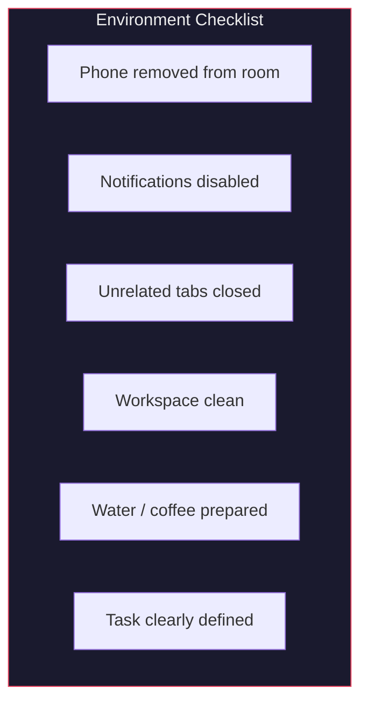
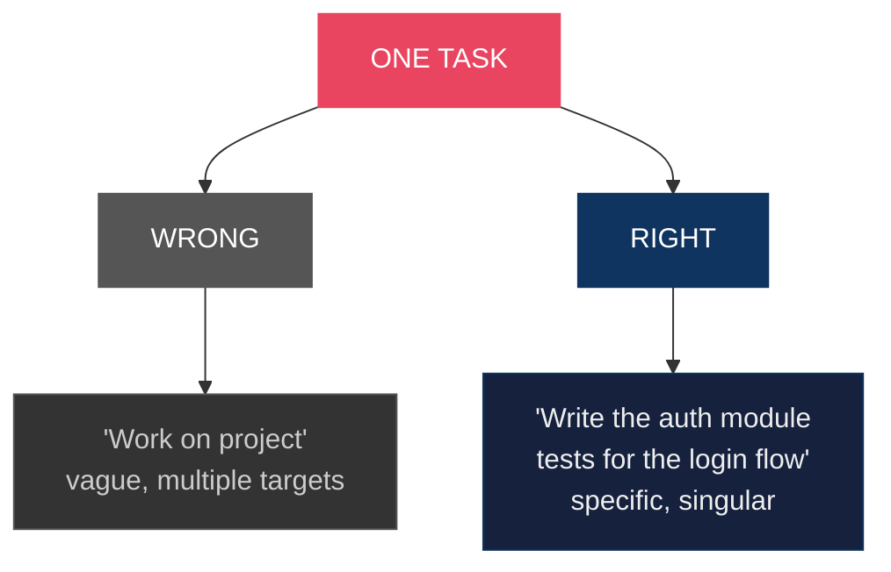
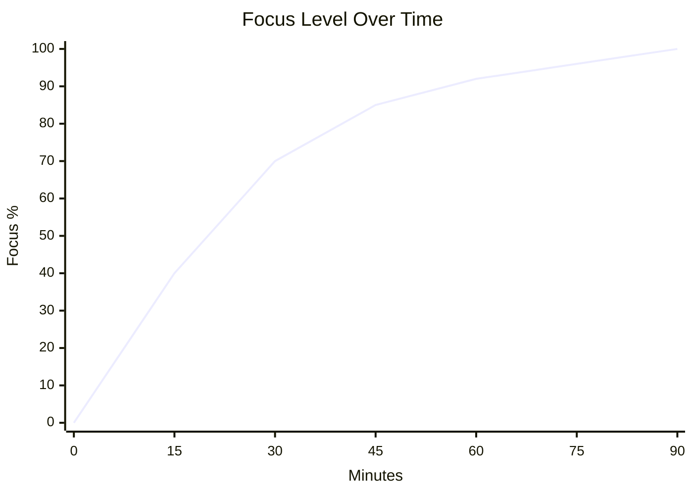
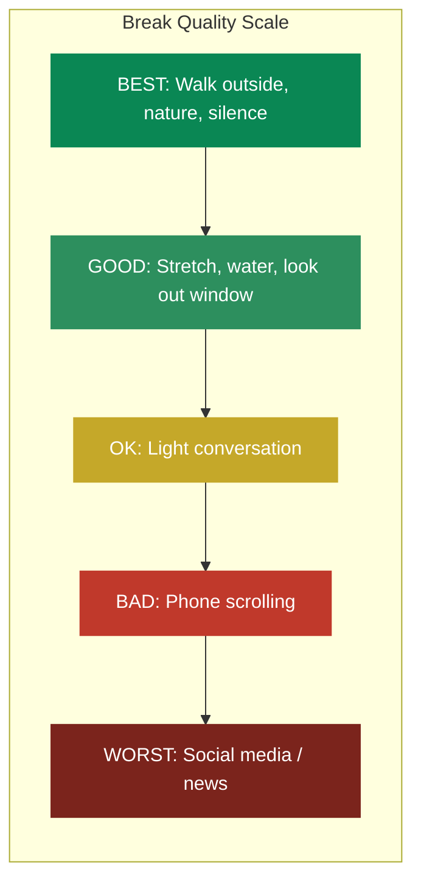
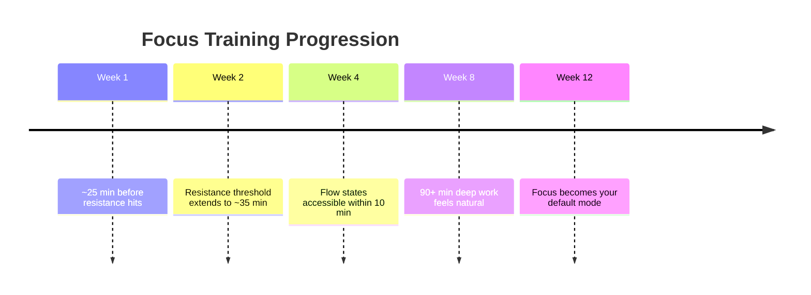
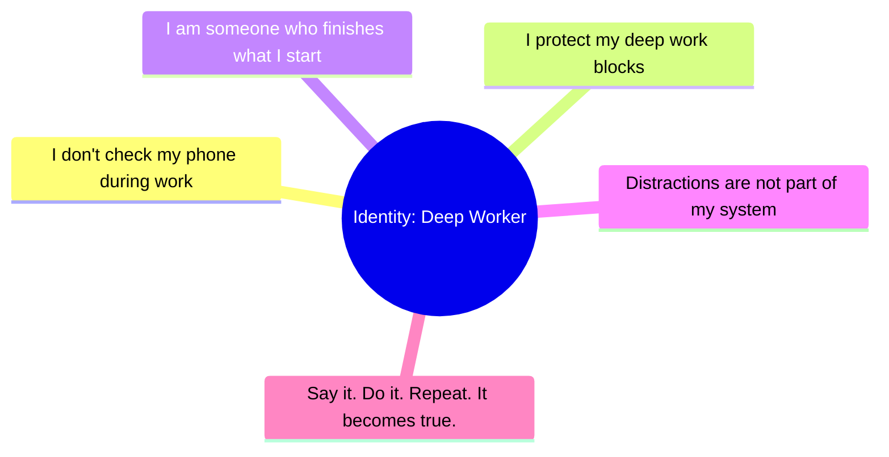

# Flow State Protocol

> Your brain functions in power-saving mode by default. It conserves energy, pushes you to procrastinate, and stops you from doing creative work. But you can train yourself to enter a flow state of deep focus at will.

## The Protocol

### Phase 1: Environment Design

**Elimination before optimization.** Don't add tools — remove friction.

- Phone in another room (not flipped over, not on silent — GONE)
- Close all browser tabs unrelated to the task
- Notifications off on all devices
- Clean workspace — visual clutter = mental clutter
- One monitor if possible (reduces context-switching temptation)
- Same location, same time daily (environment becomes the trigger)

### Phase 2: Pre-Work Ritual (5-10 minutes)

The minutes before work define the quality of the session. Pick what works for you:

- **Box breathing**: 4 seconds in, 4 hold, 4 out, 4 hold (3-5 rounds)
- **Journaling**: Write down the ONE thing you will accomplish this session — try [Isip](https://isip.pastelero.ph), a todo + journal app I built for exactly this
- **Visualization**: See yourself completing the work, then start
- **Intention statement**: "For the next 90 minutes, I am working on X. Nothing else exists."

The purpose is **clarity of intention** — making your target obvious and singular.

### Phase 3: Single Focus Execution

Pick ONE task. Not two. Not a task list. One clear target.

### Phase 4: The Resistance Threshold (15-25 minutes)

This is where most people fail. ~15-25 minutes in, you'll feel the itch:

- Check your phone
- Open social media
- "Quickly" check email
- Get a snack you don't need

**This is the critical moment.** Giving in here is the worst thing you can do.

> **THE WALL hits at 15-25 min.** Most people quit here. Push through it — each time you do, the neural pathways for deep focus physically strengthen.

**What to do:**
1. Notice the urge — don't fight it, acknowledge it: "There's the itch."
2. Set a **distraction stopwatch** — time how long you can resist
3. Breathe through it — the urge passes in 60-90 seconds
4. Return to the task

Each time you cross this threshold, the neural pathways for deep focus physically strengthen. It is literally a training process — like building muscle.

### Phase 5: Real Breaks

After 60-90 minutes of deep work:

- **DO**: Walk around, look out the window, stretch, drink water, stare at nothing
- **DON'T**: Check phone, scroll social media, watch videos, read news

The break must let your brain idle — not switch to another stimulation source.

> **Rule: If it has a screen, it's not a break.**

## Compounding Effects

This is not a one-day hack. It's a practice with compound returns:

## Identity Lock

The final piece: **You must identify as someone who operates this way.**

Not "I'm trying to focus more." Instead: **"I am someone who protects their focus."**

Every time you sit down and push through the resistance, you cast a vote for this identity. Every vote strengthens it.

## Daily Template

```mermaid
gantt
    title Deep Work Daily Schedule
    dateFormat HH:mm
    axisFormat %H:%M
    section Morning
        Wake + hydrate           :06:00, 15m
        Movement                 :06:15, 15m
        Pre-work ritual          :06:30, 10m
    section Deep Work
        Block 1 (90 min)         :crit, 06:40, 90m
        Real break (no screens)  :08:10, 15m
        Block 2 (90 min)         :crit, 08:25, 90m
        Break                    :09:55, 15m
        Block 3 (60-90 min)      :crit, 10:10, 75m
    section Afternoon
        Meetings, admin, shallow :11:25, 240m
```

Most people can sustain 3-4 hours of true deep work per day. That's enough to outperform 99% of people who scatter their attention across 8+ hours.

## References

- Cal Newport — *Deep Work*
- Mihaly Csikszentmihalyi — *Flow*
- Andrew Huberman — Focus Toolkit (Huberman Lab Podcast)
- Steven Kotler — *The Art of Impossible*
