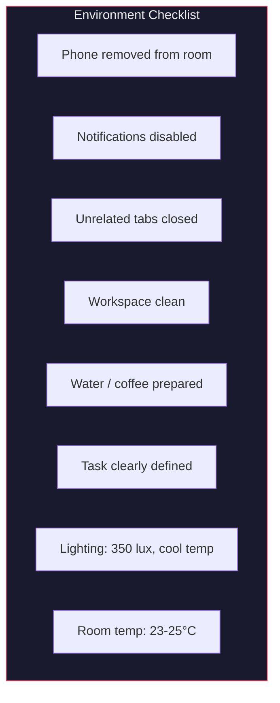
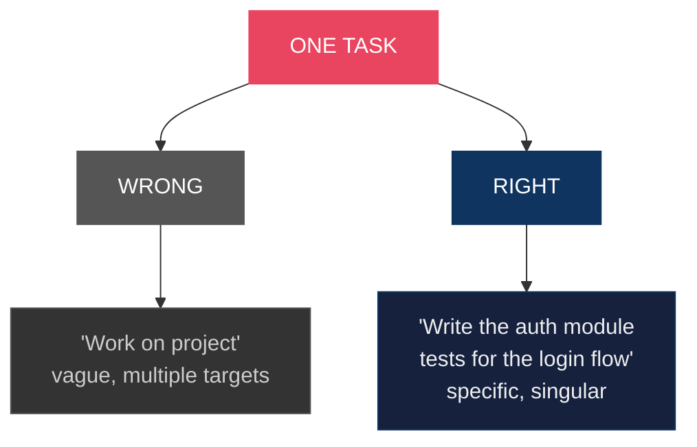
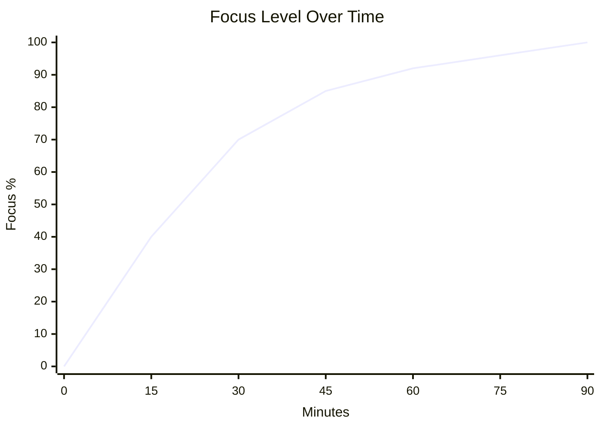
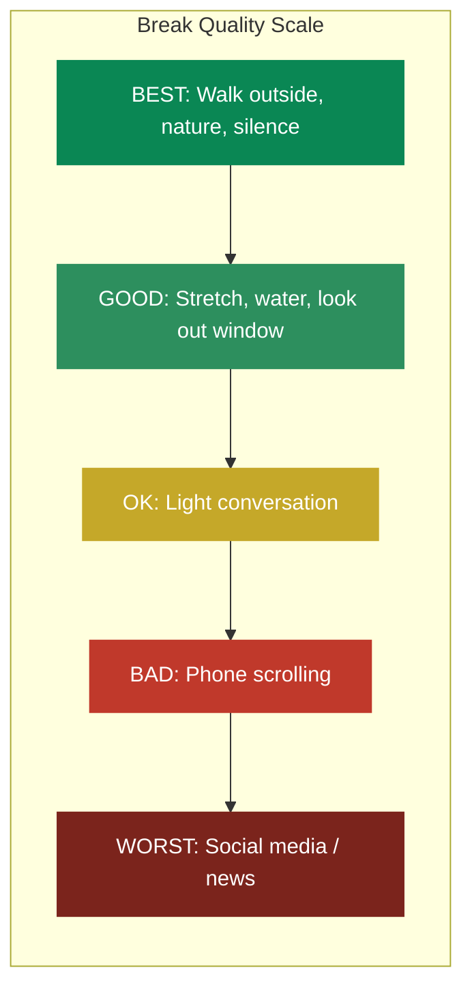
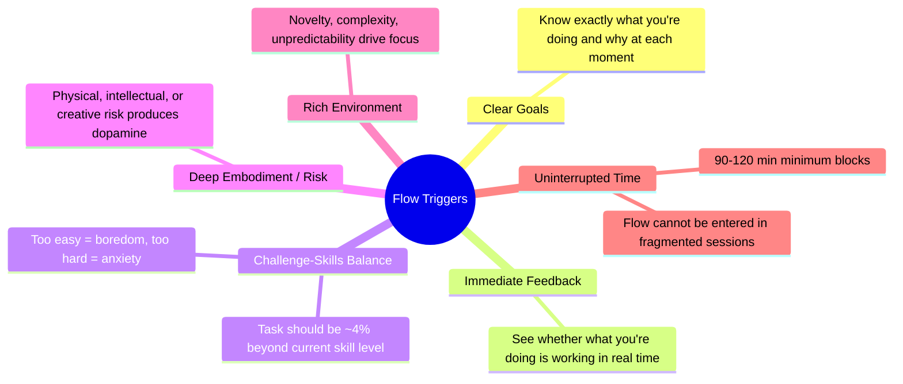
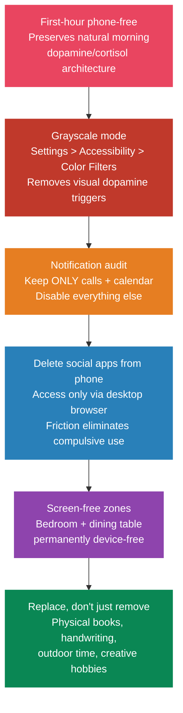
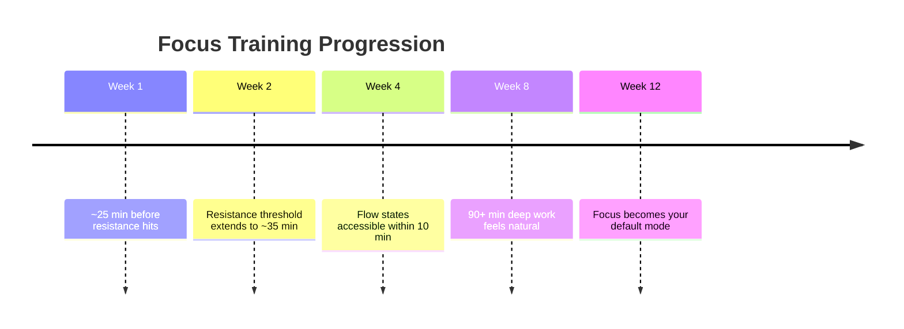
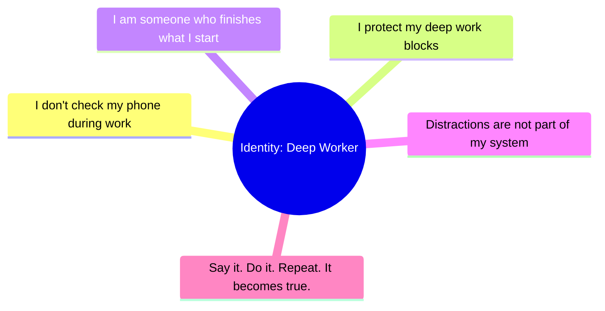

# Flow State Protocol

> Your brain functions in power-saving mode by default. It conserves energy, pushes you to procrastinate, and stops you from doing creative work. But you can train yourself to enter a flow state of deep focus at will.

## The Protocol

### Phase 1: Environment Design

**Elimination before optimization.** Don't add tools — remove friction.

- Phone in another room (not flipped over, not on silent — GONE)
- Close all browser tabs unrelated to the task
- Notifications off on all devices — every notification takes ~23 minutes to fully recover from (UC Irvine research)
- Clean workspace — visual clutter = mental clutter
- One monitor if possible (reduces context-switching temptation)
- Same location, same time daily (environment becomes the trigger)
- **Lighting**: ~350 lux, cooler color temp (~5000K) for analytical work, warmer (~3000K) for creative work
- **Temperature**: 23-25°C (73-77°F) optimal for cognition. Above 26°C significantly increases fatigue and errors
- **Noise**: ~45 dB for analytical focus (quiet library). ~70 dB ambient (coffee shop) boosts creativity but impairs analytical work

### Phase 2: Pre-Work Ritual (5-10 minutes)

The minutes before work define the quality of the session. Pick what works for you:

- **Box breathing**: 4 seconds in, 4 hold, 4 out, 4 hold (3-5 rounds)
- **Journaling**: Write down the ONE thing you will accomplish this session — try [Isip](https://isip.pastelero.ph), a todo + journal app I built for exactly this
- **Visualization**: See yourself completing the work, then start
- **Intention statement**: "For the next 90 minutes, I am working on X. Nothing else exists."
- **NSDR (Non-Sleep Deep Rest)**: A 10-minute body-scan + long-exhale breathing protocol. A daily 13-minute practice improved attention, working memory, and recognition memory while reducing anxiety. 1-hour yoga nidra increased baseline dopamine by 65% (Huberman Lab)

The purpose is **clarity of intention** — making your target obvious and singular.

### Phase 3: Single Focus Execution

Pick ONE task. Not two. Not a task list. One clear target.

### Phase 4: The Resistance Threshold (15-25 minutes)

This is where most people fail. ~15-25 minutes in, you'll feel the itch:

- Check your phone
- Open social media
- "Quickly" check email
- Get a snack you don't need

**This is the critical moment.** Giving in here is the worst thing you can do.

Steven Kotler's flow research confirms: the first 20-30 minutes of frustration/difficulty is a **required neurochemical precursor** to flow. The brain is loading information and shifting from beta to alpha/theta waves. This "struggle phase" is not failure — it's the entry fee.

> **THE WALL hits at 15-25 min.** Most people quit here. Push through it — each time you do, the neural pathways for deep focus physically strengthen.

**What to do:**
1. Notice the urge — don't fight it, acknowledge it: "There's the itch."
2. Set a **distraction stopwatch** — time how long you can resist
3. Breathe through it — the urge passes in 60-90 seconds
4. Return to the task

Each time you cross this threshold, the neural pathways for deep focus physically strengthen. It is literally a training process — like building muscle.

### Phase 5: Real Breaks

After 60-90 minutes of deep work:

- **DO**: Walk around, look out the window, stretch, drink water, stare at nothing
- **DON'T**: Check phone, scroll social media, watch videos, read news

The break must let your brain idle — not switch to another stimulation source.

> **Rule: If it has a screen, it's not a break.**

---

## Ultradian Rhythms: The 90-Minute Rule

Your brain operates in ~90-minute ultradian cycles of higher and lower alertness (the same cycles that govern sleep stages at night). Professionals who aligned work with 90-minute cycles experienced **40% higher productivity** and **50% less mental fatigue** (Journal of Cognition).

After 90 minutes, forcing more deep work yields diminishing returns. The break is not optional — it's when the brain consolidates what was processed.

**DeskTime research** on the most productive 10% of users found they worked **52 minutes**, then broke for **17 minutes** on average.

---

## Caffeine Timing Science

```mermaid
gantt
    title Optimal Caffeine Window
    dateFormat HH:mm
    axisFormat %H:%M
    section Morning
        Wake up              :milestone, 07:00, 0m
        No caffeine zone     :crit, 07:00, 90m
    section Caffeine OK
        Optimal window       :active, 08:30, 270m
        Last caffeine cutoff :milestone, 13:00, 0m
    section Evening
        No caffeine zone     :crit, 13:00, 600m
```

- **Wait 90 minutes after waking** before your first caffeine. Cortisol peaks 30-45 min after waking and naturally promotes alertness. Caffeine during this peak wastes the effect and blunts your cortisol response over time
- **Caffeine doesn't create energy** — it blocks adenosine receptors, masking fatigue. Drinking it immediately means adenosine is still there and hits you later as the "afternoon crash"
- **Half-life: 5-6 hours.** A cup at 2pm means half the caffeine is active at 7-8pm
- **Evening caffeine delays melatonin by ~40 minutes** (Science Translational Medicine)
- **Conservative cutoff**: No caffeine within 10 hours of bedtime

---

## Sound & Music for Focus

| Sound Type | Best For | Why |
|---|---|---|
| **Brown noise** | Analytical/deep work | Masks speech frequencies better than white noise. Many ADHD individuals report significant focus improvement |
| **40Hz binaural beats** | Concentration | Gamma-range associated with focus (mixed evidence, but consistent auditory environment helps) |
| **Instrumental music** | Analytical work | No lyrics — lyrics in any language you understand impair language-based tasks |
| **Nature sounds / silence** | Creative work | Lower stimulation supports divergent thinking |
| **Brain.fm** | Both | Uses neural phase-locking (not traditional binaural beats). Backed by fMRI studies. Reaches effective state in ~5 min |

> **Pro tip**: Using the same focus soundtrack creates a Pavlovian association that speeds up the transition into focus mode over time.

---

## Flow State Triggers (Steven Kotler Research)

Kotler's Flow Research Collective identified 22 triggers. The most actionable:

> Kotler's program measured an average **70% improvement** across seven flow metrics.

---

## The Flowtime Technique (Best Pomodoro Alternative)

The Pomodoro's fixed 25-minute timer interrupts flow. The Flowtime technique respects your natural rhythm:

1. Start a timer when you begin working — do NOT set an alarm
2. Work until focus naturally fades, then note elapsed time
3. Take a proportional break:

| Work Duration | Break |
|---|---|
| ~25 min | 5 min |
| ~50 min | 8 min |
| ~90+ min | 10-15 min |

---

## Digital Minimalism Protocol

The average person checks their phone **96 times/day**. Gen Z: 150+.

---

## Dopamine Management (What Actually Works)

"Dopamine detox" is misleading — no evidence supports it. What the science actually shows:

- **Avoid dopamine stacking** — layering multiple pleasurable stimuli (music + phone + coffee + pre-workout) before a task creates an artificial peak followed by a crash below baseline, killing motivation
- **Cold exposure**: 1-5 minutes at 4-10°C (40-50°F) produces a **250% increase in dopamine** above baseline, lasting 2-5+ hours. Comparable to stimulant medications but without the crash. Target ~11 minutes/week across 2-4 sessions (Huberman)
- **Reduce supernormal stimuli**: Social media, porn, ultra-processed food, gambling hijack the reward system with larger spikes than natural rewards
- **Pursue "earned dopamine"**: Exercise, completing hard work, learning, and social connection provide dopamine through healthier pathways
- **Think about the anticipation, not the reward**: Positive anticipation of goals generates sustained dopamine lasting hours to days

---

## Compounding Effects

This is not a one-day hack. It's a practice with compound returns:

## Identity Lock

The final piece: **You must identify as someone who operates this way.**

Not "I'm trying to focus more." Instead: **"I am someone who protects their focus."**

Every time you sit down and push through the resistance, you cast a vote for this identity. Every vote strengthens it.

## The Optimal Deep Work Day

```mermaid
gantt
    title Deep Work Daily Schedule
    dateFormat HH:mm
    axisFormat %H:%M
    section Morning
        Wake + sunlight (10 min)      :06:00, 15m
        Movement + hydrate             :06:15, 15m
        Pre-work ritual (NSDR/breathe) :06:30, 10m
    section Deep Work
        Block 1 — analytical work     :crit, 06:40, 90m
        Real break (walk, no screens)  :08:10, 15m
        Block 2 — analytical work     :crit, 08:25, 90m
        Break                          :09:55, 15m
        Block 3 — creative work       :crit, 10:10, 75m
    section Afternoon
        Meetings, admin, shallow       :11:25, 240m
    section Notes
        First caffeine at 07:30        :milestone, 07:30, 0m
        Last caffeine by 13:00         :milestone, 13:00, 0m
```

> **Key insight**: Prioritize analytical/implementation tasks in the morning (0-8 hours after waking) when norepinephrine and cortisol are elevated. Shift to creative/brainstorming work in the afternoon when serotonin is relatively higher.

Most people can sustain 3-4 hours of true deep work per day. That's enough to outperform 99% of people who scatter their attention across 8+ hours.

## References

- Cal Newport — *Deep Work*
- Mihaly Csikszentmihalyi — *Flow*
- Steven Kotler — *The Art of Impossible* + Flow Research Collective
- Andrew Huberman — Focus Toolkit, Dopamine Control, NSDR (Huberman Lab Podcast)
- Nir Eyal — *Indistractable*
- Chris Bailey — *Hyperfocus*
- DeskTime — 52/17 productivity research
- Journal of Cognition — Ultradian rhythm study
- Science Translational Medicine — Caffeine and circadian rhythm
- UC Irvine — Notification recovery time research
