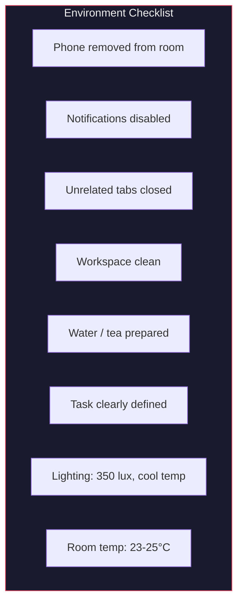
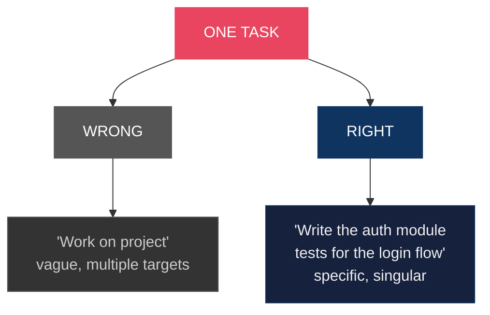
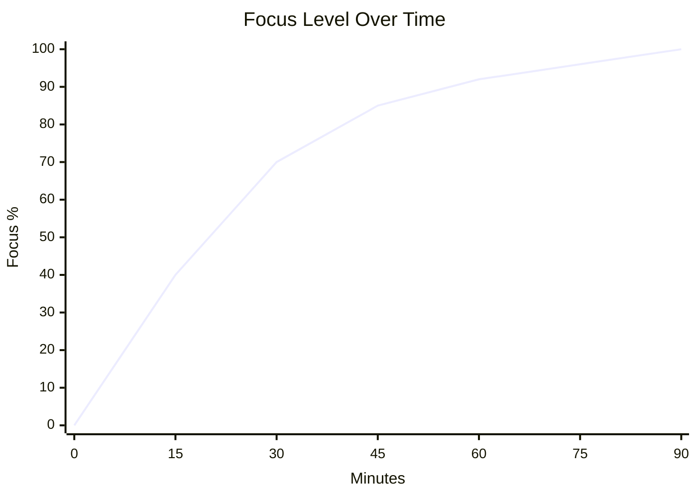
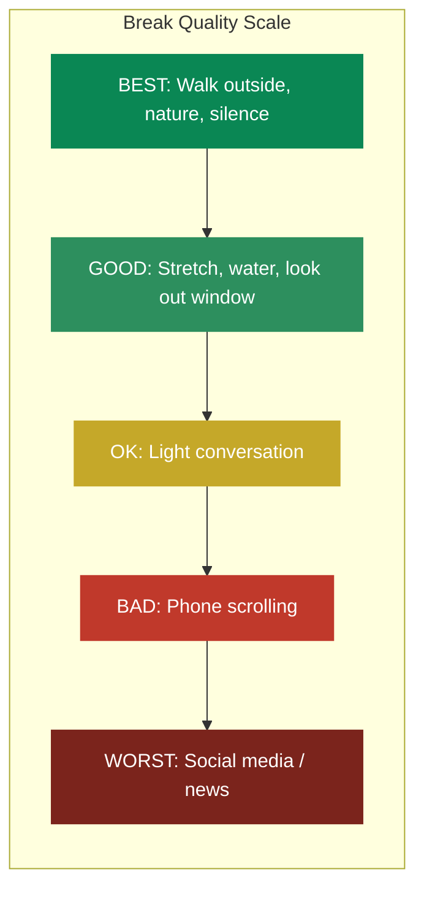
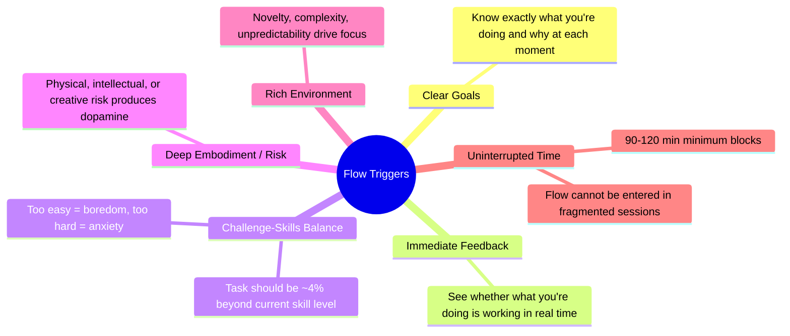
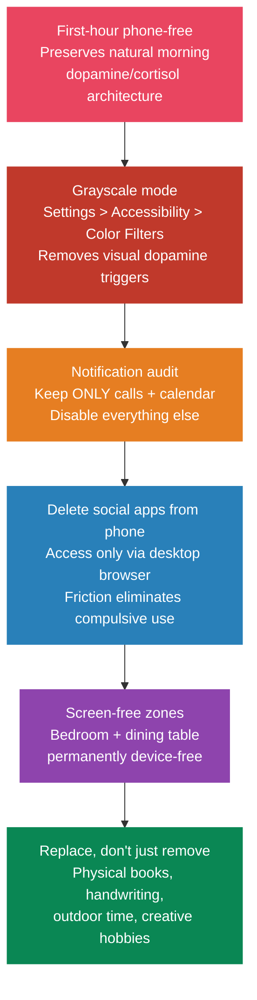
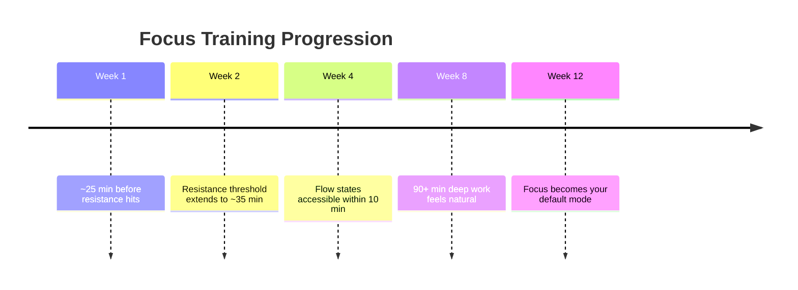
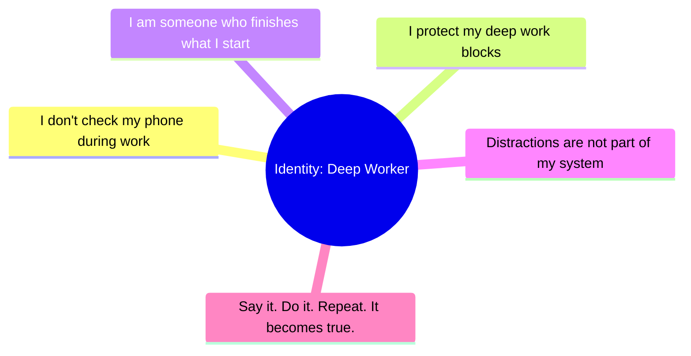

```mermaid
gantt
    title Optimal Caffeine Window
    dateFormat HH:mm
    axisFormat %H:%M
    section Morning
        Wake up              :milestone, 07:00, 0m
        No caffeine zone     :crit, 07:00, 90m
    section Caffeine OK
        Optimal window       :active, 08:30, 270m
        Last caffeine cutoff :milestone, 13:00, 0m
    section Evening
        No caffeine zone     :crit, 13:00, 600m
```

# Flow state protocol

> Your brain runs in power-saving mode by default. It conserves energy, nudges you toward procrastination, and gets in the way of creative work. The useful part is that you can train yourself into deep focus on demand.

## The protocol

### Phase 1: environment design

Remove friction before you add tools.

- Phone in another room. Not flipped over, not on silent. Gone.
- Close every browser tab unrelated to the task.
- Notifications off on all devices. Each one costs about 23 minutes of recovery time (UC Irvine research).
- Clean workspace. Visual clutter turns into mental clutter.
- One monitor if you can manage it, since two invites context switching.
- Same place, same time each day, so the environment itself becomes the trigger.
- Lighting: around 350 lux, cooler color temperature (~5000K) for analytical work, warmer (~3000K) for creative work.
- Temperature: 23-25°C (73-77°F) is best for cognition. Above 26°C, fatigue and errors climb noticeably.
- Noise: around 45 dB for analytical focus, roughly a quiet library. Around 70 dB of coffee-shop ambience helps creativity but hurts analytical work.

### Phase 2: pre-work ritual (5-10 minutes)

The minutes before you start decide how good the session is. Pick whichever of these works for you:

- Box breathing: 4 seconds in, 4 hold, 4 out, 4 hold, for three to five rounds.
- Journaling: write down the one thing you'll finish this session. I built [Isip](https://isip.pastelero.ph), a todo and journal app, for exactly this.
- Visualization: watch yourself finish the work, then begin.
- Intention statement: "For the next 90 minutes I am working on X. Nothing else exists."
- NSDR (non-sleep deep rest): a 10-minute body scan with long exhales. A daily 13-minute practice improved attention, working memory and recognition memory while reducing anxiety, and an hour of yoga nidra raised baseline dopamine by 65% (Huberman Lab).

What you're after is one obvious target and nothing competing with it.

### Phase 3: single focus execution

Pick one task. Not two, and not a list.

### Phase 4: the resistance threshold (15-25 minutes)

Somewhere around 15 to 25 minutes in, the itch shows up: check your phone, open social media, "quickly" check email, get a snack you don't want. This is the point where most sessions die.

Steven Kotler's flow research says the first 20-30 minutes of frustration is a required neurochemical precursor to flow. The brain is loading information and shifting from beta into alpha and theta waves. The struggle phase isn't a sign you're failing at this, it's the part everyone has to sit through.

> The wall hits at 15-25 min. Push through it and the neural pathways for deep focus physically strengthen.

What to do when it hits:

1. Notice the urge and name it rather than fighting it: "there's the itch."
2. Start a distraction stopwatch and see how long you can hold out.
3. Breathe through it. The urge passes in 60 to 90 seconds.
4. Go back to the task.

Every time you cross that threshold you're training a capacity, in the same sense that you'd train a muscle.

### Phase 5: real breaks

After 60 to 90 minutes of deep work: walk around, look out the window, stretch, drink water, stare at nothing. Don't check your phone, scroll, watch videos, or read news.

The break works by letting your brain idle. Swapping one stimulation source for another doesn't count.

> Rule: if it has a screen, it isn't a break.

---

## Ultradian rhythms: the 90-minute rule

Your brain runs on roughly 90-minute ultradian cycles of higher and lower alertness, the same cycles that govern sleep stages at night. Sleep researcher Nathaniel Kleitman described them first. Working with the cycle, pushing while alertness is high and resting at the trough, means you're not fighting your own biology for the whole session.

Past 90 minutes, pushing for more deep work gives you less and less. The break is where the brain consolidates what it just processed.

DeskTime's research on their most productive 10% of users found they worked 52 minutes and broke for 17, on average. That was the original 2014 analysis, and a later look put it closer to 112/26, so take the principle rather than the exact ratio.

---

## Caffeine timing

This applies to any caffeine source: tea, matcha, energy drinks, pre-workout, soda.

- Wait 90 minutes after waking before the first one. Cortisol peaks 30-45 minutes after waking and already makes you alert. Caffeine on top of that peak wastes the effect and blunts your cortisol response over time.
- Caffeine doesn't create energy. It blocks adenosine receptors and masks fatigue. Drink it too early and the adenosine is still piling up behind the blockade, which is what the afternoon crash actually is.
- Half-life is 5-6 hours. Caffeine at 2pm means half of it is still working at 7 or 8pm.
- Evening caffeine delays melatonin by about 40 minutes (Science Translational Medicine).
- Conservative cutoff: nothing within 10 hours of bedtime.
- If you don't drink caffeine at all, you're already ahead. The cortisol and adenosine cycle runs unmasked, which means steadier energy through the day and better sleep without doing anything.

---

## Sound and music for focus

| Sound Type | Best For | Why |
|---|---|---|
| **Brown noise** | Analytical/deep work | Masks speech frequencies better than white noise. Many ADHD individuals report significant focus improvement |
| **40Hz binaural beats** | Concentration | Gamma-range associated with focus (mixed evidence, but consistent auditory environment helps) |
| **Instrumental music** | Analytical work | No lyrics. Lyrics in any language you understand impair language-based tasks |
| **Nature sounds / silence** | Creative work | Lower stimulation supports divergent thinking |
| **Brain.fm** | Both | Uses neural phase-locking rather than traditional binaural beats. Backed by fMRI studies. Reaches effective state in ~5 min |

> Reusing the same focus soundtrack builds a Pavlovian association, and the transition into focus gets faster over time.

---

## Flow state triggers (Steven Kotler)

Kotler's Flow Research Collective identified 22 triggers. The ones you can actually act on:

> Kotler's Flow Research Collective reports an average 70% improvement across seven flow metrics in its own training programs. That's a program metric rather than a peer-reviewed result, though the triggers themselves are well grounded.

---

## The Flowtime technique

Pomodoro's fixed 25-minute timer cuts you off mid-flow. Flowtime works around your actual rhythm instead:

1. Start a timer when you begin. Don't set an alarm.
2. Work until focus fades on its own, then note the elapsed time.
3. Take a proportional break.

| Work Duration | Break |
|---|---|
| ~25 min | 5 min |
| ~50 min | 8 min |
| ~90+ min | 10-15 min |

---

## Digital minimalism protocol

The average person checks their phone 96 times a day. Gen Z is past 150.

---

## Dopamine management

"Dopamine detox" is a misleading term with no evidence behind it. What the research does support:

- Avoid dopamine stacking. Layering pleasurable stimuli before a task (music plus phone plus coffee plus pre-workout) creates an artificial peak and then a crash below baseline, which kills motivation.
- Cold exposure works. It produces a sustained, hours-long rise in dopamine above baseline without the crash stimulants leave behind. The widely quoted 250% figure comes from about an hour in 14°C water, so a 1-5 minute plunge gives you something smaller but still real. Target roughly 11 minutes a week across two to four sessions at 4-10°C / 40-50°F (Huberman).
- Reduce supernormal stimuli. Social media, porn, ultra-processed food and gambling hijack the reward system with spikes larger than anything natural.
- Go after earned dopamine instead: exercise, finishing hard work, learning, time with people.
- Think about the anticipation rather than the reward. Positive anticipation of a goal generates dopamine that lasts hours or days.

---

## Compounding effects

This isn't a one-day hack. It's a practice, and the returns arrive late:

## Identity lock

The last piece is that you have to see yourself as someone who works this way. Not "I'm trying to focus more" but "I protect my focus."

Every time you sit down and push through the resistance, you cast a vote for that version of yourself, and the votes accumulate.

## The optimal deep work day

```mermaid
gantt
    title Deep Work Daily Schedule
    dateFormat HH:mm
    axisFormat %H:%M
    section Morning
        Wake + sunlight (10 min)      :06:00, 15m
        Movement + hydrate             :06:15, 15m
        Pre-work ritual (NSDR/breathe) :06:30, 10m
    section Deep Work
        Block 1 (analytical work)      :crit, 06:40, 90m
        Real break (walk, no screens)  :08:10, 15m
        Block 2 (analytical work)      :crit, 08:25, 90m
        Break                          :09:55, 15m
        Block 3 (creative work)        :crit, 10:10, 75m
    section Afternoon
        Meetings, admin, shallow       :11:25, 240m
    section Notes
        Caffeine-free advantage         :milestone, 07:30, 0m
```

Put analytical and implementation work in the morning, in the first eight hours after waking, while norepinephrine and cortisol are elevated. Shift creative and brainstorming work to the afternoon when serotonin is relatively higher.

Most people can hold three or four hours of genuine deep work a day. That's plenty to outwork almost everyone spreading their attention across eight.

## References

- Cal Newport, *Deep Work*
- Mihaly Csikszentmihalyi, *Flow*
- Steven Kotler, *The Art of Impossible* and the Flow Research Collective
- Andrew Huberman, Focus Toolkit, Dopamine Control, NSDR (Huberman Lab Podcast)
- Nir Eyal, *Indistractable*
- Chris Bailey, *Hyperfocus*
- DeskTime, 52/17 productivity research
- Nathaniel Kleitman, the basic rest-activity cycle (ultradian rhythms)
- Science Translational Medicine, caffeine and circadian rhythm
- UC Irvine, notification recovery time research
