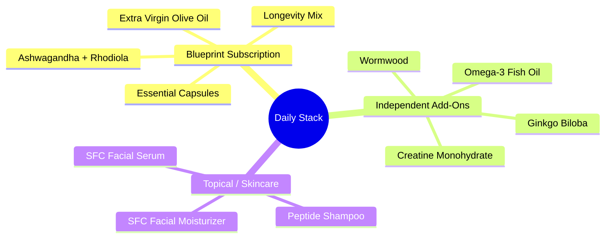
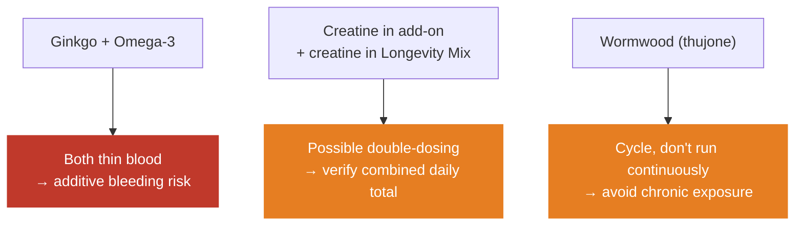

```mermaid
flowchart LR
    subgraph AM["Morning"]
        direction TB
        M1["Longevity Mix (with water)"]
        M2["Essential Capsules"]
        M3["Ginkgo biloba"]
        M4["SFC Serum → SFC Moisturizer"]
    end
    subgraph MEALS["With Meals"]
        direction TB
        F1["Omega-3 fish oil"]
        F2["EVOO on food"]
        F3["Creatine 5 g (anytime)"]
    end
    subgraph PM["Evening / As-Needed"]
        direction TB
        E1["Ashwagandha + Rhodiola"]
        E2["Wormwood (cycled)"]
        E3["Peptide Shampoo (wash days)"]
    end
    AM --> MEALS --> PM
    style AM fill:#16213e,stroke:#0f3460,color:#eee
    style MEALS fill:#1a1a2e,stroke:#e67e22,color:#eee
    style PM fill:#1a2c1a,stroke:#0a8754,color:#eee
```

# My supplement and longevity stack

> This is what I actually take, not a theoretical list. The science behind each compound is in the [training protocol](../fitness/training-protocol.md#supplement-stack). This page is the operating layer: what, when, why, and what it costs.

## The stack at a glance

---

## Blueprint monthly subscription (Bryan Johnson)

Auto-ships monthly. Prices in SGD.

| Item | Category | Price | Notes |
|------|----------|------:|-------|
| Longevity Mix, Blood Orange | Foundational | $68.11 | Daily multi-nutrient drink (creatine, taurine, glycine, electrolytes, polyphenols) |
| Essential Capsules | Foundational | $68.11 | Core micronutrient and longevity capsule blend |
| Ashwagandha + Rhodiola | Adaptogen | $33.35 | Cortisol and stress support, fatigue resistance |
| Extra Virgin Olive Oil (2 bottles) | Nutrition | $97.29 | High-polyphenol EVOO, the main cooking and finishing fat |
| Peptide Shampoo | Topical | $82.00 | Scalp and hair peptide formula |
| SFC Facial Moisturizer | Topical | $95.90 | Daily skin barrier and hydration |
| SFC Facial Serum | Topical | $82.00 | Active serum, goes on before moisturizer |
| **Subtotal (7 items)** | | **$526.76** | |
| Order discount (`EPUO326`) | | −$26.33 | |
| Shipping | | Free | |
| **Monthly total** | | **$500.43** | About $6,005 a year |

---

## Independent add-ons

These I buy outside the subscription. The first two have Tier 1 evidence behind them. The last two are lower confidence and carry interaction notes, flagged honestly below.

| Supplement | Typical dose | Timing | Purpose | Evidence |
|------------|-------------|--------|---------|----------|
| **Creatine monohydrate** | 5 g | Any time, daily | Strength, power, muscle, cognition | Tier 1, the most-studied supplement there is, no loading needed. Note: Longevity Mix also contains creatine, so check the combined total |
| **Omega-3 fish oil** | 2-4 g combined EPA+DHA | With a meal | Anti-inflammatory, brain, heart | Tier 1. Aim for at least 1 g EPA for the anti-inflammatory effect |
| **Ginkgo biloba** | 120-240 mg standardized extract | Morning | Circulation, cognition, memory | Mixed evidence, modest at best. Increases bleeding tendency, which compounds with omega-3. Stop about two weeks before any surgery |
| **Wormwood** (*Artemisia absinthium*) | Per product label | Short courses, not continuous | Digestive bitter, traditional antiparasitic | Limited human evidence. Contains thujone, which is neurotoxic at high or chronic doses. Avoid in pregnancy and with a seizure history, and cycle rather than run it indefinitely |

### Interactions and overlaps to watch

> This is not medical advice. Ginkgo and wormwood in particular are worth a quick conversation with a clinician, given the ginkgo plus omega-3 bleeding stack and wormwood's thujone content.

---

## Daily routine

> Timing is a starting template, so adjust to how each one sits with you. Adaptogens usually go in the evening for cortisol and sleep, but rhodiola is stimulating for some people. Move it earlier if it wrecks your sleep.

---

## Cost and review

| Metric | Value |
|--------|-------|
| Monthly spend (Blueprint) | SGD $500.43 |
| Annual spend (Blueprint) | About SGD $6,005 |
| Add-ons | Creatine, omega-3, ginkgo, wormwood. Budget separately |

Quarterly review questions:

- Which items have an effect I can feel or measure, in energy, sleep, recovery, skin, or bloodwork?
- Is anything redundant, like the creatine double-up or polyphenols coming from both EVOO and Longevity Mix?
- What does the bloodwork say? Is anything moving the markers I care about?
- Could a cheaper generic deliver the same active ingredient at the same dose?

> A stack costing $6K a year deserves the same scrutiny as any other system. Bloodwork and how you feel are the real measures, not how impressive the routine looks.

---

## References

- [Training protocol, supplement stack](../fitness/training-protocol.md#supplement-stack) for the dosing science on creatine, D3+K2, magnesium, omega-3 and ashwagandha
- [Blueprint Protocol (Bryan Johnson)](https://blueprint.bryanjohnson.com/), product source
- Examine.com, independent citation-based supplement reviews
- Dr. Peter Attia, *Outlive*
- NIH Office of Dietary Supplements, fact sheets on omega-3 and creatine
