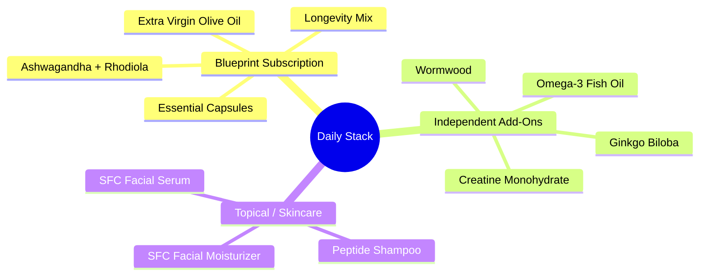
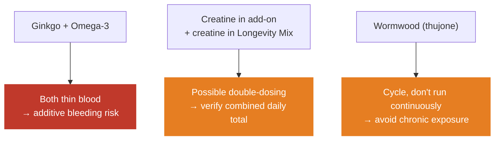

# My Supplement & Longevity Stack

> This is the *actual* stack I run — not a theoretical list. For the underlying science on each compound, see the evidence-based tables in [Training Protocol](../fitness/training-protocol.md#evidence-based-supplement-stack). This page is the operating layer: what I take, when, why, and what it costs.

## The Stack at a Glance

---

## Blueprint Monthly Subscription (Bryan Johnson)

Auto-ships monthly. Prices in **SGD**.

| Item | Category | Price | Notes |
|------|----------|------:|-------|
| Longevity Mix – Blood Orange | Foundational | $68.11 | Daily multi-nutrient drink (creatine, taurine, glycine, electrolytes, polyphenols) |
| Essential Capsules | Foundational | $68.11 | Core micronutrient + longevity capsule blend |
| Ashwagandha + Rhodiola | Adaptogen | $33.35 | Cortisol/stress support, fatigue resistance |
| Extra Virgin Olive Oil (2 bottles) | Nutrition | $97.29 | High-polyphenol EVOO — primary cooking/finishing fat |
| Peptide Shampoo | Topical | $82.00 | Scalp/hair peptide formula |
| SFC Facial Moisturizer | Topical | $95.90 | Daily skin barrier + hydration |
| SFC Facial Serum | Topical | $82.00 | Active serum (apply before moisturizer) |
| **Subtotal (7 items)** | | **$526.76** | |
| Order discount (`EPUO326`) | | −$26.33 | |
| Shipping | | Free | |
| **Monthly Total** | | **$500.43** | ≈ **$6,005 / year** |

> The four ingestibles (Longevity Mix, Essential Capsules, Ashwagandha + Rhodiola, EVOO) are the "inside" work; the three topicals (shampoo, moisturizer, serum) are the "outside" work.

---

## Independent Add-Ons (sourced separately)

These I buy outside the subscription. The first two are Tier-1 evidence; the last two are lower-confidence and carry interaction notes — flagged honestly below.

| Supplement | Typical Dose | Timing | Purpose | Evidence |
|------------|-------------|--------|---------|----------|
| **Creatine monohydrate** | 5 g | Any time, daily | Strength, power, muscle + cognitive support | Tier 1 — most-studied supplement; no loading needed. (Note: Longevity Mix also contains creatine — check combined total) |
| **Omega-3 fish oil** | 2–4 g combined EPA+DHA | With a meal | Anti-inflammatory, brain, heart | Tier 1 — aim ≥1 g EPA for anti-inflammatory effect |
| **Ginkgo biloba** | 120–240 mg standardized extract | Morning | Circulation, cognition / memory | Mixed evidence — modest at best. ⚠️ **Bleeding risk** — increases bleeding tendency, compounded by omega-3. Stop ~2 weeks before any surgery |
| **Wormwood** (*Artemisia absinthium*) | Per product label | Short courses, not continuous | Digestive bitter / traditional antiparasitic | Limited human evidence. ⚠️ Contains **thujone** — neurotoxic at high/chronic doses. Avoid in pregnancy and with seizure history; cycle rather than take indefinitely |

### Interaction & Overlap Watch-List

> **Not medical advice.** Ginkgo and wormwood in particular warrant a quick check with a clinician — especially given the omega-3 + ginkgo bleeding stack and wormwood's thujone content.

---

## Daily Routine

```mermaid
flowchart LR
    subgraph AM["Morning"]
        direction TB
        M1["Longevity Mix (with water)"]
        M2["Essential Capsules"]
        M3["Ginkgo biloba"]
        M4["SFC Serum → SFC Moisturizer"]
    end
    subgraph MEALS["With Meals"]
        direction TB
        F1["Omega-3 fish oil"]
        F2["EVOO on food"]
        F3["Creatine 5 g (anytime)"]
    end
    subgraph PM["Evening / As-Needed"]
        direction TB
        E1["Ashwagandha + Rhodiola"]
        E2["Wormwood (cycled)"]
        E3["Peptide Shampoo (wash days)"]
    end
    AM --> MEALS --> PM
    style AM fill:#16213e,stroke:#0f3460,color:#eee
    style MEALS fill:#1a1a2e,stroke:#e67e22,color:#eee
    style PM fill:#1a2c1a,stroke:#0a8754,color:#eee
```

> Timing is a starting template — adjust to how each sits with you. Adaptogens (ashwagandha/rhodiola) are commonly placed in the evening for cortisol/sleep, but rhodiola can be stimulating for some, so move it earlier if it disrupts sleep.

---

## Cost & Review

| Metric | Value |
|--------|-------|
| Monthly spend (Blueprint) | SGD $500.43 |
| Annual spend (Blueprint) | ≈ SGD $6,005 |
| Add-ons (est.) | Creatine / omega-3 / ginkgo / wormwood — budget separately |

**Quarterly review questions:**
- Which items have a *felt or measured* effect (energy, sleep, recovery, skin, bloodwork)?
- Is anything redundant (e.g., creatine double-up, polyphenols from both EVOO and Longevity Mix)?
- What does bloodwork say — is anything moving the markers I care about?
- Could a cheaper generic deliver the same active ingredient at the same dose?

> A $6K/year stack deserves the same rigor as any other system: **measure what matters, cut what doesn't.** Bloodwork and how you feel are the real KPIs — not the size of the routine.

---

## References

- See [Training Protocol → Supplement Stack](../fitness/training-protocol.md#evidence-based-supplement-stack) for dosing science (creatine, D3+K2, magnesium, omega-3, ashwagandha)
- [Blueprint Protocol (Bryan Johnson)](https://blueprint.bryanjohnson.com/) — product source
- Examine.com — independent, citation-based supplement reviews (creatine, ginkgo, ashwagandha, omega-3)
- Dr. Peter Attia — *Outlive* (longevity supplementation framing)
- NIH Office of Dietary Supplements — fact sheets (omega-3, creatine)
