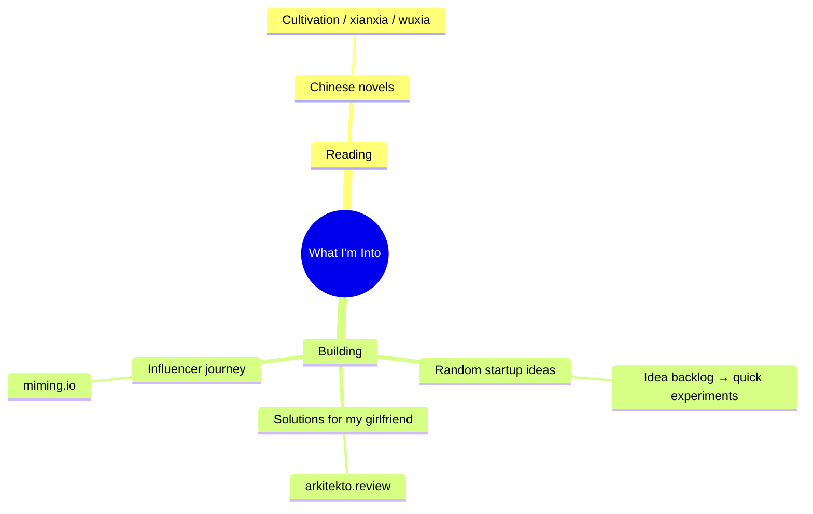
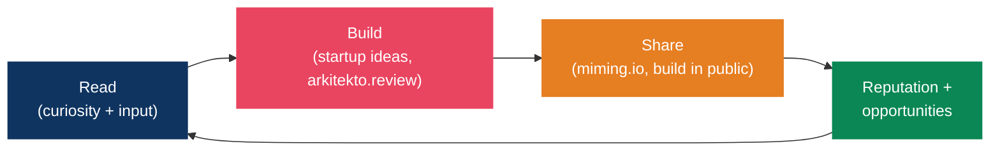

# Interests & Things I'm Building

> Hobbies aren't a break from the system — they *are* the system. Reading sharpens input, building ships output, and creating in public compounds reputation. This is where curiosity turns into leverage.

## The Map

---

## Reading — Chinese Novels

My default leisure input. Cultivation/progression fiction (xianxia, wuxia, web novels) — long-arc stories about discipline, incremental mastery, and breaking through "realms." The irony isn't lost: the genre's core loop (steady cultivation → breakthrough → next plateau) is the same compound-growth model in [Identity Architecture](../mindset/identity-architecture.md) and the [Career Growth System](../career/growth-system.md).

- **Why it works as a hobby**: pure recovery input — story, not screens-as-stimulation. Pairs well with a [real break](../focus/flow-state-protocol.md#phase-5-real-breaks).
- **Optional system upgrade**: keep a running list of novels/arcs finished + a one-line takeaway, the same way the [resources](../resources/curated-links.md) page tracks books.

---

## Building — Side Projects

> Permissionless leverage: code and media replicate at zero marginal cost (Naval). Every project below is a vote for the "builder" identity.

### Random Startup Ideas

A rolling backlog of experiments — the deliberate-practice arena for product thinking, fast shipping, and learning new tech before it's needed at work.

- **System fit**: treat each as a [Type 2 / two-way door](../career/growth-system.md#bezos-two-way-doors) — decide fast, ship small, learn, kill or double down.
- **Discipline**: build *complete, deployed* things, not half-finished experiments. A shipped small thing beats a perfect unshipped one.

### arkitekto.review — for my girlfriend

Building a review solution for my girlfriend (reviews tooling under the **arkitekto** brand). Solving a real problem for one real user is the highest-signal product work there is — tight feedback loop, no vanity metrics, immediate "does this actually help?" validation.

- **Status**: _(track here — live URL, what it does, what's next)_
- **Principle**: scratch a real itch for a real person before generalizing.

### miming.io — influencer journey

The platform/brand for starting my influencer journey — [building in public](../career/growth-system.md#building-in-public) and the long-form/short-form content engine.

- **Strategy** (from the growth system): niche down, value-first, consistency over virality — 3–5x/week on one platform.
- **Status**: _(track here — what miming.io is, current build stage, first content goal)_
- **Principle**: document the process (wins *and* failures); consistency beats one viral hit.

---

## How These Connect

> Input → build → share → grow → repeat. The same flywheel as the [career growth system](../career/growth-system.md), pointed at the things I genuinely enjoy.

## Project Tracker

| Project | What it is | Status | Next milestone |
|---------|-----------|--------|----------------|
| **arkitekto.review** | Review solution for my girlfriend | _TBD_ | _TBD_ |
| **miming.io** | Influencer-journey platform / brand | _TBD_ | _TBD_ |
| Startup idea backlog | Rolling experiments | Ongoing | Pick one, ship a v0 |

> Keep this table honest — update status when things move, archive what you've killed. A visible tracker is a vote for the builder identity.

## References

- [arkitekto.review](https://arkitekto.review) — review solution (building for my girlfriend)
- [miming.io](https://miming.io) — influencer-journey platform
- Naval Ravikant — *The Almanack of Naval Ravikant* (permissionless leverage: code + media)
- Austin Kleon — *Show Your Work* (building/sharing in public)
- Related: [Career Growth System](../career/growth-system.md), [Identity Architecture](../mindset/identity-architecture.md), [Flow State Protocol](../focus/flow-state-protocol.md)
