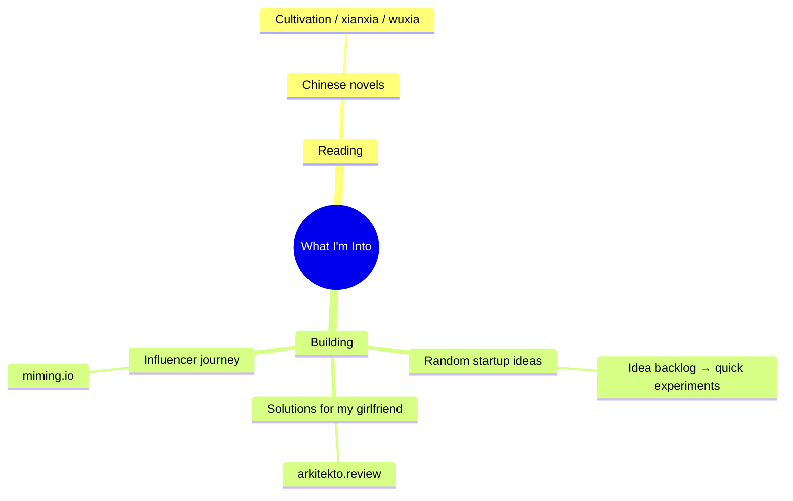
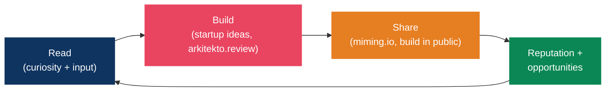

# Interests and things I'm building

Reading, side projects, and building in public. They feed the rest of the system rather than sitting outside it.

## The map

---

## Reading: Chinese novels

My default leisure input. Cultivation and progression fiction (xianxia, wuxia, web novels), which are long-arc stories about discipline, incremental mastery, and breaking through realms. The irony isn't lost on me: the genre's core loop of steady cultivation, breakthrough, then a new plateau is the same compound-growth model as [identity architecture](../mindset/identity-architecture.md) and the [career growth system](../career/growth-system.md).

It works as a hobby because it's genuinely restorative input, story rather than screens-as-stimulation. It pairs well with a [real break](../focus/flow-state-protocol.md#phase-5-real-breaks).

Possible upgrade: keep a running list of novels and arcs finished with a one-line takeaway, the way the [resources](../resources/curated-links.md) page tracks books.

---

## Building: side projects

> Permissionless leverage, in Naval's sense: code and media replicate at zero marginal cost. Every project here is a vote for the builder identity.

### Random startup ideas

A rolling backlog of experiments. It's the deliberate-practice arena for product thinking, shipping fast, and learning new tech before I need it at work.

Treat each one as a [two-way door](../career/growth-system.md#bezos-two-way-doors): decide fast, ship small, learn, then kill it or double down. The discipline is finishing. Build complete, deployed things, because a small shipped thing beats a perfect hidden one.

### arkitekto.review

A review solution I'm building for my girlfriend, under the arkitekto brand. Solving a real problem for one real user is the highest-signal product work there is: tight feedback loop, no vanity metrics, and an immediate answer to whether it actually helps.

Status: _(track here: live URL, what it does, what's next)_

The principle: scratch a real itch for a real person before generalizing.

### miming.io

The platform and brand for starting my influencer journey, which means [building in public](../career/growth-system.md#building-in-public) and running the content engine across long and short form.

Strategy comes straight from the growth system: niche down, lead with value, and post three to five times a week on one platform. Consistency matters more than one viral hit, and documenting the failures alongside the wins is the part that builds trust.

Status: _(track here: what miming.io is, current build stage, first content goal)_

---

## How these connect

> Same flywheel as the [career growth system](../career/growth-system.md), pointed at things I actually enjoy.

## Project tracker

| Project | What it is | Status | Next milestone |
|---------|-----------|--------|----------------|
| **arkitekto.review** | Review solution for my girlfriend | _TBD_ | _TBD_ |
| **miming.io** | Influencer-journey platform / brand | _TBD_ | _TBD_ |
| Startup idea backlog | Rolling experiments | Ongoing | Pick one, ship a v0 |

> Keep this table honest. Update status when things move and archive what you've killed. A tracker only works if it isn't flattering.

## References

- [arkitekto.review](https://arkitekto.review), review solution I'm building for my girlfriend
- [miming.io](https://miming.io), influencer-journey platform
- Naval Ravikant, *The Almanack of Naval Ravikant* (permissionless leverage: code and media)
- Austin Kleon, *Show Your Work* (building and sharing in public)
- Related: [career growth system](../career/growth-system.md), [identity architecture](../mindset/identity-architecture.md), [flow state protocol](../focus/flow-state-protocol.md)
