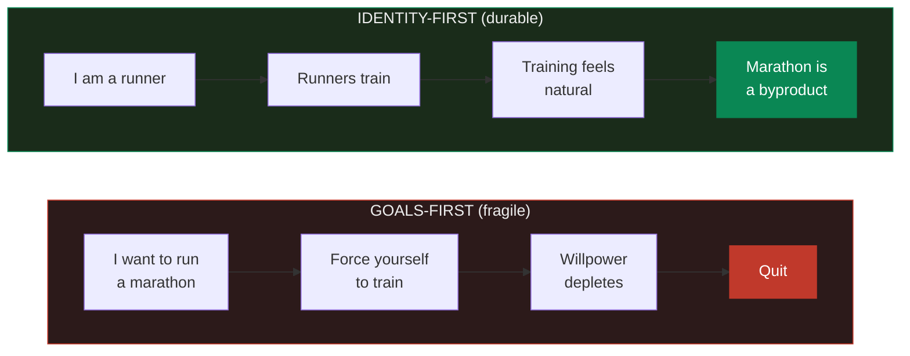
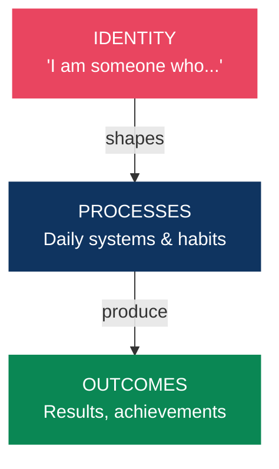
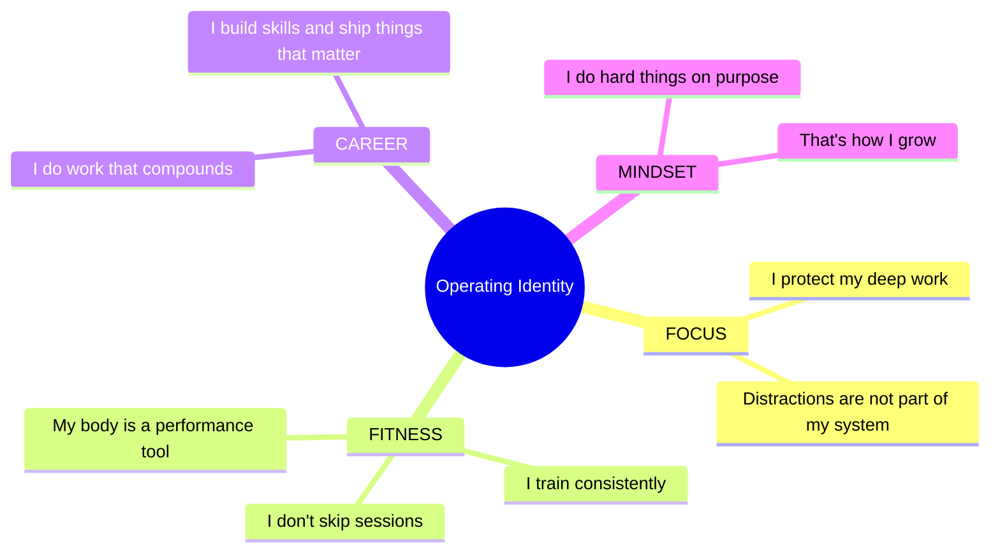
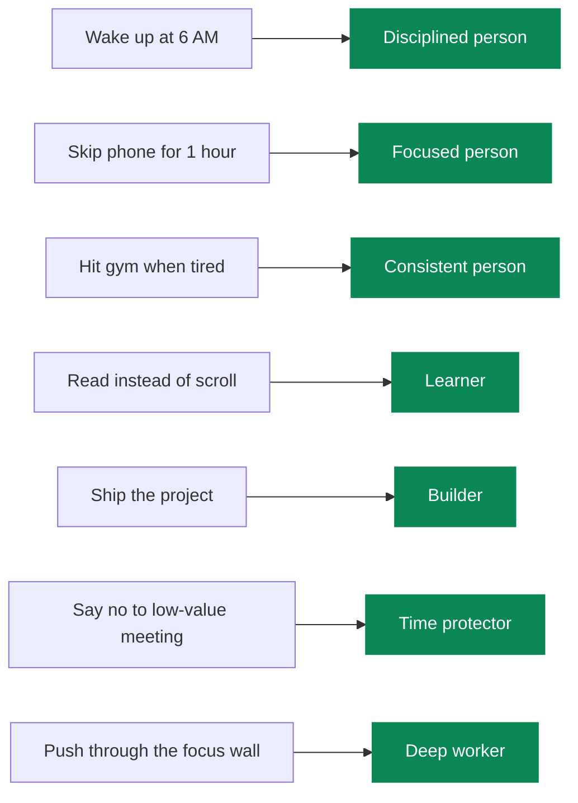
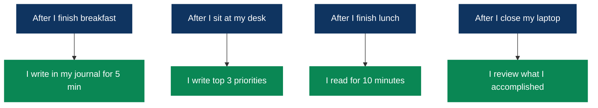
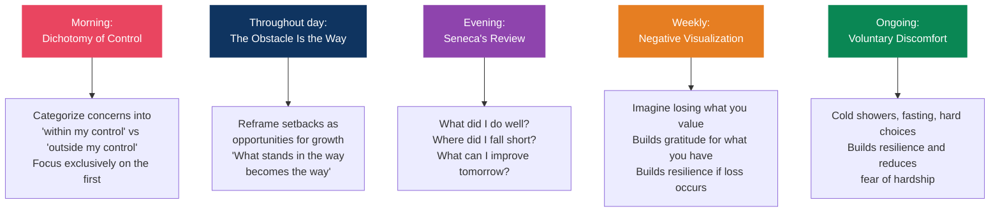
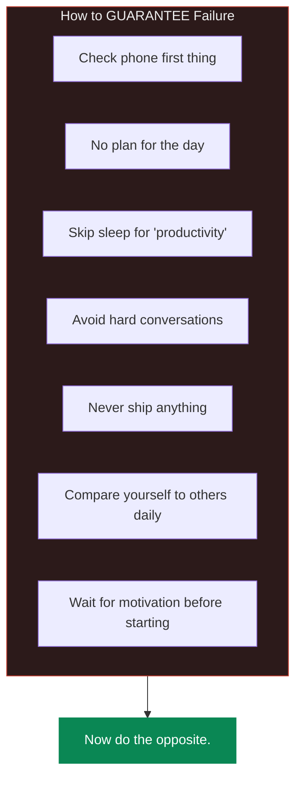
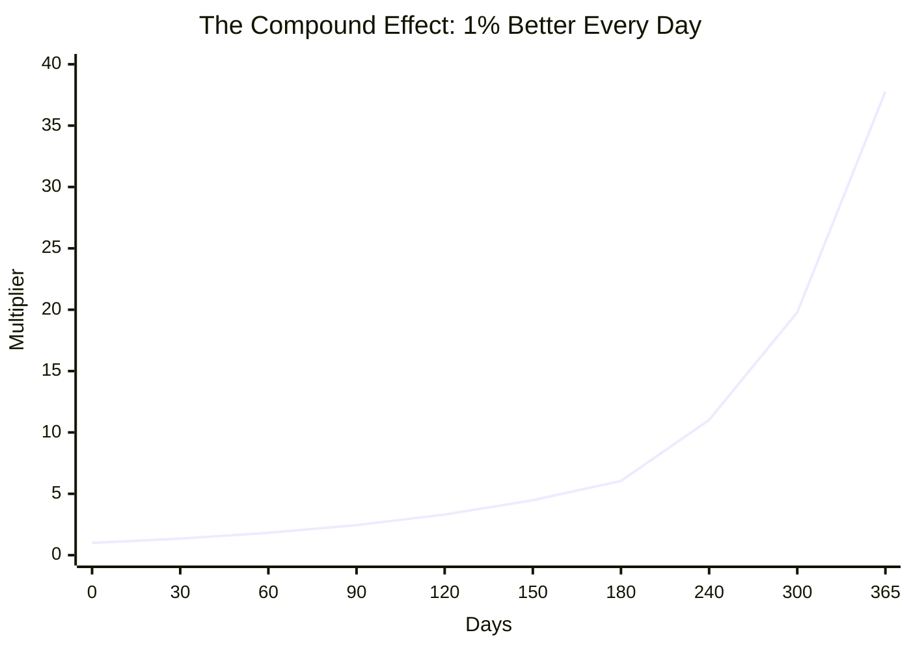
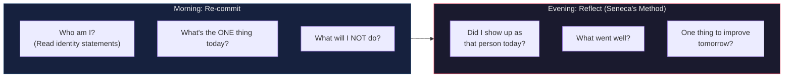

# Identity architecture

> You do not rise to the level of your goals. You fall to the level of your identity.

## The identity-behavior loop

Most people set a goal and then try to force the behavior. It doesn't hold. Working from identity outward does:

---

## Motivation vs discipline: what the research says

Ego depletion is probably a myth. A large replication across 23 labs and 2,141 participants failed to reproduce the original "willpower as a limited resource" finding. What holds up instead:

- High motivation offsets whatever depletion exists. The effect looks more like waning interest than a drained tank.
- What you believe about willpower becomes self-fulfilling. People who think it's limitless pursue more goals, burn out less, and report being happier.
- Environment design beats willpower outright. Remove friction from the good habits and add it to the bad ones so you need less discipline in the first place.
- When motivation is low, shrink the task. "I'll just do two minutes" gets you past the activation energy, and you rarely stop at two minutes.

So don't wait on motivation to start. Use implementation intentions, environment design and identity, and save actual discipline for the handful of moments that need it.

---

## Defining your operating identity

Write down who you're becoming. Present tense, non-negotiable.

> Write your own, read them daily, and act like that person.

---

## Voting for your identity

Every action is a vote for the kind of person you're becoming.

You don't need a perfect record, just a majority. Win more votes than you lose.

---

## Habit stacking and implementation intentions

### The research

In a classic exercise study (Milne, Orbell and Sheeran), participants given an implementation-intention prompt were compared against motivation alone:

- Specific if-then plan ("if it's Monday at 6 AM, then I go to the gym"): 91% followed through
- Motivation only ("I want to exercise"): 39%
- No intervention: 29%

Across many studies the effect is medium sized (d ≈ 0.65), which works out to people with if-then plans being roughly two to three times more likely to hit their goals.

### The formula

**"After I [current habit], I will [new habit]."**

You're borrowing an established habit's neural pathway instead of building one from nothing.

> Keep stacks to two or three habits. Once they run automatically, usually after two to four weeks, add another.

---

## Journaling techniques that work

### Morning pages (Julia Cameron)

Three pages of longhand stream-of-consciousness, first thing. Don't re-read them. The value is in the writing. It works as a mental declutter: getting anxious thoughts out of your head frees up the capacity they were occupying.

### Interstitial journaling (Tony Stubblebine)

Whenever you switch tasks, write a few sentences with a timestamp about what you just did and what you're moving to. It cuts the cost of context switching, creates small commitments, and makes procrastination harder to slip into. Keep it in one running document for the day.

### Gratitude journaling (strongest evidence)

Write down three to five specific things. Robert Emmons' UC Davis research found ten weeks of weekly gratitude journaling led to more positive moods, more optimism, and better sleep.

The frequency finding is the surprising part: once or twice a week beats daily. Weekly boosted happiness, three times a week did not.

> Be specific. "I'm grateful Sarah called to check on me when I was stressed" does more than "I'm grateful for friends."

---

## Visualization and mental rehearsal

### The neuroscience

fMRI and EEG work shows that imagining an action lights up the same brain regions as doing it, which researchers call functional equivalence. Visualization strengthens the neural pathways, muscle memory, focus and confidence you'd otherwise build through reps.

### The protocol

- Dosage: 10 minutes per session, three times a week, over roughly 100 days.
- Visualize the process rather than the outcome. Rehearse the steps, not the trophy.
- Use first person. Seeing it through your own eyes beats watching yourself from outside.
- Make it multi-sensory. Feel the movement, hear the sound, run the emotions.
- Treat it as a supplement to physical practice, never a replacement.

This carries past sports. Five to ten minutes of vivid process visualization works for presentations, difficult conversations, sales calls, anything with stakes.

---

## Stoic philosophy, applied

Stoicism was the original inspiration for cognitive-behavioral therapy, still the leading form of evidence-based psychotherapy. Participants in Modern Stoicism's "Stoic Week" self-report roughly 13% more positive emotions and 21% fewer negative ones. That's a self-selected online survey rather than a controlled trial, so treat it as directional.

### Daily techniques

---

## Mental models for daily life

### 1. The two-day rule

Never skip a habit two days running. One day off is rest. Two days is how the old habit gets its foot back in the door.

### 2. The 40% rule (Navy SEALs)

When your mind says you're finished, you're at about 40% of actual capacity. Treat the discomfort as information rather than an instruction.

### 3. Inversion (Charlie Munger)

Instead of asking how to succeed, ask what would guarantee failure, then avoid those things.

### 4. The compound effect

Small consistent actions produce results that look like overnight success from outside.

> 1% better every day for a year comes to 37x. The math is easy. Sitting through the flat part is not.

### 5. Memento mori

You're going to die. That's clarifying rather than morbid, because it takes "someday" off the table and leaves you with today.

### 6. First principles (Elon Musk)

Break the problem down to fundamental truths and reason up from there. Don't accept "that's how it's always been done" as an answer.

### 7. Circle of competence (Munger)

Know what you know, and know what you don't. The dangerous zone is the stuff you think you know.

---

## The daily reset

---

## The ten highest-leverage actions

1. Use implementation intentions for every goal. "If [situation], then [action]" doubles or triples the success rate.
2. Design your environment instead of relying on willpower. Remove friction for the good, add it to the bad.
3. Run the dichotomy of control each morning. Sort concerns into what you control and what you don't.
4. Visualize the process rather than the outcome: 10 minutes, three times a week, multi-sensory, first person.
5. Gratitude journal once or twice a week rather than daily, with specific entries.
6. Build in public on one platform and keep documenting.
7. Stack new habits onto existing ones, two or three at a time until they're automatic.
8. Use the two-way door framework. Most choices are reversible, so decide like it.
9. Anchor high in negotiations and raise the salary question first.
10. Reduce supernormal stimuli like social media and ultra-processed food, rather than attempting a "dopamine detox."

## References

- James Clear, *Atomic Habits* (identity-based habits, habit stacking)
- Ryan Holiday, *The Obstacle Is the Way* and *Ego Is the Enemy*
- Marcus Aurelius, *Meditations* (Gregory Hays translation)
- David Goggins, *Can't Hurt Me* (40% rule)
- Steven Pressfield, *The War of Art*
- Viktor Frankl, *Man's Search for Meaning*
- Naval Ravikant, *The Almanack of Naval Ravikant*
- Charlie Munger, *Poor Charlie's Almanack*
- Peter Gollwitzer, implementation intentions research (Stanford SPARQ)
- Robert Emmons, gratitude research (UC Davis)
- Modern Stoicism, the 13%/21% emotion study
- APA, willpower and ego depletion replication research
- Frontiers in Psychology, self-discipline and procrastination study
