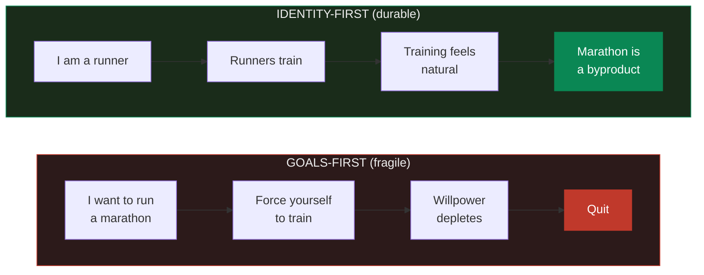
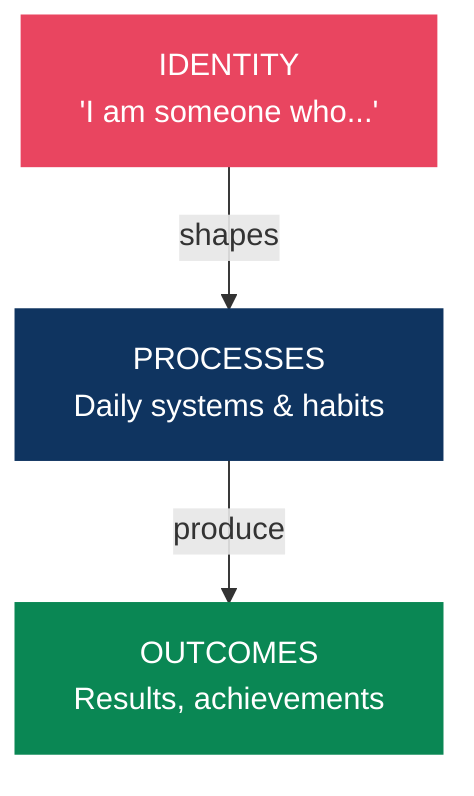
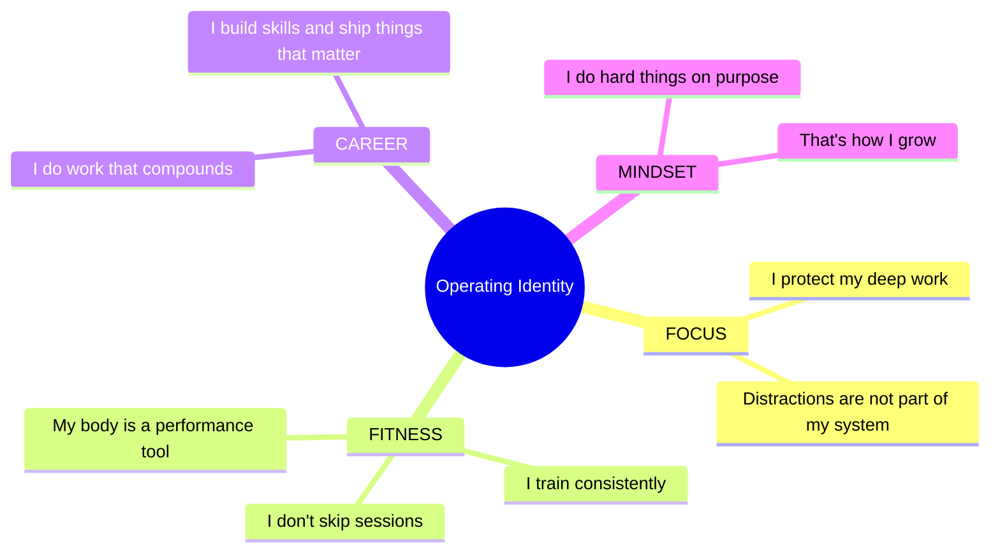
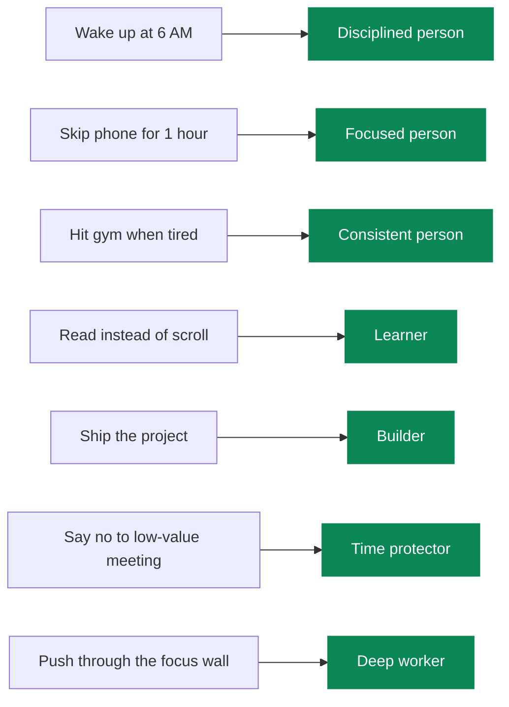
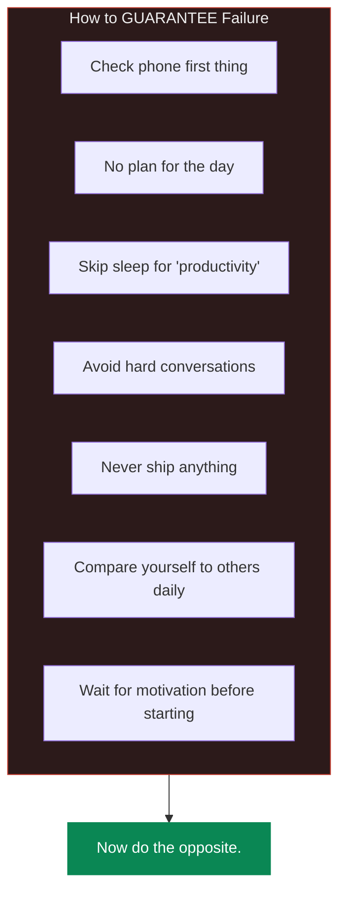
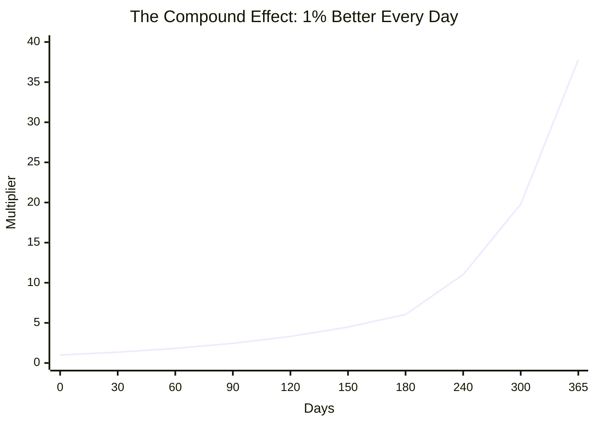
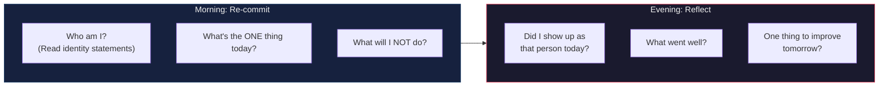

# Identity Architecture

> You do not rise to the level of your goals. You fall to the level of your identity.

## The Identity-Behavior Loop

Most people set goals and try to force behavior change. It doesn't last. The sustainable path is identity-first:

> Work from the inside out. Not outside in.

## Defining Your Operating Identity

Write down who you are becoming. Present tense. Non-negotiable.

> Write your own. Read them daily. Then ACT as that person.

## Voting for Your Identity

Every action is a vote for the type of person you want to become.

You don't need a perfect record. You need a majority. Win more votes than you lose.

## Mental Models for Daily Life

### 1. The Two-Day Rule
Never skip a habit two days in a row. One day off is rest. Two days is the start of a new (bad) habit.

### 2. The 40% Rule (Navy SEALs)
When your mind says you're done, you're only at 40% of your actual capacity. The discomfort is a signal, not a stop sign.

### 3. Inversion
Instead of "How do I succeed?", ask "What would guarantee failure?" — then avoid those things.

### 4. The Compound Effect
Small, consistent actions over time produce results that look like overnight success to outsiders.

> 1% better every day for a year = **37x better**. The math is real. The timeline is the hard part.

### 5. Memento Mori
You will die. This is not morbid — it's clarifying. It removes the option of "someday" and replaces it with "today or never."

## The Daily Reset

## References

- James Clear — *Atomic Habits* (identity-based habits)
- Ryan Holiday — *The Obstacle Is the Way* (Stoic mental models)
- Marcus Aurelius — *Meditations*
- David Goggins — *Can't Hurt Me* (40% rule, mental toughness)
- Mark Manson — *The Subtle Art of Not Giving a F*ck*
- Naval Ravikant — Mental models and decision-making
