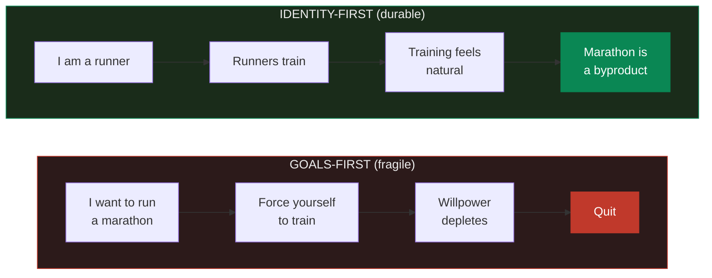
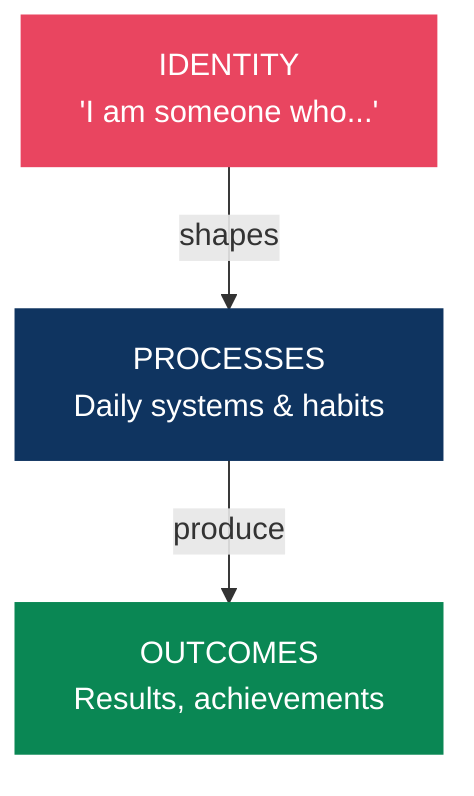
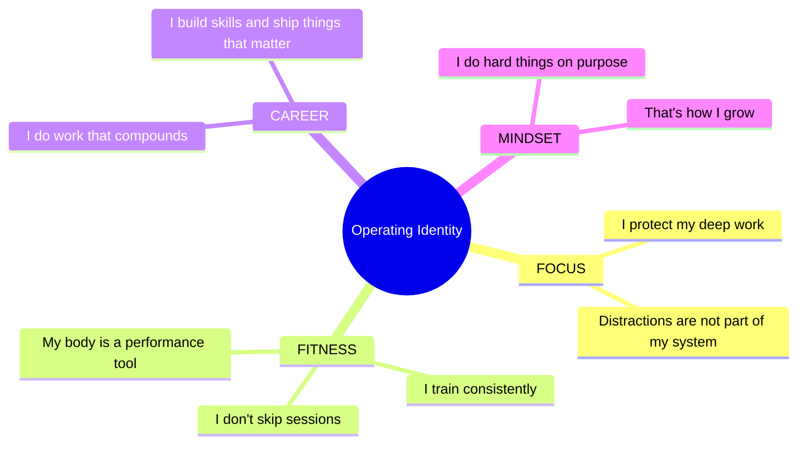
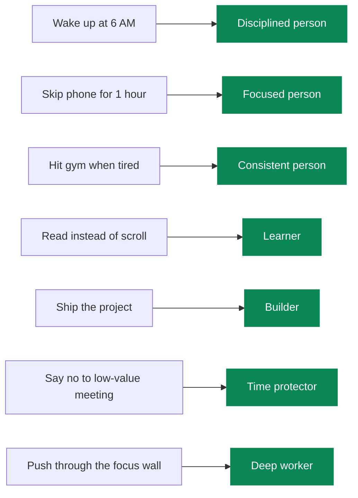
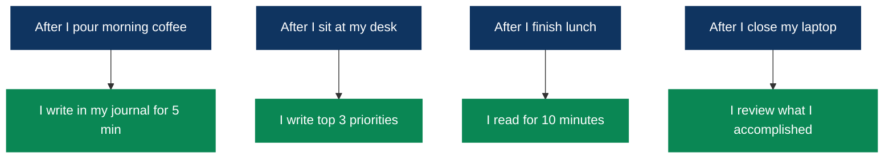
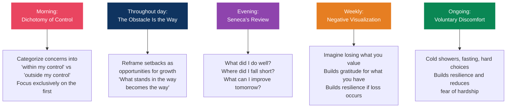
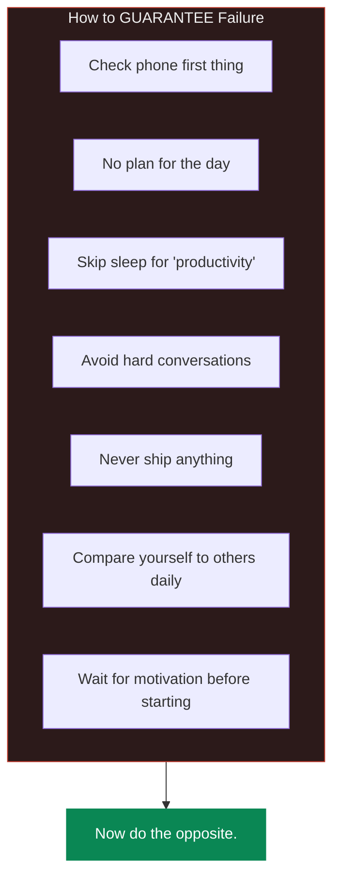
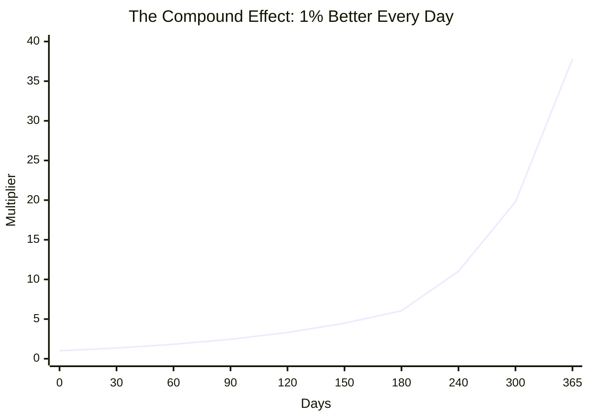
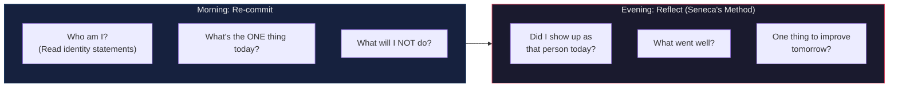

# Identity Architecture

> You do not rise to the level of your goals. You fall to the level of your identity.

## The Identity-Behavior Loop

Most people set goals and try to force behavior change. It doesn't last. The sustainable path is identity-first:

> Work from the inside out. Not outside in.

---

## The Science: Motivation vs Discipline

**Ego depletion is likely a myth.** A large replication across 23 labs (2,141 participants) failed to replicate the original "willpower as limited resource" theory. What the current science actually shows:

- **High motivation offsets any willpower depletion** — the effect may be about waning interest, not a drained resource
- **Beliefs about willpower become self-fulfilling** — people who believe willpower is limitless pursue goals more, burn out less, and report greater happiness
- **Environment design beats willpower** — reduce the need for discipline entirely. Remove friction for good habits, add friction for bad ones
- **When motivation is low, shrink the task** — "I'll just do 2 minutes" overcomes activation energy. You rarely stop at 2 minutes

> **Bottom line**: Don't rely on motivation to start. Use implementation intentions, environment design, and identity. Reserve discipline for the few high-stakes moments that matter.

---

## Defining Your Operating Identity

Write down who you are becoming. Present tense. Non-negotiable.

> Write your own. Read them daily. Then ACT as that person.

---

## Voting for Your Identity

Every action is a vote for the type of person you want to become.

You don't need a perfect record. You need a majority. Win more votes than you lose.

---

## Habit Stacking & Implementation Intentions

### The Research (One of Psychology's Most Replicated Findings)

Peter Gollwitzer's implementation intentions research:
- **Specific plan** ("If it's Monday at 6 AM, then I will go to the gym") = **91% success rate**
- **Vague intention** ("I will exercise") = **29% success rate**

People who make specific if-then plans are **2-3x more likely** to achieve their goals.

### Habit Stacking Formula

**"After I [CURRENT HABIT], I will [NEW HABIT]."**

Link a new behavior to an established habit's neural pathway instead of building one from scratch.

> Start with stacks of 2-3 habits maximum. Once automatic (typically 2-4 weeks), add another.

---

## Journaling Techniques That Work

### Morning Pages (Julia Cameron)

Write 3 pages of longhand stream-of-consciousness first thing in the morning. Don't re-read them — the value is in the writing, not the reading. Functions as a "mental declutter" — externalizing anxious thoughts frees cognitive resources and enhances creativity.

### Interstitial Journaling (Tony Stubblebine)

Every time you transition between tasks, write a few sentences about what you just did and what you're about to do, with a timestamp. Combats context-switching costs, creates micro-commitments, and reduces procrastination. Keep it in one running document throughout the day.

### Gratitude Journaling (Strongest Evidence)

Write 3-5 specific things you're grateful for. UC Davis research (Robert Emmons):
- 10 weeks of weekly gratitude journaling → more positive moods, optimism, and better sleep

**Critical finding on frequency**: Writing **once or twice per week is MORE beneficial than daily**. Weekly boosted happiness; three times per week did not.

> **Be specific.** "I'm grateful for Sarah calling to check on me when I was stressed" > "I'm grateful for friends"

---

## Visualization & Mental Rehearsal

### The Neuroscience

Neuroimaging (fMRI, EEG) shows that imagining an action activates the **same brain regions** as physically performing it ("functional equivalence"). Visualization strengthens neural pathways, muscle memory, focus, and confidence.

### The Protocol (Research-Backed)

- **Optimal dosage**: 10 minutes per session, 3x per week, over ~100 days
- **Process > outcome**: Visualize the steps and actions, not just the end result
- **First-person perspective**: Seeing through your own eyes is more effective than watching yourself from outside
- **Multi-sensory**: Don't just "see" — feel the movements, hear the sounds, experience the emotions
- **Combine with physical practice**: Supplement, don't replace

> **Apply beyond sports**: presentations, difficult conversations, sales calls, any high-stakes performance. 5-10 minutes of vivid process visualization beforehand.

---

## Stoic Philosophy (Practical Applications)

Stoicism was the original inspiration for **Cognitive-Behavioral Therapy (CBT)**, the leading form of evidence-based psychotherapy. Practicing Stoicism: **+13% positive emotions, -21% negative emotions** (Modern Stoicism research).

### Daily Techniques

---

## Mental Models for Daily Life

### 1. The Two-Day Rule
Never skip a habit two days in a row. One day off is rest. Two days is the start of a new (bad) habit.

### 2. The 40% Rule (Navy SEALs)
When your mind says you're done, you're only at 40% of your actual capacity. The discomfort is a signal, not a stop sign.

### 3. Inversion (Charlie Munger)
Instead of "How do I succeed?", ask "What would guarantee failure?" — then avoid those things.

### 4. The Compound Effect
Small, consistent actions over time produce results that look like overnight success to outsiders.

> 1% better every day for a year = **37x better**. The math is real. The timeline is the hard part.

### 5. Memento Mori
You will die. This is not morbid — it's clarifying. It removes the option of "someday" and replaces it with "today or never."

### 6. First Principles (Elon Musk)
Break problems to fundamental truths and reason up. Don't accept "that's how it's always been done."

### 7. Circle of Competence (Munger)
Know what you know. More importantly, know what you don't. The danger zone is thinking you know something you don't.

---

## The Daily Reset

---

## The Top 10 Highest-Leverage Actions (Research-Ranked)

1. **Use implementation intentions for every goal** — "If [situation], then [action]" doubles to triples success rate
2. **Design your environment** rather than relying on willpower — remove friction for good, add for bad
3. **Practice the Dichotomy of Control daily** — categorize concerns each morning
4. **Visualize process, not outcomes** — 10 min, 3x/week, multi-sensory, first-person
5. **Gratitude journal 1-2x per week** (not daily) — specific, concrete entries
6. **Build in public on one platform** — document your journey consistently
7. **Stack new habits onto existing ones** — keep stacks small (2-3 max) until automatic
8. **Use the Two-Way Door framework** — most choices are reversible; treat them that way
9. **Anchor high in negotiations** and always initiate the salary discussion
10. **Reduce supernormal stimuli** (social media, ultra-processed food) instead of "dopamine detox"

## References

- James Clear — *Atomic Habits* (identity-based habits, habit stacking)
- Ryan Holiday — *The Obstacle Is the Way*, *Ego Is the Enemy* (Stoic mental models)
- Marcus Aurelius — *Meditations* (Gregory Hays translation)
- David Goggins — *Can't Hurt Me* (40% rule, mental toughness)
- Steven Pressfield — *The War of Art*
- Viktor Frankl — *Man's Search for Meaning*
- Naval Ravikant — *The Almanack of Naval Ravikant*
- Charlie Munger — *Poor Charlie's Almanack*
- Peter Gollwitzer — Implementation intentions research (Stanford SPARQ)
- Robert Emmons — Gratitude research (UC Davis)
- Modern Stoicism — 13%/21% emotion improvement study
- APA — Willpower and ego depletion replication research
- Frontiers in Psychology — Self-discipline and procrastination study
