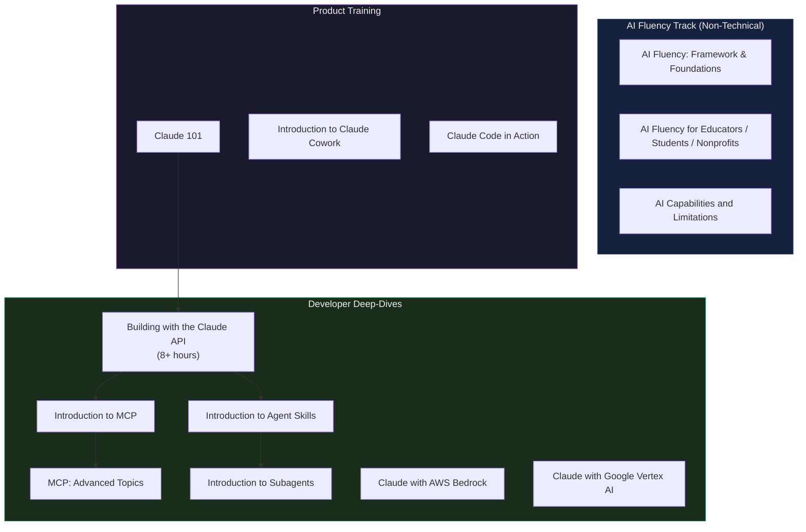
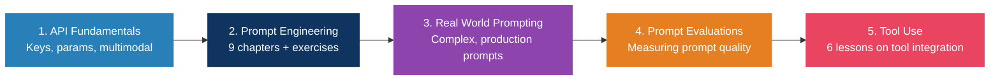
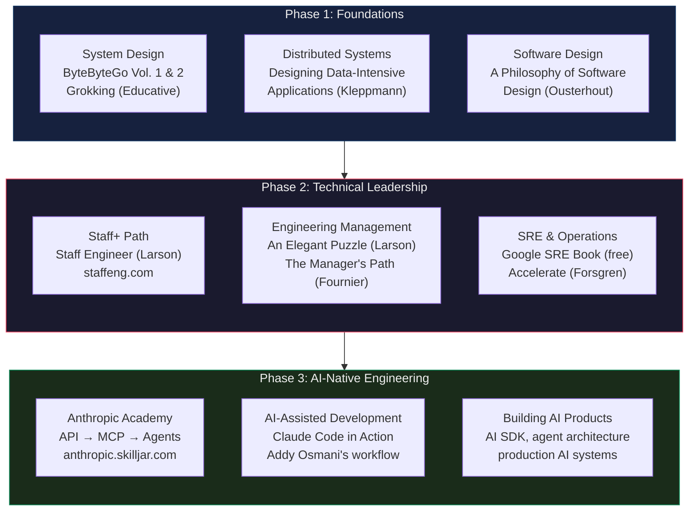

# Curated Resources

## YouTube Channels & Videos

### Focus & Productivity
- **Andrew Huberman — Focus Toolkit**: https://www.youtube.com/watch?v=yb5zpo5WDG4
- **Andrew Huberman — How to Stop Procrastinating**: https://www.youtube.com/watch?v=GuCdiSPFQJM
- **Andrew Huberman — Controlling Dopamine**: https://www.youtube.com/watch?v=QmOF0crdyRU
- **Andrew Huberman — NSDR Protocol**: https://www.youtube.com/results?search_query=huberman+nsdr
- **Cal Newport — Deep Work talks**: Search "Cal Newport deep work" on YouTube
- **Ali Abdaal — Productivity**: https://www.youtube.com/@aliabdaal
- **Thomas Frank — Study/Work Systems**: https://www.youtube.com/@ThomasFrank
- **Matt D'Avella — Minimalism & Habits**: https://www.youtube.com/@mattdavella

### Fitness & Health
- **Jeff Nippard — Evidence-Based Training**: https://www.youtube.com/@JeffNippard
- **Renaissance Periodization (Dr. Mike Israetel)**: https://www.youtube.com/@RenaissancePeriodization
- **Andrew Huberman — Fitness Series with Andy Galpin**: Search "Huberman Galpin" on YouTube
- **Jeremy Ethier — Science-Based Workouts**: https://www.youtube.com/@JeremyEthier
- **Natacha Oceane — Functional Fitness**: https://www.youtube.com/@NatachaOceane

### Career & Business
- **Naval Ravikant — How to Get Rich (Without Getting Lucky)**: https://www.youtube.com/watch?v=1-TZqOsVCNM
- **Y Combinator — Startup School**: https://www.youtube.com/@ycombinator
- **Sahil Bloom — Growth Frameworks**: https://www.youtube.com/@SahilBloom
- **Alex Hormozi — Offers, sales, scaling**: https://www.youtube.com/@AlexHormozi
- **Greg Isenberg — Startup ideas & indie business**: https://www.youtube.com/@GregIsenberg
- **Starter Story — Founder case studies**: https://www.youtube.com/@StarterStory
- **My First Million — Business ideas podcast**: https://www.youtube.com/@MyFirstMillionPod

### Mindset & Philosophy
- **Jocko Willink — Discipline Equals Freedom**: https://www.youtube.com/@JockoWillink
- **Ryan Holiday — Daily Stoic**: https://www.youtube.com/@DailyStoic
- **Lex Fridman — Long-form interviews**: https://www.youtube.com/@lexfridman
- **Chris Williamson — Modern Wisdom**: https://www.youtube.com/@ChrisWillx
- **Einzelganger — Philosophy**: https://www.youtube.com/@Einzelganger

## Podcasts

| Podcast | Focus | Why |
|---------|-------|-----|
| **Huberman Lab** | Neuroscience + protocols | Deep, research-cited, actionable protocols |
| **The Tim Ferriss Show** | Peak performers | Patterns from world-class people |
| **Deep Questions** (Cal Newport) | Focus + career | Practical deep work advice |
| **The Knowledge Project** (Shane Parrish) | Mental models | Decision-making frameworks |
| **Jocko Podcast** | Discipline + leadership | Mindset forging |
| **The Peter Attia Drive** | Longevity + health | Deep-dive health protocols |
| **Modern Wisdom** (Chris Williamson) | Self-improvement | Wide range, excellent guests |
| **The Mel Robbins Podcast** | Motivation + science | Science-backed, practical |
| **Finding Mastery** (Dr. Michael Gervais) | High-performance psych | How elite performers think |
| **The Happiness Lab** (Dr. Laurie Santos) | Science of happiness | Yale research, evidence-based |
| **Ten Percent Happier** (Dan Harris) | Mindfulness | Meditation with healthy skepticism |
| **Lenny's Podcast** (Lenny Rachitsky) | Product, growth, startups | The #1 product/startup interview show |
| **My First Million** (Shaan Puri, Sam Parr) | Business ideas + building | Idea generation, opportunity spotting |
| **The SaaS Podcast** (Omer Khan) | SaaS founder interviews | Practical bootstrapped-SaaS tactics |
| **Acquired** (Ben Gilbert, David Rosenthal) | Company deep-dives | How great companies were actually built |
| **The Twenty Minute VC** (Harry Stebbings) | Venture + scaling | Candid founder/investor conversations |

## Books (Essentials)

### Focus
| Book | Author | Key Takeaway |
|------|--------|-------------|
| *Deep Work* | Cal Newport | Rules for focused success in a distracted world |
| *The Art of Impossible* | Steven Kotler | Flow state triggers and peak performance science |
| *Flow* | Mihaly Csikszentmihalyi | The original research on optimal experience |
| *Hyperfocus* | Chris Bailey | Managing attention as your most valuable resource |
| *Indistractable* | Nir Eyal | Becoming immune to distraction |

### Fitness & Health
| Book | Author | Key Takeaway |
|------|--------|-------------|
| *Outlive* | Dr. Peter Attia | Longevity-focused training and preventive medicine |
| *Why We Sleep* | Dr. Matthew Walker | Sleep is the #1 performance intervention |
| *Starting Strength* | Mark Rippetoe | Barbell training fundamentals |
| *Bigger Leaner Stronger* | Michael Matthews | Evidence-based body composition |

### Career
| Book | Author | Key Takeaway |
|------|--------|-------------|
| *So Good They Can't Ignore You* | Cal Newport | Skill > passion for career satisfaction |
| *The Almanack of Naval Ravikant* | Eric Jorgenson | Wealth through leverage + specific knowledge (free PDF) |
| *Range* | David Epstein | Generalists often outperform specialists |
| *Show Your Work* | Austin Kleon | Share your process, not just results |
| *Poor Charlie's Almanack* | Charlie Munger | Mental models from multiple disciplines |

### Business & Startups
| Book | Author | Key Takeaway |
|------|--------|-------------|
| *The Mom Test* | Rob Fitzpatrick | Talk to customers without lying to yourself |
| *The Lean Startup* | Eric Ries | Build-measure-learn, MVP, pivot-or-persevere |
| *Zero to One* | Peter Thiel | Monopoly, moats, contrarian bets |
| *$100M Offers* | Alex Hormozi | Build an offer people can't refuse |
| *Demand-Side Sales 101* | Bob Moesta | Jobs To Be Done + the Four Forces of progress |
| *The Founder's Dilemmas* | Noam Wasserman | Co-founder, equity, and control traps to avoid |
| *Start Small, Stay Small* | Rob Walling | The bootstrapper's stair-step approach |
| *The Embedded Entrepreneur* | Arvid Kahl | Audience-first business building |
| *Obviously Awesome* | April Dunford | Positioning that makes products click |

### Mindset
| Book | Author | Key Takeaway |
|------|--------|-------------|
| *Atomic Habits* | James Clear | Identity-based habits + implementation intentions |
| *Can't Hurt Me* | David Goggins | 40% rule — you have more capacity than you think |
| *Meditations* | Marcus Aurelius | The Stoic playbook (Gregory Hays translation) |
| *The Obstacle Is the Way* | Ryan Holiday | Reframe setbacks as opportunities |
| *Man's Search for Meaning* | Viktor Frankl | Finding purpose in suffering |
| *The War of Art* | Steven Pressfield | Overcoming Resistance (capital R) |
| *Thinking, Fast and Slow* | Daniel Kahneman | Cognitive biases and dual-process thinking |
| *Courage Is Calling* | Ryan Holiday | Practical Stoic courage for modern life |

### Engineering
| Book | Author | Key Takeaway |
|------|--------|-------------|
| *Designing Data-Intensive Applications* | Martin Kleppmann | The distributed systems bible |
| *A Philosophy of Software Design* | John Ousterhout | Managing complexity in software |
| *Staff Engineer* | Will Larson | Staff+ career guide with archetypes |
| *An Elegant Puzzle* | Will Larson | Systems of engineering management |
| *The Manager's Path* | Camille Fournier | Technical leadership ladder |
| *Accelerate* | Forsgren, Humble, Kim | The DORA research book on DevOps |
| *Site Reliability Engineering* | Google | SRE practices (free online) |
| *System Design Interview Vol. 1 & 2* | Alex Xu | System design patterns and walkthroughs |
| *The Pragmatic Programmer* | Hunt & Thomas | Timeless software craftsmanship |
| *Clean Code* | Robert C. Martin | Readable, maintainable code (take selectively) |

## Newsletters & Blogs

| Source | URL | Focus |
|--------|-----|-------|
| **James Clear — 3-2-1 Thursday** | https://jamesclear.com/3-2-1 | Habits, mental models, quotes |
| **Sahil Bloom — The Curiosity Chronicle** | https://sahilbloom.com | Growth frameworks, career |
| **Paul Graham — Essays** | https://paulgraham.com/articles.html | Startups, thinking clearly |
| **Farnam Street Blog** | https://fs.blog | Mental models, decision-making |
| **Mark Manson** | https://markmanson.net/articles | Life philosophy, no-BS |
| **Tim Ferriss — 5-Bullet Friday** | https://tim.blog | Curated weekly finds |
| **Andrew Huberman Newsletter** | https://www.hubermanlab.com/newsletter | Protocols from the podcast |
| **The Pragmatic Engineer** | https://www.pragmaticengineer.com/ | #1 for senior engineers — comp, architecture, culture |
| **ByteByteGo** (Alex Xu) | https://blog.bytebytego.com/ | System design, distributed systems |
| **TLDR Newsletter** | https://tldr.tech/ | Daily tech news digest |
| **Software Lead Weekly** | https://softwareleadweekly.com/ | Engineering leadership |
| **LeadDev** | https://leaddev.com/ | Staff+ engineering, scaling teams |
| **Lenny's Newsletter** | https://www.lennysnewsletter.com/ | #1 product, growth & startup newsletter |
| **First Round Review** | https://review.firstround.com/ | Deep operator playbooks from top founders |
| **SaaStr** (Jason Lemkin) | https://www.saastr.com/ | The bible for B2B SaaS go-to-market |
| **Growth Unhinged** (Kyle Poyar) | https://www.growthunhinged.com/ | Pricing, monetization, GTM benchmarks |
| **The Bootstrapped Founder** (Arvid Kahl) | https://thebootstrappedfounder.com/ | Audience-first, indie SaaS |
| **Indie Hackers** | https://www.indiehackers.com/ | Bootstrapped founder community + stories |
| **a16z** | https://a16z.com/ | AI, startups, market theses |

## Tools

### Focus
| Tool | Purpose |
|------|---------|
| **Brain.fm** | AI-powered focus music (neural phase-locking, fMRI-backed) |
| **Cold Turkey Blocker** | Nuclear option for website blocking |
| **Forest App** | Gamified focus timer (phone stays locked, tree grows) |
| **Centered** | AI-powered flow state coach |

### Fitness
| Tool | Purpose |
|------|---------|
| **Strong App** | Workout tracking (simple, effective) |
| **MacroFactor** | Nutrition tracking with adaptive TDEE |
| **Whoop / Oura Ring** | Recovery and sleep tracking |

### Journaling & Habits
| Tool | Purpose |
|------|---------|
| **[Isip](https://isip.pastelero.ph)** | Todo + journal app (I built this) — completed todos auto-generate journal entries |
| **Streaks** (iOS) | Simple daily habit tracker |
| **Pen and paper** | Still the best for daily review — zero distractions |

### Dev & AI (the 2026 solo-builder stack)
| Tool | Purpose |
|------|---------|
| **Claude Code** | Agentic coding in the terminal/IDE — primary build tool |
| **Cursor** | AI-native code editor |
| **v0 / Bolt / Lovable** | Prompt-to-UI / full-app scaffolding |
| **Context7 (MCP)** | Live, version-correct library docs for AI coding |
| **GitHub + gh CLI** | Version control + ~80% of GitHub from the terminal |
| **Linear** | Issue tracking built for speed |
| **Vercel** | Ship and host front-ends + serverless in minutes |

> The thesis from the [business playbook](../business/startup-playbook.md#the-solo-and-ai-founder-playbook-2026): one person + this stack (~$200-500/mo) replaces what used to need a team. But [read every line](../engineering/dev-setup.md#read-every-line-understanding-ai-generated-code) — own what you ship.

### Build & Launch
| Tool | Purpose |
|------|---------|
| **Stripe** | Payments — charge from day one |
| **Resend / Loops** | Transactional + lifecycle email |
| **Plausible / PostHog** | Privacy-friendly analytics + product insights |
| **Carrd / Framer** | Fast landing pages for smoke-test validation |

### Supplements (Quick Reference)

> Dosing science lives in [Training Protocol → Supplement Stack](../fitness/training-protocol.md#evidence-based-supplement-stack); my actual daily routine and costs are in [Health → Supplement Stack](../health/supplement-stack.md). Quick recap below.

| Supplement | Dosage | When |
|---|---|---|
| Creatine monohydrate | 5g | Daily (any time) |
| Vitamin D3 + K2 | 2,000-4,000 IU + 100-200mcg | Morning, with fat |
| Omega-3 (EPA/DHA) | 2-4g combined | With meals |
| Magnesium glycinate | 200-400mg | Before bed |
| Ashwagandha KSM-66 | 600mg | Daily |

## Learning Roadmaps

### Anthropic Academy (Free, Certificates)

All courses at https://anthropic.skilljar.com/ — free, self-paced, with certificates on completion.

**GitHub Notebooks** (hands-on): https://github.com/anthropics/courses (20K+ stars)

Also available on **Coursera**: https://www.coursera.org/partners/anthropic

### Senior Engineer Learning Path

## Key Numbers to Remember

| Metric | Target | Why |
|---|---|---|
| Deep work | 3-4 hours/day | Outperforms 99% of scattered 8-hour days |
| Sleep | 7-9 hours | #1 performance intervention |
| Zone 2 cardio | 150-180 min/week | Base building, longevity |
| Protein | 1.6-2.2g/kg/day | Muscle repair and satiety |
| Caffeine cutoff | 10 hrs before bed (if any) | Half-life is 5-6 hours. No caffeine = natural advantage |
| Morning sunlight | 10 min within 30 min of waking | Sets circadian rhythm |
| Cold exposure | 11 min/week (2-4 sessions) | Sustained dopamine rise, no crash |
| Sauna | 4-7x/week, 15-20 min | 40% reduction in all-cause mortality |
| Grip strength | Men 40+ kg, Women 25+ kg | Top longevity predictor |
| VO2max | Train to stay out of the lowest-fit group | #1 predictor of all-cause mortality |
| Gratitude journaling | 1-2x/week (not daily) | Weekly > daily per research |
| Implementation intentions | "If X, then Y" format | 91% vs 39% follow-through |
